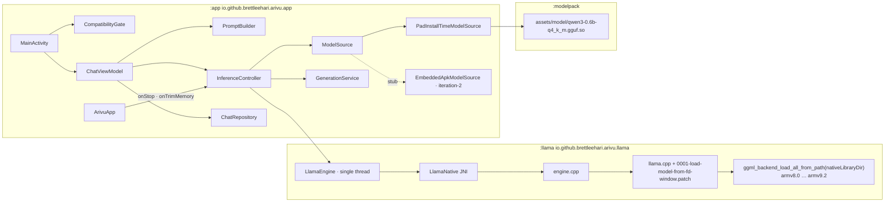

# Architecture Leaf

Sub-files: [`architecture/release-and-signing.md`](architecture/release-and-signing.md) (keys, Play App
Signing, release pipeline) · [`architecture/threat-model.md`](architecture/threat-model.md).

## Leaf changelog

- **2026-09-15 (b)** — Deployment review. Measured compute buffers (300.75 MiB at the shipped config, not
  ~80 MB); boundary review against code; release/signing architecture; threat model; Build vs Adopt
  rows for Play-side services. Still Spine 0.1.
- **2026-09-15 (a)** — First Leaf.

## System — architect resolution

## Component resolution — module flow

Iteration-2 note (D-005): in a universal APK — including the one Play generates — install-time pack
assets are merged into the single APK's `assets/`, so `PadInstallTimeModelSource`'s `openFd()` call
works unchanged [B, verify in W18]. The stub may end up as a rename, not a second mechanism.
Consequence for R1 to record now: a **Play-installed** copy is a set of split APKs, so its `sourceDir`
is not shareable as one file. Only users who installed the universal APK can seed P2P shares.

## Build vs Adopt

The moat is not the model or the runtime — both are commodity and permissively licensed. The moat is
**the harness**: an app that installs in one tap, never asks for anything, fits a 4GB phone, and is
honest about what a small model is for. That is what we build. Everything about *trust in the
distribution channel* we adopt from the platform: building it ourselves would need a network.

| Component | Decision | Triage | Why |
|---|---|---|---|
| Language model (Qwen3 0.6B Q4_K_M) | **Adopt** | Reuse | Apache-2.0 weights; training a model is not our product. Provenance: Unsloth re-quant (threat T7, proposed D-019) |
| Inference runtime (llama.cpp / ggml) | **Adopt** | Improvise | MIT, mmap, quantized KV, ARM variants. One small patch: load from fd window |
| CPU kernel selection | **Adopt** | Reuse | ggml `GGML_CPU_ALL_VARIANTS` + `GGML_BACKEND_DL` picks dotprod/i8mm/sve at runtime. Cost: needs extracted libs (see boundary review) |
| Model delivery | **Adopt** | Reuse | Play Asset Delivery install-time pack |
| Alignment of the model inside the APK | **Build** (config) | Improvise | `.gguf.so` naming so bundletool page-aligns it (D-013) |
| Engine wrapper (prefix reuse, cancel, UTF-8 streaming, stop reasons) | **Build** | — | Product behaviour: visible truncation, stop at any token |
| Lifecycle policy (lazy load, idle free, trim) | **Build** | — | The difference between "runs on 4GB" and "gets killed on 4GB" |
| Compatibility gate (3 layers) | **Build** layer 3 + **Adopt** layers 1–2 | — | Layer 2 = Play Console device-catalog RAM rule [V-doc: rules by RAM or SoC; not applied to internal testers] |
| Prompt + truncation policy | **Build** | — | Honest positioning lives in the system prompt and the divider |
| UI | **Adopt** Compose/Material3, **Build** one screen | Reuse | |
| Persistence | **Adopt** kotlinx.serialization | Reuse | One flat file |
| Licences screen, report intent | **Build** | — | Store policy + Apache NOTICE obligations |
| **App signing key custody** | **Adopt** Play App Signing, Google-generated key | Reuse | A leaked app signing key turns repackaging into trusted updates; Google's HSM beats a laptop. D-018 |
| **Off-Play artifact (iteration-2)** | **Adopt** Play's signed universal APK | Reuse | Same key by construction, same versionCode train. Fallback: own key via PEPK before Open testing. D-018 |
| **Package registration / anti-impersonation** | **Adopt** Android developer verification + platform signature-update rule + Play Protect | Reuse | The only anti-repackaging control that works without network. Auto-registered under Play App Signing [V-doc] |
| **Tamper evidence for code** | **Adopt** bundletool code transparency | Reuse | Proves DEX + native libs unchanged by the store; separate key; not assets |
| **Crash / ANR reporting** | **Adopt** Play Console Android vitals + pre-launch report | Reuse | No SDK possible without INTERNET. AAB already carries R8 mapping and native `.sym` files for symbolication [V-local]. Data is collected by the OS under the user's diagnostics opt-in, not by the app [B] — Compliance to confirm Data-safety wording |
| In-app diagnostics for field bugs | **Build** (small, later) | — | Report intent may attach stop reason + engine stats the user can read before sending. Not before W21 shows a need |
| **Privacy policy hosting** | **Adopt** a static page (arivu.org if D-001 confirms control, else the repo's GitHub Pages), no analytics, text mirrored in About | Reuse | Play requires a policy URL even for apps collecting nothing [B, widely documented] |
| **Play Integrity automatic protection** | **Reject** | — | Needs Play connectivity and pushes sideloaded users back to Play — breaks C2/C3 and R1 |
| Release automation / CI signing | **Reject** for iteration-1 | — | One person, one release machine; putting an upload key into CI adds a custody surface for no speed gain |

## Trust mechanisms

| Mechanism | Where | Enforced by |
|---|---|---|
| No network capability | manifest | `tools/check_manifest.sh` fails the build on INTERNET / network-state permissions or any unlisted permission |
| Data stays on phone | `allowBackup=false`, `fullBackupContent=false`, `data_extraction_rules.xml` excludes cloud + device transfer | manifest check (asserts `allowBackup` only — see boundary review) |
| Weights are evictable | mmap from APK, `load_mode=MMAP`, never MLOCK, repack off | `Policy.REPACK_WEIGHTS`, benchmark RSS |
| KV cache is not left resident | context freed at idle/hidden/trim | `verify_lifecycle.sh` (W08) |
| Model identity | sha256 pinned in `tools/fetch_model.sh` | fetch script |
| Runtime identity | llama.cpp commit pinned + patch in repo; KleidiAI FetchContent off | `tools/llama/fetch_llama.sh`, CMake cache |
| Model cannot be mapped misaligned | `llama_model_load_from_fd` rejects offset % 32 ≠ 0 | runtime error + `zip_entry_offset.py` |
| Play did not break alignment or signing | Play-generated splits + universal APK checked | W18 (release pipeline step 7) |
| App identity across channels | one package, one app signing cert SHA-256, published | developer verification; platform signature-update rule; D-018 |
| Code identity vs the store | code transparency file (if adopted) | `bundletool check-transparency` |
| Incompatible phones are told, not tortured | gate layers 1–3 | unit tests + W10; Console RAM rule |

## Memory budget (4GB phone)

Measured on host (macOS arm64, CPU backend, pinned llama.cpp 38a5b42, 2026-09-15) with a probe that
creates the context exactly as `engine.cpp` does. Buffer sizes are graph-determined, so they carry over
to Android; **resident** size on the phone is still W02's job.

| Allocation | CLAUDE.md budget | Measured (buffer size) | Reclaimable | Controlled by |
|---|---|---|---|---|
| Weights, mmap'd file pages | ~400 MB | **372.65 MiB** mapped | yes | kernel |
| KV cache 2048 × q8_0 | ~115 MB | **119.00 MiB** | no | `freeContext()` |
| Compute buffers, n_batch = n_ubatch = 512, `n_outputs_max` default | ~80 MB | **300.75 MiB** | no | `freeContext()` |
| — same, `n_outputs_max = 1` | | **28.09 MiB** | no | proposed engine change |
| — ubatch 256 / 128, default outputs | | 150.38 / 75.19 MiB | | |
| Output (logits) buffer | — | 0.58 MiB | no | |
| Native libs (one CPU variant + libllama + base + libc++), file-backed text | — | ~6 MB of ~11.9 MB extracted | yes | kernel |
| App + ART + Compose | ~150 MB | not measured | no | — |
| **Peak RSS target** | **≤ 800 MB** | worst case today ≈ 373 + 119 + 301 + 150 ≈ **943 MB**; with the fix ≈ **670 MB** | | M3 |

Why 300 MiB: this llama.cpp reserves the worst-case graph with `n_outputs = min(n_tokens, n_outputs_max)`,
and `n_outputs_max` defaults to `n_batch`. 512 outputs × 151,936 vocab × 4 bytes ≈ 297 MiB of logits
scratch that `engine.cpp` never uses (it requests logits for one token). Whether those pages ever
become resident is unmeasured — the allocation is lazy — so this is a **risk to M3, not yet a proven
breach**. Setting `n_outputs_max = 1` removes the question at no cost to prefill speed.

## Boundary review — code vs this Leaf (2026-09-15)

| # | Boundary | Finding | Status | Spine |
|---|---|---|---|---|
| B1 | Compute buffers | 300.75 MiB reserved vs ~80 MB budget; fix `n_outputs_max = 1` → 28.09 MiB | **Mismatch** | C2, M3 |
| B2 | KV / weights | 119.00 / 372.65 MiB vs ~115 / ~400 | Minor, budget updated | C2 |
| B3 | Native lib packaging | `useLegacyPackaging = true` → libs deflated in the APK (~4.9 MB) **and** extracted (~11.9 MB) ≈ 16.8 MB on disk vs 11.9 MB uncompressed-in-place; download ~7 MB smaller. Required because `ggml_backend_load_all_from_path` scans a directory. Only 1 of 7 CPU variants (~0.9 MB each) is used per phone. All 13 .so have 16 KB LOAD alignment [V-local]. CLAUDE.md BOM's "~3 MB .so" is low. | **Accepted** — net cost ~5 MB disk against a 400 MB app; smaller download matters more in these markets | C1, C2 |
| B4 | `.gguf.so` alignment (D-013) | bundletool 1.18.3 `ModuleSplitSerializer.alignmentForEntry` returns `nativeLibraryAlignment` for **any** path ending `.so`, else 4 — unconditional, independent of `useLegacyPackaging` [V-local, bytecode]. Still an implementation detail of Play's server-side bundletool. Unknown [B]: whether Play's 16 KB / native-code scanners flag a non-ELF `.so` in assets. | Holds; W18 is mandatory, not optional | C1, C2 |
| B5 | Foreground service | Manifest `shortService` + `FOREGROUND_SERVICE` matches D-002/D-003. **`GenerationService` overrides only `onTimeout(int, int)` (API 35+)**; Android 14 (API 34) calls `onTimeout(int)` (since 34) [V-local, api-versions.xml]. On API 34 a reply running > ~3 min is never stopped → ANR [V-doc: timeout without stopSelf → ANR]. At 768 max tokens that is reachable below 4.3 tok/s. Play Console requires declaring FGS types for targetSdk ≥ 34 [V-doc]. | **Mismatch** | C10, M6 | _Update 2026-09-15: Engineering added `onTimeout(int)`; emulator-verified API 36 only — API 34 test is W45._
| B6 | Backup exclusion | `allowBackup=false`, `fullBackupContent=false`, extraction rules exclude all domains for cloud and D2D — matches. `check_manifest.sh` asserts `allowBackup` but not `dataExtractionRules`. `ChatRepository` keeps `conversation.json.corrupt-*` forever. | Match; two small gaps | C3 |
| B7 | Release signing | Release AAB is unsigned; no `signingConfig`. Correct for the repo, but there is no path yet to an upload-signed AAB. | **Gap** for Play | C1 |
| B8 | Model source | `PadInstallTimeModelSource` → `openFd` → fd window, as drawn | Match | C1 |
| B9 | Gate layer 2 | Not configured (Console); no RAM value yet (D-009). Rules do not apply to internal testers [V-doc] — W21 on the internal track will not exercise it. | Open | C6 |
| B10 | Supply-chain pins | llama.cpp commit and model sha256 pinned; bundletool jar, Gradle wrapper, and Maven deps **not** checksum-pinned | **Gap** | C3, C4 | _Update 2026-09-15: bundletool sha256 (matches GitHub digest), wrapper `distributionSha256Sum`, Gradle dependency verification added (hashes TOFU from local cache)._
| B11 | Lifecycle vs D-012 | `onTrimMemory`: BACKGROUND frees model, UI_HIDDEN frees context, generating is exempt — matches | Match | C2 |
| B12 | Account / timeline | A personal Play developer account created after 2023-11-13 needs a 12-tester, 14-day closed test before production [V-doc]. Now on the Sequencing production critical path (~30 days, SEQUENCING.md). | **Timeline risk** | C1 |
