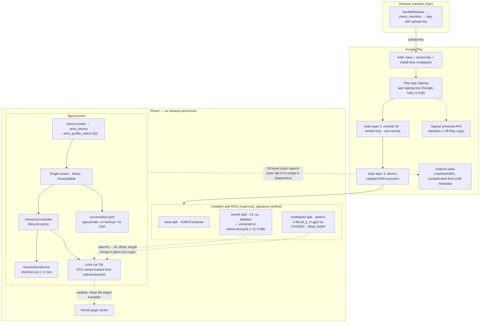
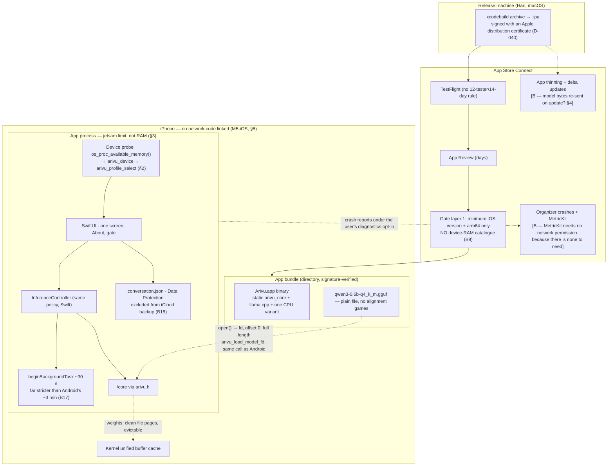
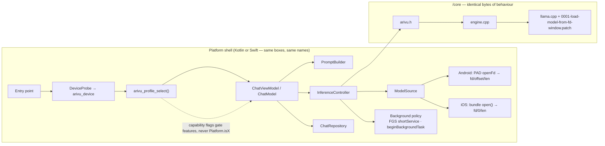
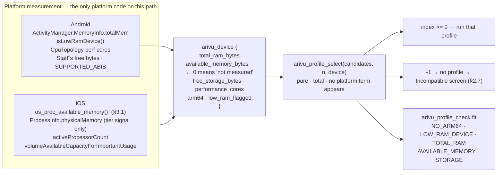
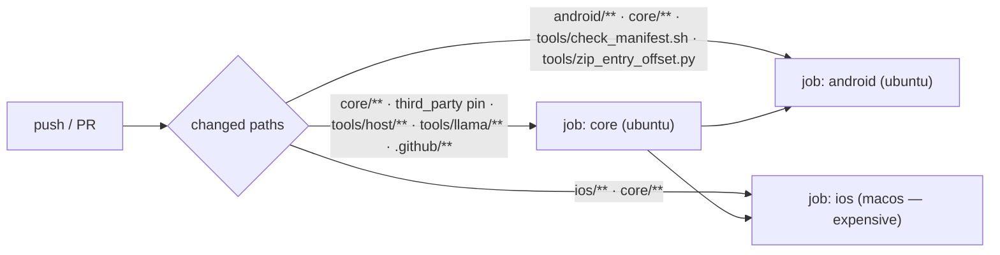

# Architecture Leaf

Sub-files: [`architecture/release-and-signing.md`](architecture/release-and-signing.md) (keys, Play App
Signing, release pipeline) · [`architecture/threat-model.md`](architecture/threat-model.md) ·
[`architecture/ios-port.md`](architecture/ios-port.md) (the port analysis that fed D-037; re-stamped
0.2, partly superseded by §§2–4 here).

`release-and-signing.md` and `threat-model.md` are **deliberately still stamped 0.1**: neither has
been reconciled to two platforms, and stamping them 0.2 would claim work that has not been done.
W72 is the iOS section of `release-and-signing.md`; the threat model needs its own iOS pass (no work
item proposed yet — it should follow the first iOS build, not precede it).

Evidence labels, as in the sub-files:
**[V-doc]** verified against current vendor documentation (URL in Sources) ·
**[V-local]** verified in this repo by command or file inspection ·
**[B]** architect's belief, not verified — each one names the check that would settle it.
Nothing in this Leaf is a measurement on a physical phone; `leaves/NOTES.md` owns those.

## Leaf changelog

- **2026-09-15 (c)** — **Re-stamped to Spine 0.2.** iOS in scope, R7 withdrawn, C11 added.
  Redrew the system as one core and two shells; specified the C API boundary and its enforcement
  ladder; reviewed and ratified the profile object that landed in `/core` mid-pass, and
  specified where the boundary now sits (§2); worked the iOS memory budget and the entitlement
  against current Apple documentation (§3); recommended bundled packaging on iOS (§4); designed tags,
  commit scopes and the three CI jobs (§5); answered the one-product-or-two question with a
  four-part fork test (§6); re-walked the boundary review and added B13–B22 (§10).
- **2026-09-15 (b)** — Deployment review. Measured compute buffers (300.75 MiB at the shipped config, not
  ~80 MB); boundary review against code; release/signing architecture; threat model; Build vs Adopt
  rows for Play-side services. Spine 0.1.
- **2026-09-15 (a)** — First Leaf. Spine 0.1.

---

## 0. What Spine 0.2 changed, architecturally

Three things, and only the third is hard.

1. **The engine moved below a platform boundary.** `/core` is C++ with a C API
   (`core/include/arivu/arivu.h`); `/android` and `/ios` are shells. That is a file move plus a
   rule, and the rule has a harness (`tools/host/run_smoke.sh`).
2. **A second shell exists.** Everything in the old Leaf that said "the phone" now has to say
   which phone, or say nothing platform-specific at all. Most of it turned out to be Android
   packaging detail (B3, B4, B9) that simply does not apply on iOS.
3. **C11 says capability follows the device, not the platform.** This is the one that needed new
   architecture, because nothing in the code represented "what this device can carry" — `Policy.kt`
   was a single hardcoded tier inside the Android app, and copying it into Swift would have
   satisfied the letter of "one product" while breaking it in practice within two releases. During
   this re-walk the Core/Tools Leaf landed the mechanism in `/core` (`arivu_profile`, `arivu_device`,
   `arivu_profile_select`) [V-local]. §2 reviews that design, says where the boundary now sits and
   why, and names the three things still missing — chief among them that **no shell calls it yet**.

The through-line: **the divergence between platforms must be pushed into data, not code.** A
profile table is data. `#if os(iOS)` around a feature is a fork with a delayed fuse.

---

## 1. System — one core, two shells

### 1.1 Repository map and ownership

```mermaid
flowchart TB
  subgraph shared["Shared — changes here fan out to both stores"]
    TP["/third_party/llama.cpp<br/>pinned commit 38a5b42 + patch 0001 (fd window)"]
    CORE["/core — arivu_core (static)<br/>engine.cpp · arivu_c.cpp<br/>include/arivu/engine.h (C++, internal)<br/>include/arivu/arivu.h (C, the boundary)"]
    TOOLS["/tools<br/>host smoke (the contract) · bench · fetch_llama · fetch_model<br/>check_manifest · zip_entry_offset · trace · sequence · propagate"]
    LEAVES["/leaves<br/>SPINE · BRIEF · MULTIPLATFORM · decisions.yml · NOTES.md · Leaves"]
  end
  subgraph android["/android — Play shell"]
    JNI[":llama · jni_bridge.cpp + LlamaNative/LlamaEngine"]
    KT[":app · Compose, ChatViewModel, InferenceController, Gate"]
    PACK[":modelpack · install-time PAD asset pack"]
  end
  subgraph ios["/ios — App Store shell"]
    SW["ArivuCore.swift bridge over arivu.h"]
    UI["SwiftUI · one screen, About, gate"]
    BUN["Model in the app bundle (§4)"]
  end
  TP --> CORE
  CORE -->|"arivu.h — C only"| JNI
  CORE -->|"arivu.h — C only"| SW
  TOOLS -->|"builds and runs /core with no platform SDK"| CORE
  JNI --> KT
  PACK --> KT
  SW --> UI
  BUN --> UI
  LEAVES -. "one Spine, one decisions.yml, one NOTES.md" .-> android
  LEAVES -. .-> ios
```

| Directory | Owner Leaf | Builds with | May depend on |
|---|---|---|---|
| `/core` | Core/Tools Engineering | host toolchain only | llama.cpp, libc, libc++, POSIX, `<mach/mach.h>` |
| `/android` | Android Engineering | NDK r27+, AGP | `/core` via `arivu.h`, Android SDK/NDK |
| `/ios` | iOS Engineering | Xcode | `/core` via `arivu.h`, Apple SDKs |
| `/tools` | Core/Tools Engineering | host toolchain, Python, JDK | `/core`, bundletool |
| `/leaves` | each Leaf owns its file | — | — |

### 1.2 The C API boundary — what may cross

`core/include/arivu/arivu.h` is the entire public surface. It is C, not C++, because Swift imports C
directly. Both shells must speak only this header [target state; **not true today** — see B14].

**Downward (shell → core), the complete list:**

| What | Form | Why it is allowed |
|---|---|---|
| Model bytes | `fd`, `offset`, `length` — or a `const char *` path | One signature covers an APK window and a bundle file. iOS passes offset 0 |
| Engine configuration | `arivu_context_params` (n_ctx, n_batch, n_threads, kv_q8_0, repack) | The engine-relevant *subset* of a profile (§2). Plain integers and bools |
| Sampling | `arivu_sampling_params` | Same |
| Prompt | `const char *` + length, UTF-8, already templated by the shell | The chat template is product policy and stays above the line |
| Reply cap | `int32_t max_new_tokens` | |
| Cancel | `arivu_cancel`, thread-safe | The one call that may arrive off the owning thread |
| A log sink | `arivu_log_fn` + opaque `void * user_data` | Lets Android reach logcat and iOS reach `os_log` without the core knowing either exists |
| Error space | caller-owned `char * err_buf`, `size_t err_len` | No allocation crosses the boundary in either direction |

**Upward (core → shell), the complete list:** complete UTF-8 pieces through `arivu_piece_fn` (never a
partial codepoint); `arivu_stats` (stop reason enum, token counts, timings); `bool` success;
`int32_t`/`int64_t` counts; a NUL-terminated message written into the caller's buffer; `const char *`
static literals (`arivu_version`).

**What must not cross, and what each prohibition buys:**

| Prohibited | Concretely | What breaks if it crosses |
|---|---|---|
| Platform handles | `JNIEnv *`, `jobject`, `AAssetManager *`, `NSObject`, `CFTypeRef`, `NSURL`, `MTLDevice` | `/core` stops building on the host; the contract harness dies and with it every claim below |
| C++ in the signature | `std::string`, `std::function`, `std::vector`, references, exceptions | Swift cannot import it; ABI becomes compiler-dependent |
| Heap ownership | Core returning memory the shell must free, or vice versa | Two allocators, two languages, one leak nobody can find on a 4 GB phone |
| llama.cpp / ggml types | `llama_*`, `ggml_*` anywhere in `arivu.h`, or called from a shell | The pinned-runtime boundary leaks; bumping llama.cpp becomes a two-shell migration. **Violated today (B14)** |
| Product policy | Chat template, system prompt, truncation rule, idle timers, gate thresholds, profile selection, capability flags | These are the product. Below the boundary they become two implementations that drift (C11) |
| User-facing text | Any English sentence, any localisable string | The core returns `ARIVU_STOP_CONTEXT_FULL`; the shell decides what the user reads (C7) |
| Filesystem decisions | The core inventing a path, opening a file by name it chose, writing a cache | Sandboxes differ; the shell owns every path and every fd |
| Platform conditionals for *behaviour* | `#ifdef __ANDROID__` / `#if TARGET_OS_IOS` selecting a feature or a limit in `/core` | This is C11's failure mode in its purest form |

One deliberate exception, written down so it is not mistaken for a leak: `arivu_c.cpp` uses
`<mach/mach.h>` on Apple and `/proc/self/status` elsewhere to read the process's own RSS. Those are
kernel interfaces available without any framework or SDK, and they exist so that M3 can be measured
by the same code on both platforms. The rule is "no platform **SDK**", not "no platform".

### 1.3 Enforcement — a ladder, cheapest rung first

The rule is only as real as the thing that fails when it is broken. Five rungs, in order of cost:

| # | Check | Catches | Status |
|---|---|---|---|
| E1 | `/core/CMakeLists.txt` names no SDK, no toolchain file, no `find_library(android)` | A build-system leak | **holds** [V-local] |
| E2 | `tools/host/run_smoke.sh` — builds `/core` + llama.cpp with the host compiler and runs the behavioural smoke (fd window == path load, misaligned offset rejected, prefix reuse, cancel, ContextFull) | A source-level leak, and every engine regression | **holds** [V-local]; run by hand, not in CI (B21) |
| E3 | **Boundary lint** — grep `/core` for `<jni.h>`, `<android/…>`, `<Foundation/…>`, `<UIKit/…>`, `<Metal/…>`, `TARGET_OS_`, `__ANDROID__`; allow-list `<mach/mach.h>` | A leak that happens to compile on the host anyway (macOS has Foundation) | **proposed**, W67 |
| E4 | **C-API conformance** — compile a TU that includes only `arivu.h` as C99 with `-Wall -Werror -pedantic`, then `nm` the static library and assert the exported `arivu_*` set equals the header's | C++ creeping into the header; a missing `extern "C"`; a symbol the shells cannot link | **proposed**, W68 |
| E5 | **The C API is actually exercised** — the smoke harness links through `arivu.h`, not `engine.h` | The contract surface rotting while the C++ one works | **proposed**, W68 (see B13) |

E2 is the contract. The precise claim it supports, stated carefully because the shell script does
touch an Apple SDK path: on macOS `run_smoke.sh` pins `CMAKE_OSX_SYSROOT` to the Command Line Tools
SDK for libc++ headers and sets `GGML_METAL=OFF` [V-local]. That is a host C++ toolchain, not a
platform SDK: no Xcode, no iOS SDK, no NDK, no frameworks. On a Linux CI runner none of it applies,
which is why the `core` job (§5) belongs on Linux — it makes the claim unarguable.

### 1.4 Deployment — Android (unchanged from 0.1 except where the core moved)



### 1.5 Deployment — iOS

Three structural differences, and they are all simplifications except the last.



**What disappears on iOS** [V-local, from the code and D-013]: the `.gguf.so` naming trick, the
bundletool alignment rule, the 32-byte offset check, `useLegacyPackaging`, the seven CPU variants and
`ggml_backend_load_all_from_path` (every Apple ARM core is armv8.2+ with dotprod, so one statically
linked variant is correct), and the split-APK model entirely. B3 and B4 become Android-only rows.

**What gets harder:** background execution (B17), memory pressure with no useful callback (B19),
the absence of a device-exclusion catalogue (B9), and the fact that C3's proof — a permission the
app does not hold — has no iOS equivalent (B20, §5).

**Deliberate symmetry:** iOS opens the bundle file itself and calls `arivu_load_model_fd(fd, 0,
length, …)` rather than `arivu_load_model_path`. One loading path ships on both platforms; the path
variant stays a host-test convenience. Costs three lines of Swift, removes a whole class of "it only
happens on iOS" from the engine.

### 1.6 Component flow — both shells, one shape



The rule this diagram encodes: **the box names are the same on both platforms.** When an Android box
has no iOS counterpart (`GenerationService`) or vice versa, that is a platform mechanism serving a
shared policy, and the policy is named in the shared box (`Background policy`), not in the mechanism.

Iteration-2 note (D-005), unchanged: in a universal APK — including the one Play generates —
install-time pack assets are merged into the single APK's `assets/`, so `PadInstallTimeModelSource`'s
`openFd()` call works unchanged [B, verify in W18]. Consequence for R1: a Play-installed copy is a
set of split APKs, so its `sourceDir` is not shareable as one file. Only users who installed the
universal APK can seed P2P shares. **On iOS there is no R1 analogue at all** — no sideloading path
worth designing for, so iteration-2's P2P story stays Android-only and that is not a C11 violation:
C11 governs what the *app* can do, not how the OS lets people move installers around.

---

## 2. Profiles — capability follows the device (C11)

### 2.1 The problem this solves

C11 says an 8 GB Android phone and an 8 GB iPhone get the same profile. The failure mode it forbids
is not malice, it is convenience: someone measures a 4 B model on an iPhone 16 Pro, it works, and
`longform` ships "on iOS". Six weeks later Android flagship users ask why, and the answer is a shrug.
The architectural fix is to make "which platform" **unavailable as an input** to any feature
decision, by making the only available input a profile derived from a measurement.

### 2.2 Where the line ended up

The Core/Tools Leaf landed the profile as C types and C functions in `arivu.h`, not as a config file
read by each shell [V-local, `core/include/arivu/arivu.h`, `core/src/profile.cpp`, 2026-09-15]. That
is a **better answer than the one this Leaf was going to propose** (a shared YAML plus a selector
written twice against a shared fixture table), and it is worth saying why, because the reasoning
generalises to the next divergence:

> Selection arithmetic written once has **zero** drift. Selection arithmetic written twice against a
> shared fixture has *detectable* drift. Zero beats detectable whenever the thing being shared is
> arithmetic rather than judgement.

So the boundary for profiles sits here:

| Layer | What lives there | Why |
|---|---|---|
| **Platform shell** | *Measuring* the device — `ActivityManager.MemoryInfo` / `StatFs` / `CpuTopology` on Android, `os_proc_available_memory()` / `NSFileManager` on iOS — and filling in `arivu_device` | Only the platform can measure the platform. This is the one place platform code is unavoidable, and it produces numbers, not decisions |
| **Platform shell** | The **candidate list** handed to `arivu_profile_select`, and what a capability *unlocks in the UI* | This is product judgement, and §1.2 keeps product judgement above the line |
| **`/core`** | `arivu_profile`, `arivu_device`, `arivu_fit`, `arivu_profile_valid`, `arivu_profile_fits`, `arivu_profile_select`, `arivu_profile_context_params` | Pure arithmetic over measured numbers. No I/O, no clock, no platform type. Testable on the host in milliseconds |

The core's own comment states the split exactly right: *"The candidate list is the caller's product
decision; this function is only the arithmetic."* [V-local]

**One honest wrinkle, recorded as a tripwire rather than an objection.** `arivu_default_profile()`
also lives in the core, and it *is* product policy below the line — the shipped model, context,
thread count and capability set. With exactly one shippable profile (§2.8) that is the pragmatic
call and this Leaf endorses it. The tripwire: **the moment a second profile is shippable, the
candidate list must be constructed above the boundary**, or `/core` quietly becomes the place
product decisions live, and two years later nobody can say why the app does what it does without
reading C++. Proposed D-038 records this.

### 2.3 The object, as landed

```c
typedef struct {                       // core/include/arivu/arivu.h  — spine: C11, C8
    const char * id;                   // "compact"
    const char * model_id;             // "qwen3-0.6b-q4km"
    uint64_t     model_bytes;          // weights on disk == mapped size of the weights

    int32_t  n_ctx; n_batch; n_threads; bool kv_q8_0, repack;   // -> arivu_context_params

    int32_t  reply_reserve_tokens;     // held back for the reply when fitting history
    int32_t  max_reply_tokens;         // overrun is reported, never silent (C7)

    uint64_t kv_bytes_per_token;       // the memory model, in bytes:
    uint64_t compute_buffer_bytes;     //   peak = model_bytes
    uint64_t runtime_overhead_bytes;   //        + kv_bytes_per_token*n_ctx + compute + overhead

    uint64_t min_total_ram_bytes;      // floors the platform gate also enforces
    uint64_t min_free_storage_bytes;

    uint32_t capabilities;             // bitmask: ARIVU_CAP_CHAT | _TOOLS | _LONGFORM
} arivu_profile;
```

Field notes that matter architecturally:

- **The engine block is a *subset*, extracted by `arivu_profile_context_params()`.** Only that subset
  crosses into llama.cpp. The rest — reply caps, floors, capability flags — is read by the shell. So
  a profile is a product object that happens to contain an engine object, which is the right
  nesting: the engine never learns the word "profile".
- **`capabilities` is a bitmask of flags, not a tier number.** Tiers imply ordering and invite
  "iOS is tier 2". Flags force each feature to name what it needs. `ARIVU_CAP_TOOLS` is present and
  marked reserved against R2 — §6 argues that flag is a tripwire, not a roadmap.
- **The memory model is four numbers, not one.** That is what makes §2.5 possible: a profile's cost
  can be recomputed from measured buffer sizes instead of being a remembered figure in a table.
- **`min_total_ram_bytes` is a heuristic floor and `available_memory_bytes` is the real one.** The
  profile carries both because Android can only offer the first and iOS can offer the second. §3.2
  is about the second one being subtler than it looks.

What the struct does **not** have, and this Leaf thinks it should — three requests to Core, in
descending order of consequence:

| # | Missing | Why it matters | Where |
|---|---|---|---|
| R-a | A split between **mapped** bytes and **dirty footprint** bytes in the peak estimate | `arivu_profile_estimated_peak_bytes` adds `model_bytes` into one figure, and the shell compares that figure against `available_memory_bytes`. On iOS those are **not the same currency** — see §3.2. This is the single most consequential correction in this Leaf | §3.2, W82 |
| R-b | A **headroom margin** — `arivu_profile_fits` currently accepts when `available_memory_bytes >= estimated_peak_bytes` with no margin [V-local] | `os_proc_available_memory()` is advisory and moves; jetsam is a hard kill with no callback. Accepting at exactly 1.00× means accepting a device that will fit until the user opens the camera | §3.1, D-043 |
| R-c | **Provenance** of `available_memory_bytes` — probed, or inferred from total RAM | Android cannot probe it; iOS can. A gate decision made on a heuristic and one made on a measurement deserve different margins, and a field report should say which it was | §2.4 |

### 2.4 Probe → device → profile



Two encodings in `arivu_device` are worth defending, because both look like platform leakage and
neither is:

- **`available_memory_bytes == 0` means "not measured"**, and `arivu_profile_fits` skips the check
  entirely in that case [V-local]. That is the honest encoding: Android genuinely cannot answer the
  question, so it declines to, rather than inventing a number. The cost is that Android's gate is
  strictly weaker than iOS's, which is true and should be visible.
- **`low_ram_flagged` is documented "false on iOS"** — because `isLowRamDevice()` has no iOS
  counterpart. This is a *measurement one platform can make*, not a rule keyed on platform. The
  distinction is the whole of C11: a field that says "Android measured this and iOS could not" is
  fine; a field that says "on iOS, do less" is not.

**`arivu_fit` is a product gift nobody asked for.** Today the Android gate has one Incompatible
screen with one sentence. The fit enum distinguishes "not enough memory" from "not enough free
storage" from "this is a 32-bit phone", and those deserve different sentences — the storage one is
even actionable. Design Leaf request: three or four gate messages keyed on `arivu_fit_name()`,
same on both platforms (W83).

### 2.5 Validating a profile against measured memory

A profile that claims 670 MB and costs 900 MB is worse than no profile: it gets past the gate and
then dies. Three checks, at three different times.

| When | Check | Fails how |
|---|---|---|
| **CI (`core` job)** | Create a context with the profile's `arivu_profile_context_params()` on the host; read `arivu_compute_buffer_kib()` and llama.cpp's KV size; assert the measured figures match the profile's `compute_buffer_bytes` and `kv_bytes_per_token × n_ctx` within a tolerance | Build fails. **A profile cannot be edited into a shape it cannot afford**, and the numbers in the struct stop being folklore |
| **Runtime, before committing** | `arivu_profile_fits`, with the margin requested in R-b | The device gets the next profile down, or none |
| **Runtime, after the first generation** | Read `arivu_memory_kb()` peak (and on iOS, `phys_footprint`). If the peak exceeds the profile's estimate by more than ~10%, record it app-privately; on the **next cold start** the probe subtracts the overshoot from `available_memory_bytes` | The device demotes itself once and stays stable |

The first check is the one that pays for itself immediately, because buffer sizes are
graph-determined: they are identical on host and phone [V-local — that reasoning is how the 0.1
budget table was built and the emulator then matched it to 1.5 MiB]. **So the affordability of a
profile is settled before anyone owns an iPhone**, and the only open number is the device's side of
the inequality — which is §3.

The third check is the only self-healing path and needs two guardrails. It must not be silent in the
sense of "the app quietly got worse forever", and it must not become a dialog or a setting (C8). The
resolution: demotion is invisible in the moment, visible in About ("Arivu is running in its smaller
configuration on this phone"), and one-way within an install. It never promotes back on its own,
because a phone that overshot once under real multitasking will do it again, and an oscillating
profile is worse than a small one.

### 2.6 Gating features on capabilities

```
if (arivu_profile_has(&profile, ARIVU_CAP_LONGFORM)) { … }    // legal
if (Platform.isIOS) { … }                                     // forbidden for behaviour
#if os(iOS) … beginBackgroundTask … #endif                    // legal — mechanism, not feature
```

The line: **a platform conditional may choose *how* something is done; it may never choose *whether*
a user-visible thing exists, or *what limit* applies.** Both shells get a lint (W67) that flags a
platform conditional whose body mentions a capability constant, a profile field, or a user-facing
string. It will produce false positives; the allow-list entry is a comment with a reason, which is
the point — each exception gets argued once, in writing, where the next person can read it.

`arivu_profile_valid` already enforces one cross-field rule of this kind: `tools` and `longform`
require `n_ctx >= 4096` [V-local]. That is the right shape — a capability states its own
precondition in terms of the profile, and a profile that claims a capability it cannot carry fails
validation rather than failing a user.

### 2.7 A device that qualifies for no profile

`arivu_profile_select` returns `-1`, and that is a first-class state, not an error:

| | Android | iOS |
|---|---|---|
| Screen | Incompatible screen, one button | Same screen, same words, **no button** |
| Action offered | `ACTION_DELETE` → system uninstall dialog (D-006, verified on an API 36 emulator) [V-local] | **Nothing.** iOS apps cannot offer to uninstall themselves. The screen says how, in one line |
| Reason shown | from `arivu_fit_name()` (W83) | same |
| How often it is reached | Rarely — gate layers 1 and 2 keep most such phones from installing at all | **Often** — no device-exclusion catalogue exists (B9), so the only pre-install filter is the minimum iOS version |
| What it cost the user | An install they can undo | A ~400 MB download they paid for and cannot un-pay (§4) |

That last row is the architectural consequence, and it is this Leaf's strongest argument for setting
the iOS minimum version from the profile table rather than from convenience:

> **The pre-install filter and the runtime gate must agree.** The minimum iOS version is the lowest
> version whose slowest supported device still passes `arivu_profile_fits` for `compact`. Anything
> looser ships a 400 MB download that ends in a wall, and C6 — "will not pretend to work on a phone
> it cannot serve well" — is met in letter and broken in spirit.

C6 is satisfied on both platforms; the mechanism differs and the difference is **forced by the OS,
not chosen**. That is the template for every future divergence: name the commitment, name the
mechanism per platform, and write down that the mechanism was forced.

### 2.8 What is actually shippable in 0.2

One profile: `compact` — `arivu_default_profile()`. `standard` (4 B, 8192 ctx, `longform`) is
unshippable on both platforms today: on Android because no 4 GB phone reaches it, on iOS because of
§4 before §3. The honest statement, recorded now so the schema is not retro-fitted later:

> **In iteration-1 the profile chooses context, threads and capability flags — not the model.** A
> build that could choose between models would have to ship both (size) or download one (C1).

Which means the first real test of C11 is not `compact` vs `standard`. It is the day an 8 GB Android
phone and an 8 GB iPhone both run `arivu_profile_select` over the same two-element candidate list
and get the same index. Until then C11 is load-bearing architecture with nothing loaded on it — and
that is fine, as long as nobody mistakes "not yet exercised" for "not needed".

---

## 3. iOS memory reality

Every claim here is labelled. `[V-doc]` means a current Apple documentation page says it, quoted,
with the URL in §3.7. `[V-fwd]` means an Apple DTS engineer said it on the developer forums.
`[C]` means **community-reported** — measured by someone, published, not Apple's word, and not
reproducible across OS versions. `[B]` means this Leaf's inference.

**Apple publishes no numeric per-app memory limits anywhere** [V-doc, by absence — the jetsam and
entitlement pages describe the mechanism and say "supported devices" without a single figure]. Every
number in this section that is not ours is `[C]`, and should be read as an order of magnitude.

### 3.1 The number that matters is not RAM

| API | What it returns | Use |
|---|---|---|
| `os_proc_available_memory()` | "the amount of memory available to the current app" — bytes allocatable before hitting the app's **current memory limit**; 0 if the caller is not an app or is already over. `<os/proc.h>`, **iOS 13.0+** [V-doc] | **The gate input.** `arivu_device.available_memory_bytes` |
| `ProcessInfo.processInfo.physicalMemory` | Installed RAM in the device | A coarse tier signal only. `arivu_device.total_ram_bytes`. **Never** the gate input |

Apple's own discussion imposes two rules that shape the design [V-doc]: the value is **advisory**,
and it **must not be cached** because "it changes frequently"; and the app must not try to consume
up to the reported figure. So the probe re-reads it at every cold start (§2.4 already says the
profile is re-selected each launch, which turns out to be required, not merely tidy), and
`arivu_profile_fits` must leave a margin rather than accept at 1.00× — request R-b.

`os_proc_available_memory()` reflecting the *jetsam* limit specifically is `[B]`, strongly held: the
doc says "current memory limit" without using the word jetsam, and the equivalence is what Apple's
own entitlement page implies by telling you to call this function to discover the raised limit
(§3.3). Behaviour on the Simulator is `[C]`/unverified — Simulator does not enforce device jetsam
limits, so **simulator numbers are non-representative and must be labelled so in NOTES**, exactly as
the Android emulator rows already are.

How the kill actually arrives, which matters because it determines whether a callback-based policy
can work at all:

- **Jetsam** terminates apps under memory pressure; the report reason `per-process-limit` means
  "Process exceeded the resident memory limit", and Apple notes **"Extensions have much lower
  per-process limits than foreground apps"** [V-doc].
- **`EXC_RESOURCE`** with subtype `MEMORY` means "the process crossed a memory limit imposed by the
  system; may be a precursor to termination for excess memory usage", and with the note
  `NON-FATAL CONDITION` the OS filed a crash report **without** killing the process [V-doc].
- So there can be a warning shot before the kill — but the kill itself is `SIGKILL` with no
  backtrace and no callback [B, synthesised from those two pages]. **A lifecycle policy on iOS
  cannot be reactive.** That is B19, and it is why `compact`'s iOS safety margin is a design input
  rather than a nicety.

Community figures, for order of magnitude only `[C]` — none of these is Apple's word, and the
relationship between installed RAM and the per-app ceiling is demonstrably not proportional and has
moved across iOS releases:

| Device `[C]` | Reported per-app ceiling |
|---|---|
| iPhone 12 / 12 mini, 4 GB, no entitlement | jetsam around ~2.1 GB |
| iPhone 13, 4 GB, **with** entitlement | ~2.2–2.3 GB available |
| iPad Pro 11", 4 GB, with entitlement | ~2.8 GB |
| M1 iPad Pro (up to 16 GB), iOS 15 era | ~5 GB standard per-app limit — "less than a third of physical RAM" |
| iPhone 17 Pro, 8 GB, iOS 26 era, with either memory entitlement | ~3.65 GB allocated, peak ~4.65–4.78 GB observed |

MULTIPLATFORM's recorded figure — "roughly 1.3–2 GB before jetsam on a 4 GB iPhone" — sits at the
conservative end of that range and this Leaf keeps it as the planning number.

### 3.2 The fact that decides everything: clean mmap pages are not charged

This is the most consequential thing in §3, and it is the thing most likely to be got wrong.

Jetsam's per-process accounting is based on **`phys_footprint`**, which counts dirty and compressed
memory and **excludes clean file-backed pages** — including pages mapped from a file with `mmap`
`[B, strongly supported by community and kernel-internals sources; NOT a quoted Apple sentence]`.
Arivu's weights are exactly that: mapped from the bundle file, never written, never `mlock`ed,
`repack: false` [V-local, `Policy.REPACK_WEIGHTS` and the profile's `repack` field].

If that holds, `compact`'s two numbers are very different:

| | Bytes | Charged against the iOS limit? |
|---|---|---|
| Weights, mapped clean | 373 MB | **No** (if the above holds) |
| KV cache @ 2048, q8_0 | 119 MB | Yes — anonymous, dirty |
| Compute buffers (`n_outputs_max = 1`) | 28 MB | Yes |
| Shell: app binary, SwiftUI, framework text | ~150 MB, much of it clean framework pages | Partly |
| **Peak RSS (the M3 number)** | **~670 MB** | — |
| **Peak `phys_footprint` (the number jetsam reads)** | **~300 MB `[B]`** | — |

**Consequence: `compact` fits on an iPhone with room to spare, with no entitlement, and it is not
close.** Even at the most pessimistic reading — the clean-pages fact is wrong and the full 670 MB is
charged — 670 MB against a conservative ~1.3 GB ceiling still fits, with a margin that is thinner
than one would like but real. Both readings say ship it; they disagree only about how much room the
next profile would have.

Three things follow, and they are the practical output of this whole section:

1. **Request R-a to Core is now concrete.** `arivu_profile_estimated_peak_bytes()` adds `model_bytes`
   into a single figure which the shell then compares against `available_memory_bytes` [V-local].
   On iOS those are different currencies, and the comparison is wrong in the *conservative*
   direction — it will refuse devices that would have worked. Split the estimate:
   `estimated_mapped_bytes` (weights) and `estimated_footprint_bytes` (KV + compute + overhead), and
   compare the footprint figure against the probed number. On Android the sum stays the right
   comparison against `totalMem`, so both platforms get a correct rule out of one struct (W82).
2. **`repack: true` would be far more expensive on iOS than on Android.** D-015 already keeps it off
   so the weights stay evictable. On iOS repacking would additionally move ~373 MB from *uncharged*
   to *charged*, turning a comfortable profile into a marginal one. D-015's answer does not change;
   its reasoning gains a second, sharper limb, and whoever revisits it for a speed win on a flagship
   needs to know that the iOS bill is different from the Android one.
3. **This is the first thing W81 must measure**, and it is measurable in an afternoon: peak RSS and
   peak `phys_footprint` (from `task_info` / `TASK_VM_INFO`) during one generation on a physical
   iPhone. If footprint ≈ 300 MB the headroom question is closed for `compact` forever. If footprint
   ≈ 670 MB, the iOS margin becomes a live constraint and R-b's margin has to be chosen carefully.

### 3.3 The entitlement

`com.apple.developer.kernel.increased-memory-limit` — a Boolean, **iOS 15.0+, iPadOS 15.0+,
visionOS 2.5+** [V-doc]. What Apple actually says, quoted:

> "A Boolean value that indicates whether core features of your app may perform better with a higher
> memory limit on supported devices." … "If you use this entitlement, make sure your app still
> behaves correctly if additional memory isn't available." … "An increased memory limit is only
> available on some device models. Call the `os_proc_available_memory` function to determine the
> amount of memory available." [V-doc]

Three things that sentence does and does not grant:

- **It grants nothing specific.** Apple names no devices and no figures. `[C]` reports put the gain
  at a few hundred MB to ~1 GB depending on device and OS, and several forum threads report the
  ceiling **not** visibly moving after adding it — attributed to device gating, OS version, or
  confusion between the virtual-address ceiling and the footprint budget `[B]`.
- **Apple requires the app to work without it.** "Make sure your app still behaves correctly if
  additional memory isn't available" is not advice, it is the condition of use. So the entitlement
  can never be a *precondition* for a profile; at most it can raise the number the probe reads.
- **How you enable it is genuinely unsettled.** An Apple DTS engineer (Quinn) stated it appears as
  "Increased Memory Limit" in Certificates, Identifiers & Profiles and is **not** available in
  Xcode's Signing & Capabilities editor (tested with Xcode 13.1) [V-fwd]; a 2026 community write-up
  says it is now addable directly in Xcode `[C]`. No dated Apple changelog resolves this. **Check it
  in the current Xcode before relying on either path.**
- **Whether App Review questions it: UNVERIFIED.** No documented pre-approval gate was found for
  this specific entitlement. Apple's general position is that appropriate use of entitlements falls
  under App Review's purview, and secondary sources asserting a formal approval requirement read as
  inference from that general clause rather than a documented gate `[B]`. Treat "Review may ask" as
  a live possibility with no evidence either way.

The sibling entitlement is a different thing and is often confused with it.
`com.apple.developer.kernel.extended-virtual-addressing` — **iOS 14.0+** — is about *address space*:
"whether the app may access an extended address space… games that memory map assets to stream to
the GPU may benefit from a larger address space", and Apple describes it as addable in the Xcode
project editor [V-doc]. **Footprint versus address space** is the distinction: `increased-memory-limit`
is about how much real dirty memory you may hold before jetsam kills you; `extended-virtual-addressing`
is about how much you may *map*. For `compact`, 400 MB mapped into a 64-bit address space needs
neither. For a hypothetical 2.5 GB `standard`, the address-space one is the more likely requirement.

`com.apple.developer.kernel.increased-debugging-memory-limit`: **no evidence it exists.** A
reasonably thorough search found no Apple page, forum thread or third-party reference. Do not cite
it.

### 3.4 What is shippable

| Profile | Peak RSS | Peak footprint `[B]` | Entitlement needed? | Verdict |
|---|---|---|---|---|
| **`compact`** — 0.6 B, 2048 ctx | ~670 MB | ~300 MB | **No**, on either reading of §3.2 | **Ship it.** On every iPhone that clears the minimum-version floor |
| `standard` — 4 B, 8192 ctx | ~3.07 GB | ~670 MB if §3.2 holds; ~3.07 GB if not | Probably not, *if* §3.2 holds; otherwise yes and only on unnamed "supported devices" | **Blocked by §4 before §3.** Packaging 2.5 GB is the binding constraint, not memory |

**Recommendation: do not request `increased-memory-limit` for iteration-1.** Four reasons, in order:
`compact` does not need it on either reading; Apple requires the app to work without it anyway, so
it can buy headroom but never a feature; it is device-gated with no published list, so it cannot be
relied on in a gate; and it adds an App Review question to a first submission that already carries
one (on-device model output, D-017/D-026). The entitlement is cheap to add later and expensive to
explain now.

**The C11-shaped part, which is the point:** if the entitlement is ever adopted, it must be an
**input to the probe, not a platform switch.** On a device where it is granted and effective,
`os_proc_available_memory()` returns a bigger number, `arivu_profile_select` picks a richer profile
over the same candidate list, and *no code names iOS*. An entitled iPhone and an 8 GB Android phone
arrive at the same profile by the same arithmetic. That is C11 working exactly as written, and it is
a good sign that the mechanism landed in §2 absorbs a platform-specific capability with no new
branch.

### 3.5 Metal, and why it is not a free win

`engine.cpp` sets `n_gpu_layers = 0` [V-local]. Keep it, and keep the comment, because it is
load-bearing rather than unfinished.

- On iOS's unified memory there is no separate GPU pool: Metal buffers and textures are allocated
  from the same physical RAM and count toward the app's footprint `[B, standard Apple guidance; not
  directly quoted this session]`.
- `MTLDevice.recommendedMaxWorkingSetSize` is "an approximation of how much memory this GPU device
  can allocate without affecting its runtime performance" — **iOS 16.0+** (it was macOS-only before
  that) [V-doc]. It is a *performance* hint, not the kill threshold. Exceeding it risks GPU thrash;
  exceeding the undocumented per-app footprint limit gets you killed. **Two separate, additive
  risks.**
- The architectural objection is stronger than either. **Metal buffers are dirty memory.** Offloading
  the weights to the GPU converts ~373 MB of uncharged, evictable, clean file-backed pages into
  charged memory (§3.2). That does not optimise the memory model, it **deletes the property the
  whole memory model rests on** — the one thing that makes a 400 MB model fit a phone that cannot
  spare 400 MB.
- And it fails fork-test 1 today (§6): there is no Android GPU path, so a Metal-only speed-up would
  be a capability reachable on one platform's hardware only.

So Metal is not a deferred optimisation, it is a **trade of memory for speed** — and on the Spine's
phone, memory is the scarce one. Revisit only if a Vulkan/OpenCL Android path exists and only for a
profile whose weights fit charged.

### 3.6 What must be measured before any of this is load-bearing (W81)

Nothing in §3 has run on an iPhone. In priority order, on a physical device, airplane mode:

1. Peak RSS **and** peak `phys_footprint` during one `compact` generation — settles §3.2, and it is
   the single highest-value hour of iOS work available.
2. `os_proc_available_memory()` at launch, after model load, and while another heavy app has been
   used — settles R-b's margin. The number moves; how much it moves is the margin.
3. Time-to-jetsam under deliberate multitasking (camera, maps, a browser with tabs) with Arivu in
   the background holding a context, versus the same with the context freed — settles whether B19's
   budgeted policy is sufficient.
4. Cold time to first token and decode tok/s, for M1/M2 — and label simulator results
   non-representative, as the Android emulator rows already are.
5. Only if `standard` ever becomes live: whether the entitlement moves the number on a real device.

### 3.7 Sources for §3

- `os_proc_available_memory` — https://developer.apple.com/documentation/os/os_proc_available_memory
- Increased memory limit entitlement — https://developer.apple.com/documentation/bundleresources/entitlements/com.apple.developer.kernel.increased-memory-limit
- Extended virtual addressing entitlement — https://developer.apple.com/documentation/bundleresources/entitlements/com.apple.developer.kernel.extended-virtual-addressing
- Jetsam event reports — https://developer.apple.com/documentation/xcode/identifying-high-memory-use-with-jetsam-event-reports
- `EXC_RESOURCE` — https://developer.apple.com/documentation/xcode/exc_resource
- `recommendedMaxWorkingSetSize` — https://developer.apple.com/documentation/metal/mtldevice/recommendedmaxworkingsetsize
- Apple DTS on enabling the entitlement — https://developer.apple.com/forums/thread/685084
- Community: iOS 15 memory entitlement — https://9to5mac.com/2021/06/25/apps-can-request-access-to-more-ram-with-ios-15-entitlement-exceeding-normal-system-memory-limits/
- Community: 2026 measurements with both entitlements — https://zenn.dev/mtfum/articles/ios_memory_entitlements
- Community/kernel internals on memory pressure and `phys_footprint` — http://newosxbook.com/articles/MemoryPressure.html

---

## 4. Packaging the model on iOS

### 4.1 The limits, verified

| Limit | Value | Label |
|---|---|---|
| Max **uncompressed app size**, iOS deployment target 9.0+ | **4 GB** | [V-doc, App Store Connect "Maximum build file sizes"] |
| Max **executable** size (total of all `__TEXT` sections) | **80 MB** | [V-doc, same page] |
| Cellular download threshold | **200 MB**, long-standing, user-overridable in Settings since iOS 13 | `[C]` — widely reported since May 2019; **no current first-party Apple page states a numeric figure**, and the App Store Connect size page does not mention a cellular limit at all |
| ODR: max asset-pack (tag) size | 512 MB before iOS 18; **8 GB** on iOS 18+ | [V-doc, App Store Connect "On-demand resources size limits"] |
| ODR: initial-install + prefetched tags | 4 GB before iOS 18; no limit on iOS 18+ | [V-doc, same] |
| ODR: total hosted | 20 GB before iOS 18; 70 GB on iOS 18+ | [V-doc, same] |
| **ODR status** | **Deprecated**, announced for iOS 27 / iPadOS 27 / tvOS 27 / visionOS 27, with **Background Assets** the designated replacement | `[C]`, corroborated by two independent searches incl. Apple's own page content; not re-quoted from raw HTML. Note iOS 26 is current in Sept 2026, so this is announced-and-scheduled, not yet enforced |
| Apple's own recommendation on the size page | "For larger assets, Apple recommends using Background Assets to host assets separately from your build" | [V-doc] |

Two of these matter more than the rest. **The 80 MB executable cap does not apply to the model**: it
governs compiled `__TEXT`, and a GGUF bundled as a resource is data, so the binding constraint for a
bundled model is the 4 GB app size. `compact` at ~400 MB is a tenth of that. And **ODR is on its way
out**, which turns option B below from "more machinery for the same bytes" into "more machinery for
the same bytes, on a deprecated API".

### 4.2 Does App Review treat model weights as "code"?

Guideline **2.5.2**, quoted in full [V-doc]:

> "Apps should be self-contained in their bundles, and may not read or write data outside the
> designated container area, nor may they download, install, or execute code which introduces or
> changes features or functionality of the app, including other apps. Educational apps designed to
> teach, develop, or allow students to test executable code may, in limited circumstances, download
> code provided that such code is not used for other purposes…"

Apple has never published guidance on whether model weights are "code" for 2.5.2 purposes
[**UNVERIFIED** — searched, not found]. The guideline's own language targets code "which introduces
or changes features or functionality", which reads as executable logic rather than passive data
consumed by an already-reviewed, fixed inference engine `[B]`. And the precedent is strong and
current: MLC Chat, PocketPal AI, Private LLM and others are live on the App Store and download
multi-GB GGUF weights after install `[C]`. So a first-run download is almost certainly *allowed*.

**This matters less than it looks, and the distinction is worth being precise about.** §4.3 does not
reject a first-run download because Review might refuse it. It rejects it because of what it does to
the product. 2.5.2 is a risk to note, not the argument.

### 4.3 The three options

| | **A — bundled in the IPA** | **B — On-Demand Resources** | **C — first-run download** |
|---|---|---|---|
| C1 "one tap, then it works" | **Kept** | Kept only for an *initial-install* tag — which is A with extra machinery. Any other tag breaks it | **Broken.** First launch is a progress bar |
| Network code in the shipped binary | **None** | None — the OS downloads, not app code `[B]`, confirm with `check_ios_binary.sh` | **Required** |
| What C3 can honestly claim | The strongest sentence available on iOS: *the binary links nothing that can reach the network* (§5.5) | Probably the same, pending the `[B]` above | **Collapses.** "Arivu never uses the network" becomes "Arivu uses the network once" — in a product whose whole proposition is the first sentence |
| Against the 200 MB cellular threshold | Above it: Wi-Fi or an explicit approval, once, before the user has committed | Same bytes, same threshold | Below it at install, above it at first run: the wait is **moved to after** the user committed, which is worse, not better |
| API health | Ordinary app bundle | **Deprecated** (§4.1) | Background Assets is current and well supported |
| Failure mode | None after install | Tag eviction: iOS may purge ODR assets under storage pressure, so the model can vanish from an installed app `[B]` | No network on first run = an installed app that does nothing. That is precisely the Spine's user, on the day she has no data left |
| Update cost | Whole model re-sent unless thinning/delta avoids it `[B]`, W75 | Re-downloaded per tag version | Independent of app updates — the one genuine advantage |

### 4.4 Recommendation

**Option A. Bundle the model in the app, and accept a ~400 MB install.**

**The trade-off, named:** a download most users must do on Wi-Fi, against putting a networking stack
inside a product whose entire proposition is that it has none.

On Android that proposition is *proved* by a missing permission that the OS enforces and
`check_manifest.sh` verifies on every build [V-local]. On iOS there is no permission to withhold, so
the only proof left is "this binary links no networking code" — checkable by anyone, from the
shipped binary. Option C deletes that proof to save the user a wait she will have on first run
anyway, and it deletes it in the one market where a first-run download is most likely to fail.
Option B pays extra machinery, on a deprecated API, for the same bytes and a new way to lose them.

Pay the download.

Three consequences to carry:

1. **The size becomes copy, not an apology.** "The model is inside the app; it never needs the
   internet again. Install on Wi-Fi." The Play listing already carries that line. GTM owns the
   wording; the architecture just has to not make it a lie.
2. **This is the ceiling on `standard`.** A 2.5 GB bundled model is legal (4 GB limit) but a very
   different download, and it pushes toward option C — which forks the privacy claim. That is §6's
   conclusion arriving from a different direction, and it is recorded as proposed D-041 so it is
   decided rather than discovered at submission.
3. **W75 must confirm that app thinning and delta updates leave the model intact and still mappable**
   at the first TestFlight build. Android has the same class of risk from Play's server-side
   repackaging (B4, W18), and it was worth checking there.

**Architectural symmetry worth stating:** Android's install-time asset pack and an iOS bundled file
are the same property — *the bytes arrive with the install; no app code fetches them* — expressed in
two packaging systems. Same promise, different mechanism, mechanism forced by the platform. The same
template as §2.7 and the same template every future divergence should follow.

---

## 5. Versioning, tagging, and CI

### 5.1 Three tag namespaces, one history

| Tag | Semver means | Cut when |
|---|---|---|
| `core/vX.Y.Z` | A statement about **`arivu.h` only**. MAJOR: a shell must change to compile or to behave the same. MINOR: new functions, existing ones unchanged. PATCH: behaviour-preserving | The `core` CI job is green on that commit, and only then |
| `android/vX.Y.Z` | The Play marketing version; `versionCode` train is separate and monotone | At upload to a Play track |
| `ios/vX.Y.Z` | The App Store marketing version; `CFBundleVersion` is the build train | At upload to TestFlight |

Core semver is about the *header*, not about model quality or tokens per second. That keeps the
question "does this core bump require an app change?" mechanically answerable by E4's symbol check.

**`git log core/v1.3.0..core/v1.4.0` must be useful**, which requires one discipline rule: **a commit
may not mix a `core` scope with a platform scope.** A change that spans the boundary lands as two
commits, core first. This costs a few seconds per change and buys: a core revert that does not drag
UI with it, a per-platform changelog that can be generated by filtering, and a range log that means
what it says.

### 5.2 Conventional commit scopes

`core` · `android` · `ios` · `tools` · `leaves`. Types as usual (`feat`, `fix`, `perf`, `refactor`,
`chore`, `docs`, `test`). Enforced by a commit lint in the `core` job — it is the job that runs on
every commit anyway, and the check costs milliseconds. Changelogs are generated per platform from
`scope ∈ {core, <platform>}` plus path filters, so a core fix appears in both apps' changelogs with
the core version that carried it.

### 5.3 Version provenance in the shipped artifact

Today `arivu_version()` returns the string literal `"0.1.0"` [V-local, `core/src/arivu_c.cpp`]. That
means a shipped build cannot say which core it contains, which makes a field report from a phone with
no network nearly useless. Required change (W70): inject the version at build time from
`git describe --tags --match 'core/v*' --dirty` into an `ARIVU_VERSION` compile definition, and show
the full provenance triple in About on both platforms:

```
Arivu 1.2.0 (Android)  ·  core 1.4.0  ·  llama.cpp 38a5b42  ·  model sha256 9052952c…4962
```

This is also the only in-app evidence a user or a reviewer has that the copy they are running is the
one that was published — it pairs with the signing-certificate screen in the threat model (T1).

### 5.4 The three CI jobs



| Job | Runner | Triggers on | Steps | Budget |
|---|---|---|---|---|
| **core** | ubuntu-latest | `core/**`, the llama.cpp pin, `tools/host/**`, `tools/llama/**`, workflows | **tier 1:** `tools/core_test.sh --logic-only` — seconds, links neither llama.cpp nor any SDK · **E3** boundary lint · **E4** C-API conformance · commit lint. **tier 2:** fetch+patch llama.cpp (cache keyed on the pinned SHA) · `tools/core_test.sh --with-engine` · `run_smoke.sh` (needs the model — cache it, or W80) · **§2.5** profile budget check | tier 1 < 60 s, tier 2 < 5 min. Both required on every PR |
| **android** | ubuntu-latest | `android/**`, `core/**`, the two tool scripts, `gradle/**` | `:app:testDebugUnitTest` (incl. the shared profile fixture) · `:app:lintRelease` · `:app:bundleRelease` (**unsigned**) · `tools/check_manifest.sh` (M5) · `zip_entry_offset.py` alignment check | ~15 min |
| **ios** | macos-latest | `ios/**`, `core/**` | `xcodebuild test` on a Simulator destination (incl. the shared profile fixture) · **`tools/check_ios_binary.sh`** (M5-iOS, below) · entitlements/Info.plist lint | ~20 min, path-filtered |

The two-tier split inside the `core` job is a gift from the `arivu_core_logic` target that landed on
2026-09-15 [V-local]: prompt building, truncation, profiles and UTF-8 boundaries compile and test with
*nothing installed*. That is MULTIPLATFORM's rule — "`/core` compiles and passes its tests with no
Android or Apple SDK present" — reduced to a check that runs in about a second on every commit, which
is exactly what makes it a habit rather than a ceremony.

**Fan-out:** only `core/**` triggers all three. That is the point of the split, and it is also the
reason a core change costs a macOS runner — a core change that breaks iOS should be found on the PR,
not at release.

**Branch protection gotcha, named so it is not rediscovered:** a required check that is skipped by a
path filter never reports, and the PR blocks forever. Either make only `core` a required check, or
pair each filtered job with a trivial "skipped-ok" job of the same name. Core/Tools Leaf's call at
implementation time.

**No signing in CI.** The 0.1 Leaf rejected release automation for iteration-1 (one person, one
release machine; an upload key in CI is a custody surface for no speed gain). That still holds, and
now applies twice: CI produces an unsigned AAB and an unsigned/simulator iOS build. Archiving and
signing stay on Hari's machine for both stores.

### 5.5 M5 on iOS — the missing mechanical proof

M5 today reads "Zero `INTERNET` permission in merged manifest", enforced by `check_manifest.sh` on
every build [V-local]. iOS has no such permission, so M5 as written is unmeasurable there, and C3's
strongest claim would rest on a promise.

The nearest mechanical equivalent, and it is a good one: **assert the shipped binary links nothing
that can reach the network.** `tools/check_ios_binary.sh` runs `otool -L` (and `nm -u`) against the
built app binary and fails if `CFNetwork`, `Network.framework`, `libcurl`, or the `NSURLSession` /
`URLSession` / `getaddrinfo` / `socket` / `connect` symbol set appear. It is not as strong as a
permission the OS enforces — a linked framework is capability, not use, and the check proves absence
of the capability rather than absence of intent — but it is checkable by anyone from the App Store
binary, which is more than a privacy label offers.

**Request to Hari (Spine wording):** M5 should read "no network capability in the shipped artifact,
by the strongest mechanism the platform offers", with two checkers named. That keeps one metric
across two platforms instead of inventing M7, and it is honest that the mechanisms differ in strength.

---

## 6. One product or two — the fork test

MULTIPLATFORM's third caution is right and slightly mis-aimed. It says a 4 B model with a tool
harness is a different product. The architectural answer is sharper: **the tools fork it, the
parameters do not.**

A 4 B model is a profile. It is more memory, more context, a bigger reply cap — all of them numbers
in an `arivu_profile`, reachable in principle by an 8 GB Android flagship and an entitled iPhone alike,
which is exactly what C11 describes. A tool harness is a new trust surface, a new persona and a new
answer to "what is this app for". Those are not numbers.

### The fork test

A proposed feature **F** stays inside one product only if all four hold. Any single failure means F
belongs to a different product that may share `/core` and `/tools`, and must not share the Spine.

| # | Test | Fails when |
|---|---|---|
| **1. Device-reachable both ways** | There is hardware on *each* platform that qualifies for a profile carrying F's capability, and hardware on each that does not | F is reachable only on one platform's hardware — then it is a platform feature and C11 forbids it outright |
| **2. Gracefully absent** | The app *without* F is still the same app: the empty state, the one screen and the Spine's sentence are unchanged | Removing F makes the product incoherent — then F is the new product's core, not a capability of this one |
| **3. Same user** | F serves Amaka, and its best one-line explanation names her | The honest explanation names a different persona ("developers", "power users", "people who already have a flagship") |
| **4. No new trust surface** | F adds no network, no filesystem reach beyond the sandbox's own documents, no background daemon, no account, no telemetry | F changes what the privacy sentence has to say — then it is a different product even if it fits in memory |

Applying it:

| Proposal | 1 | 2 | 3 | 4 | Verdict |
|---|---|---|---|---|---|
| 4 B model as the `standard` profile | pass (8 GB flagships exist on both) | pass | borderline — Amaka's phone never reaches it, but it is not *withheld* from her | pass | **One product.** A profile |
| 8192 context / `longform` | pass | pass | pass | pass | **One product.** A capability flag |
| Tool calling / agent loop (R2) | pass | **fail** — the tool app is not "the chat app with tools off" | **fail** | **fail** | **Fork** |
| Document import / RAG (R4) | pass | fail | fail | **fail** (filesystem reach) | **Fork** |
| Model picker (R3) | — | fail (C8) | fail | pass | **Fork**, and already a Spine refusal |
| Metal/GPU decode on capable devices | **fail today** — no Android GPU path exists | pass | pass | pass | **Not yet.** Revisit if a Vulkan/OpenCL path lands (§3.5) |
| iCloud/Drive conversation sync | pass | pass | fail | **fail** | **Fork** |

Test 1 deserves a caution: it is about *hardware existing*, not about hardware being common. If iOS
users happen to hold better hardware on average, more of them reach `standard`, and that is C11
working correctly — the profile was keyed on the device. C11 is violated by a *rule* that names a
platform, never by a *distribution* that differs.

### What stays one product, concretely

One engine, one C API, one profile schema (`arivu_profile`), one capability vocabulary, one
conversation schema, one
prompt/truncation policy, one `decisions.yml`, one `NOTES.md`, one privacy text, one report path, one
UI grammar (one screen, About, gate; same box names, §1.6).

### What a fork would look like, so it is cheap if it happens

The repo is already shaped for it: `/core` and `/tools` are the shared assets; `/android` and `/ios`
are shells. A fork adds a **third shell or a second application id with its own Spine**, above the C
API. It never adds a second core, and it never ships a profile carrying `ARIVU_CAP_TOOLS` —
because the moment that row exists, the profile table starts arbitrating between two products, and
the profile table becomes the fork nobody declared.

### The mechanical version of the test

MULTIPLATFORM puts it well: two products pretending to be one produce a README that cannot say what
the app is. Make that a release check (W71): `tools/release_check.sh` asserts that the one-sentence
description is byte-identical in `README.md`, both store listings, and the About screen on both
platforms. The day someone cannot make that sentence true in all five places, the product has forked
and the build says so.

---

## 7. Build vs Adopt

The moat is not the model or the runtime — both are commodity and permissively licensed. The moat is
**the harness**: an app that installs in one tap, never asks for anything, fits the phone it is on,
and is honest about what a small model is for. That is what we build. Everything about *trust in the
distribution channel* we adopt from the platform: building it ourselves would need a network.

Spine 0.2 adds one line to that: **the harness is now the harness plus the profile table.** Deciding
what a device can carry is product work, it is ours, and it is the part a fork cannot copy without
copying the measurements.

| Component | Decision | Triage | Why |
|---|---|---|---|
| Language model (Qwen3 0.6B Q4_K_M) | **Adopt** | Reuse | Apache-2.0 weights; training a model is not our product. Provenance: Unsloth re-quant (threat T7, proposed D-019) |
| Inference runtime (llama.cpp / ggml) | **Adopt** | Improvise | MIT, mmap, quantized KV, ARM variants. One small patch: load from fd window |
| CPU kernel selection, Android | **Adopt** | Reuse | ggml `GGML_CPU_ALL_VARIANTS` + `GGML_BACKEND_DL` picks dotprod/i8mm/sve at runtime. Cost: needs extracted libs (B3) |
| CPU kernel selection, iOS | **Adopt**, statically | Reuse | Every Apple ARM core is armv8.2+; one variant linked in, no `GGML_BACKEND_DL`, no directory scan, no extracted libs. B3 does not apply |
| **The C API boundary (`arivu.h`)** | **Build** | — | The only thing that makes "one product, two platforms" mechanical rather than aspirational |
| **Profile table + selector (§2)** | **Build** | — | C11 has no off-the-shelf equivalent. Thirty lines of rule and a data file, twice, against one fixture |
| Model delivery, Android | **Adopt** | Reuse | Play Asset Delivery install-time pack |
| Model delivery, iOS | **Adopt** the app bundle (§4) | Reuse | Bundled file. ODR and Background Assets rejected below |
| Alignment of the model inside the APK | **Build** (config) | Improvise | `.gguf.so` naming so bundletool page-aligns it (D-013). **Android-only**; no iOS analogue |
| Engine wrapper (prefix reuse, cancel, UTF-8 streaming, stop reasons) | **Build** | — | Product behaviour: visible truncation, stop at any token. Now shared by both shells |
| Lifecycle policy (lazy load, idle free, trim) | **Build** | — | The difference between "runs on 4 GB" and "gets killed on 4 GB". On iOS the difference is larger, because jetsam does not warn (§3, B19) |
| Compatibility gate | **Build** layer 3 + **Adopt** layers 1–2 on Android; **Build** layer 3 + **Adopt** layer 1 only on iOS | — | There is no App Store device-RAM catalogue (B9). Layer 1 on iOS is the minimum-iOS-version floor, chosen from the profile table (§2.7) |
| Prompt + truncation policy | **Build** | — | Honest positioning lives in the system prompt and the divider. Shared, ported not rewritten |
| UI | **Adopt** Compose/Material3 and SwiftUI, **Build** one screen twice | Reuse | Native on each. A cross-platform UI framework would buy shared pixels and cost the native feel, the binary size, and a third-party dependency tree in a product whose licence audit is a feature |
| Persistence | **Adopt** kotlinx.serialization / Codable | Reuse | One flat file. Same JSON schema on both, so a future export/import works |
| Licences screen, report intent | **Build** | — | Store policy + Apache NOTICE obligations. iOS: `MFMailComposeViewController` / share sheet |
| **App signing key custody, Android** | **Adopt** Play App Signing, Google-generated key | Reuse | A leaked app signing key turns repackaging into trusted updates; Google's HSM beats a laptop. D-018 |
| **App signing / distribution certificate, iOS** | **Adopt** Apple's managed signing | Reuse | Apple's model differs from Play App Signing and the custody question is *not* the same question. **Undesigned — proposed D-040**; `release-and-signing.md` needs an iOS section (W72) |
| **Off-Play artifact (iteration-2)** | **Adopt** Play's signed universal APK | Reuse | Same key by construction, same versionCode train. Android-only; no iOS analogue exists or is wanted |
| **Package registration / anti-impersonation** | **Adopt** Android developer verification + platform signature-update rule + Play Protect; on iOS, bundle-id ownership in App Store Connect | Reuse | Android's is the only anti-repackaging control that works without network. iOS's is weaker in kind but the sideloading exposure is also far smaller |
| **Tamper evidence for code** | **Adopt** bundletool code transparency (Android) | Reuse | Proves DEX + native libs unchanged by the store; separate key; not assets. No iOS equivalent |
| **Crash / ANR reporting** | **Adopt** Play Console vitals; **Adopt** Xcode Organizer / MetricKit on iOS | Reuse | No SDK possible without network on either. Data is collected by the OS under the user's diagnostics opt-in, not by the app [B] — Compliance to confirm both privacy forms |
| **No-network proof** | **Build** `check_manifest.sh` (Android) + **Build** `check_ios_binary.sh` (iOS, §5.5) | Improvise | The iOS one is the single highest-value iOS CI step: it is the only mechanical evidence for C3 there |
| **iOS On-Demand Resources** | **Reject** | — | §4: same bytes, more machinery, an eviction failure mode, the initial-install variant is just bundling — and it is **deprecated**, announced for iOS 27 with Background Assets as the replacement `[C]` |
| **iOS Background Assets framework** | **Reject** for iteration-1 | — | It is the right tool for a first-run download, correctly designed, currently supported, and Apple's own recommendation for large assets [V-doc]. A first-run download is the thing §4 refuses — on product grounds, not technical ones. If D-041 ever reverses that, this is the mechanism |
| **Metal / GPU decode** | **Defer** (§3.5) | — | Changes the memory model the whole budget rests on, and has no Android counterpart, so it would fail fork-test 1 today |
| **`increased-memory-limit` entitlement** | **Do not request in iteration-1** (§3.3–3.4) | Reuse | `compact` does not need it on either reading of §3.2; Apple requires the app to work without it anyway [V-doc]; it is device-gated with no published list, so it cannot be relied on in a gate; and it adds an App Review question to a submission that already carries one. If ever adopted, it is an input to the probe, never a platform switch |
| **`extended-virtual-addressing` entitlement** | **Not needed** for `compact` | Reuse | It grants address space, not footprint (§3.3). 400 MB mapped into a 64-bit space needs nothing. It is the more likely requirement for a hypothetical 2.5 GB `standard` |
| **Third-party Swift packages** | **Reject** | — | SwiftUI + `/core` is the whole app. Zero SPM dependencies keeps the licence audit (C4) unchanged and the supply chain (B10) one line long |
| **Privacy policy hosting** | **Adopt** a static page, no analytics, text mirrored in About | Reuse | Both stores require a policy URL even for apps collecting nothing [B, widely documented]. One text, two listings |
| **Play Integrity automatic protection** | **Reject** | — | Needs Play connectivity and pushes sideloaded users back to Play — breaks C2/C3 and R1 |
| Release automation / CI signing | **Reject** for iteration-1 | — | One person, one release machine; putting a signing identity into CI adds a custody surface for no speed gain. Now applies to both stores (§5.4) |

## 8. Trust mechanisms

| Mechanism | Android | iOS | Enforced by |
|---|---|---|---|
| No network capability | No `INTERNET` permission in the merged manifest | No networking framework or symbol linked in the binary | `tools/check_manifest.sh` (M5) · `tools/check_ios_binary.sh` (M5-iOS, W73) — both in CI |
| Data stays on the phone | `allowBackup=false`, `fullBackupContent=false`, extraction rules exclude cloud + D2D | Data Protection class + `isExcludedFromBackupKey` on the conversation file | manifest check (asserts `allowBackup` only — B6) · an iOS unit test asserting the resource value (B18) |
| Weights are evictable | mmap from the APK window, `load_mode=MMAP`, never MLOCK, repack off | mmap of the bundle file, same code path, same flags | `Policy`/profile `repack: false` · benchmark RSS · the shared `arivu_load_model_fd` call (§1.5) |
| KV cache is not left resident | context freed at idle / hidden / trim | context freed at idle / background / memory warning — and *pre-emptively*, because jetsam does not warn (B19) | `verify_lifecycle.sh` (W08) · an iOS equivalent (W74) |
| Model identity | sha256 pinned in `tools/fetch_model.sh`, shown in About | same file, same hash, same About line | fetch script · §5.3 provenance triple |
| Runtime identity | llama.cpp commit pinned + patch in repo; KleidiAI FetchContent off | same pin, same patch, one core | `tools/llama/fetch_llama.sh`, CMake cache, the `core` CI job |
| Core identity in a shipped build | `core/vX.Y.Z` from `git describe`, shown in About | same | W70 — **not true today**, `arivu_version()` is a literal (B15) |
| Model cannot be mapped misaligned | `llama_model_load_from_fd` rejects offset % 32 ≠ 0 | n/a — offset is 0 | runtime error + `zip_entry_offset.py` |
| Platform did not break the artifact | Play-generated splits + universal APK checked | App thinning / delta updates must not disturb the bundled model [B] | W18 (Android) · an iOS analogue at first TestFlight build (W75) |
| App identity across channels | one package, one app signing cert SHA-256, published | one bundle id, one team id | developer verification; signature-update rule; D-018 · D-040 |
| Code identity vs the store | code transparency file | no equivalent; source + reproducible build is the whole claim | `bundletool check-transparency` |
| One core, two shells | — | — | `run_smoke.sh` + boundary lint + C-API conformance (E2–E5) |
| Capability follows the device, not the platform | profile from `totalMem` heuristic | profile from probed headroom | the shared fixture table read by both test suites (W69) |
| Incompatible phones are told, not tortured | gate layers 1–3, uninstall offered | gate layers 1 and 3, uninstall impossible — the screen says so | unit tests + W10 · Console RAM rule · the iOS minimum-version floor (§2.7) |

## 9. Memory budget, per profile

Measured on host (macOS arm64, CPU backend, pinned llama.cpp 38a5b42, 2026-09-15) with a probe that
creates the context exactly as `engine.cpp` does. Buffer sizes are graph-determined, so they carry
over to both phones; **resident** size on a device is still W02's job (Android) and a new item's job
(iOS).

### `compact` — Qwen3 0.6B Q4_K_M, n_ctx 2048, q8_0 KV

| Allocation | BRIEF budget | Measured (buffer size) | Reclaimable | Controlled by |
|---|---|---|---|---|
| Weights, mmap'd file pages | ~400 MB | **372.65 MiB** mapped | yes | kernel (both platforms) |
| KV cache 2048 × q8_0 | ~115 MB | **119.00 MiB** | no | `arivu_free_context()` |
| Compute buffers, `n_outputs_max` default | ~80 MB | **300.75 MiB** | no | — |
| — same, `n_outputs_max = 1` | | **28.09 MiB** | no | shipped: `engine.cpp` sets both `n_outputs_max` and `n_outputs_max_per_seq` to 1 [V-local] |
| Output (logits) buffer | — | 0.58 MiB | no | |
| Native libs, file-backed text | — | ~6 MB of ~11.9 MB extracted (Android); ~1 CPU variant linked in (iOS) | yes | kernel |
| Shell (app + ART + Compose, or app + SwiftUI) | ~150 MB | not measured on either | no | — |
| **Peak RSS** | **≤ 800 MB (M3)** | ≈ 373 + 119 + 28 + 150 ≈ **670 MB** | | M3 |

Why the 300 MiB row still appears: this llama.cpp reserves the worst-case graph with
`n_outputs = min(n_tokens, n_outputs_max)`, and `n_outputs_max` defaults to `n_batch` — 512 outputs ×
151,936 vocab × 4 bytes ≈ 297 MiB of logits scratch that the engine never uses. `engine.cpp` now sets
it to 1 (26.59 MiB on host, 28.09 MiB on the emulator [V-local, NOTES round 2]). D-028 is still
pending Hari's stamp; the code already follows the recommendation. **This fix is now shared** — it
landed in `/core`, so iOS inherits it without anyone porting it. That is the monorepo paying for
itself once.

### The two ceilings this budget runs against

| | Android 4 GB (Amaka's phone) | iPhone, `compact` |
|---|---|---|
| What the number means | `totalMem` heuristic; the LMK is graded and gives `onTrimMemory` callbacks first | a probed per-process limit; jetsam kills without a callback (§3) |
| Ceiling | ~3.3 GiB `totalMem` floor (D-009, provisional, pending W02/W03) | ~1.3–2 GB probed headroom on a 4 GB iPhone (planning figure, `[C]`); **but jetsam charges `phys_footprint`, so the relevant cost is ~300 MB, not 670 MB, if §3.2 holds** |
| Safety factor over `peak_rss` | 1.25 | 1.40 |
| Evidence today | emulator 695 MB peak, non-representative [V-local, NOTES] | none — no iPhone has run this |

The asymmetric safety factor is the whole of §3 compressed into one number: on Android a budget
overrun is a slow degradation you can see coming; on iOS it is a process that is simply gone.

---

## 10. Boundary review — code vs this Leaf (2026-09-15, re-walked for 0.2)

Rows B1–B12 are carried forward with their 0.2 status; B13–B22 are new.

| # | Boundary | Finding | Status | Spine |
|---|---|---|---|---|
| B1 | Compute buffers | 300.75 MiB reserved vs ~80 MB budget; fixed by `n_outputs_max = 1` → 28.09 MiB. **Now in `/core`, so both platforms inherit it** [V-local] | **Fixed in code**; D-028 pending Hari | C2, M3 |
| B2 | KV / weights | 119.00 / 372.65 MiB vs ~115 / ~400. 0.2 change: these are now `compact`'s memory-model fields, not "the budget" | Minor; folded into `arivu_default_profile()` | C2, C11 |
| B3 | Native lib packaging | `useLegacyPackaging = true` → libs deflated (~4.9 MB) **and** extracted (~11.9 MB); required because `ggml_backend_load_all_from_path` scans a directory. Only 1 of 7 CPU variants is used per phone | **Accepted, and now explicitly Android-only** — iOS links one variant statically, so none of this cost crosses | C1, C2 |
| B4 | `.gguf.so` alignment (D-013) | bundletool aligns any stored entry ending `.so` [V-local, bytecode]. Unknown [B]: whether Play's 16 KB / native-code scanners flag a non-ELF `.so` in assets | Holds; W18 mandatory. **Android-only; disappears on iOS** — but the `fd + offset + length` signature stays, because it is what makes one call work on both (§1.5) | C1, C2 |
| B5 | Foreground service | `onTimeout(int)` added by Engineering; emulator-verified on API 36 only, API 34 test is W45 | Open (W45). **Android-only**; the iOS counterpart is B17 and is stricter | C10, M6 |
| B6 | Backup exclusion | `allowBackup=false`, `fullBackupContent=false`, extraction rules exclude cloud and D2D. `check_manifest.sh` asserts `allowBackup` but not `dataExtractionRules`. `conversation.json.corrupt-*` kept forever | Match; two small gaps. iOS counterpart is B18 | C3 |
| B7 | Release signing | Android release AAB is unsigned, no `signingConfig` — correct for the repo, no path yet to an upload-signed AAB. **iOS signing and provisioning are entirely undesigned** | **Gap, now on two platforms** — D-040, W72 | C1 |
| B8 | Model source | `PadInstallTimeModelSource` → `openFd` → fd window, as drawn. iOS adds a second `ModelSource` reading the bundle file; §1.5 requires it to use `arivu_load_model_fd(fd, 0, len)` so one code path ships | Match; extend on iOS | C1, C11 |
| B9 | Gate layer 2 | Play Console RAM rule not configured; no value yet (D-009); rules do not apply to internal testers [V-doc]. **iOS has no layer 2 at all** — no device-exclusion catalogue. Consequence: the minimum iOS version *is* layer 1 and must be derived from the profile table (§2.7), and `none` will be reached far more often there | Open; **materially worse on iOS** | C6, C11 |
| B10 | Supply-chain pins | llama.cpp commit + model sha256 pinned; bundletool jar, Gradle wrapper and Maven deps now pinned (TOFU hashes). **New surface: any SwiftPM/CocoaPods dependency on iOS.** Mitigation chosen: zero third-party Swift packages (§7) | Closed on Android; **avoided by construction on iOS** | C3, C4 |
| B11 | Lifecycle vs D-012 | `onTrimMemory`: BACKGROUND frees model, UI_HIDDEN frees context, generating exempt — matches. iOS counterpart is B19 and cannot be reactive | Match (Android) | C2 |
| B12 | Account / timeline | Play: 12 testers, 14 continuous days before production [V-doc], on the critical path. **TestFlight has no such rule and App Review is days** — so iOS could ship *earlier* than Android, which is a sequencing question, not an architecture one (ios-port.md; D-037) | **Timeline risk (Android); iOS inverts it** | C1 |
| **B13** | **Is the C API exercised?** | It was not when this re-walk began. During the re-walk Core/Tools landed `core/tests/` — `core_logic_test` and `core_engine_test`, both including `arivu/arivu.h` — plus `tools/core_test.sh` [V-local]. That closes most of it. **Still open:** `engine_smoke.cpp` and `apk_window_check.cpp` include the C++ `arivu/engine.h`, so the *behavioural* harness (fd window, prefix reuse, cancel, ContextFull) still runs against the C++ surface while the shells will use the C one | **Mostly closed**; move the smoke to `arivu.h` (W68) | C11 |
| **B14** | **The Android shell reaches past the core** | `jni_bridge.cpp` includes `llama.h` and `ggml-backend.h` and calls `llama_log_set`, `ggml_backend_load_all_from_path`, `llama_backend_init` [V-local]. `arivu.h` already has `arivu_set_log_fn`, but there is **no backend-discovery entry point**, so a shell that wants dynamic CPU variants must call ggml directly | **Mismatch** — §1.2 says llama/ggml types may not be called from a shell. Fix: add `arivu_backend_init(const char * backend_dir_or_null)` and move the log plumbing to `arivu_set_log_fn`. W76 | C11 |
| **B15** | **Core version is a literal** | `arivu_version()` returns `"0.1.0"` [V-local], not the `core/vX.Y.Z` tag. A shipped build cannot say which core it contains, and a field report from an offline phone loses its most useful line | **Gap** — W70 | C4, C5 |
| **B16** | **Profiles: landed in the core, absent from the shells** | The mechanism now exists — `arivu_profile`, `arivu_device`, `arivu_fit`, `arivu_profile_fits`, `arivu_profile_select`, with unit tests [V-local, landed 2026-09-15]. **What is still missing is the other half:** no shell calls it. `Policy.kt` remains a hardcoded tier inside the Android app, there is no `DeviceProbe` on either platform, and nothing fills in `arivu_device`. Until a shell probes, C11 has a mechanism and no user | **Half closed.** §2; W77, W78 | **C11**, C2, C8 |
| **B17** | **iOS background execution vs C10** | C10 promises generation "survives a brief app switch". Android delivers that with a `shortService` (~3 min). iOS offers `beginBackgroundTask`, conventionally ~30 s [B — the documented figure needs checking, and iOS has historically granted less than folklore says]. A 768-token reply at 8 tok/s is ~96 s and will **not** finish backgrounded on iOS | **Mismatch with C10** — the honest options are: finish-or-stop-and-keep-partial on backgrounding (matching the process-death behaviour that already exists), or a shorter reply cap in the profile. **Proposed D-039** | C10 |
| **B18** | **iOS at-rest and backup exclusion** | Android proves C3 at rest with `allowBackup=false` + extraction rules [V-local]. iOS needs the conversation file marked with a Data Protection class **and** `isExcludedFromBackupKey`, or the conversation reaches iCloud — the exact thing the Android side went to trouble to prevent | **Gap** — needs a unit test asserting the resource value, not a code review. W74 | C3 |
| **B19** | **iOS memory pressure is not a callback contract** | The Android lifecycle policy is partly *reactive*: `onTrimMemory` levels drive freeing the context and then the model. iOS memory warnings are advisory and jetsam kills with no callback at all [to verify, §3]. The iOS policy therefore has to be *budgeted*: free the context on the same idle/background rules, and never rely on a warning arriving | **Design consequence, not a bug** — but it means the iOS `InferenceController` is not a mechanical port of the Android one, and reviewers should expect that | C2 |
| **B20** | **No mechanical proof of "no network" on iOS** | M5 is enforced on Android by `check_manifest.sh` on every build [V-local]. iOS has no permission to withhold, so without `check_ios_binary.sh` (§5.5) C3 on iOS is a promise in a listing | **Gap** — W73, plus a Spine wording request for M5 | **C3**, M5 |
| **B21** | **CI does not exist** | Everything this Leaf calls "enforced" — the host smoke, the new core suites, `check_manifest.sh`, the alignment check — is run by hand today [V-local: no `.github/workflows`]. With one platform and one person that was defensible. With two it is not: the whole point of the core boundary is a check that runs *before* an iOS build exists to break. The `--logic-only` suite now makes the cheapest tier genuinely free (§5.4), which removes the last excuse | **Gap** — §5.4, W79 | C11, C3 |
| **B22** | **400 MB in an IPA vs the cellular threshold** | §4 recommends bundling; the install is above the cellular download threshold (200 MB `[C]` — long-standing, user-overridable since iOS 13, and **not stated on any current first-party Apple page** we could find), so most users need Wi-Fi or an explicit approval. Well inside the 4 GB app limit [V-doc]; the 80 MB executable cap does not apply to a resource. On Android the same is true and the listing already says so | **Accepted**, with the trade-off named in §4; GTM owns the copy | C1 |
| **B23** | **The peak estimate and the iOS limit are in different currencies** | `arivu_profile_estimated_peak_bytes()` sums `model_bytes + kv + compute + overhead`, and `arivu_profile_fits` compares that sum against `arivu_device.available_memory_bytes` [V-local]. On Android, against `totalMem`, that is the right comparison. On iOS, `os_proc_available_memory()` reports headroom under a limit that jetsam enforces against `phys_footprint`, which **excludes clean file-backed pages** — and the 373 MB of mapped weights are exactly that `[B, §3.2]`. So on iOS the check charges the app for memory it is not charged for, and will refuse devices that would have worked | **Mismatch** — split the estimate into mapped vs footprint bytes and compare the right one on each platform. W82; the measurement that settles it is W81 | C2, C11 |
| **B24** | **`arivu_profile_fits` has no margin** | It accepts when `available_memory_bytes >= estimated_peak_bytes`, exactly [V-local]. Apple's own documentation says `os_proc_available_memory()` is advisory, must not be cached, and must not be consumed up to [V-doc]; jetsam then kills with no callback. Accepting at 1.00× accepts a device that fits until the user opens the camera | **Gap** — proposed D-043; the margin's value comes from W81 measurement 2, not from taste | C2, C6 |

---

## 11. What this Leaf is asking for

### Proposed decisions (for `leaves/decisions.yml` — Decisions Leaf to assign final IDs)

| Proposed | Title | Spine | Options | Recommendation | Blocks release? |
|---|---|---|---|---|---|
| D-038 | Profiles as the C11 mechanism — and where the candidate list lives | C11, C2, C8 | (a) ratify the landed design (arithmetic in `/core`, `arivu_default_profile()` in `/core` too) and accept the §2.2 tripwire: the candidate list moves above the boundary the day a second profile is shippable; (b) move the candidate list above the boundary now; (c) leave `Policy.kt` per platform and revisit | **(a)** — the mechanism is built and tested, one implementation means zero drift, and (b) is cost with no benefit while there is one profile. The tripwire is what stops (a) rotting into "product decisions live in C++" | No for Android; **yes for the first iOS build** |
| D-039 | iOS background generation vs C10 | C10, C2 | (a) stop and keep the partial reply when backgrounded, as process death already does; (b) shorter `max_reply_tokens` on iOS profiles; (c) weaken C10's wording | **(a)** — it reuses behaviour that exists, is honest, and needs no platform-specific limit (which (b) would be, brushing against C11) | Yes, for iOS |
| D-040 | iOS signing and distribution-certificate custody | C1, C3, C4 | (a) Xcode-managed signing; (b) manual certificate custody mirroring D-018's discipline | Needs research before a recommendation — Apple's model is not Play App Signing and the analogy misleads. **`release-and-signing.md` gets an iOS section (W72) before this is decided** | Yes, for iOS |
| D-041 | If `standard` (4 B) is ever adopted on iOS, what happens to packaging and the privacy sentence | C1, C3, C11 | (a) never ship `standard` on iOS; (b) ship it and accept a first-run download and the weaker claim; (c) ship it bundled at ~2.5 GB | Not due now. Recorded so it is not discovered at submission. §4, §6 | No |
| D-042 | M5's wording across two platforms | C3, M5 | (a) restate M5 as "no network capability in the shipped artifact, by the platform's strongest mechanism", two checkers; (b) add a separate M7 for iOS | **(a)** — one metric, honest that the mechanisms differ in strength | Yes, for iOS |
| D-043 | The headroom margin in `arivu_profile_fits` | C2, C6, C11 | (a) no margin (today's behaviour); (b) a single multiplier in the profile; (c) a per-platform margin supplied by the shell with the device measurement | **(c)** — and it is not a C11 violation, because the margin belongs to the *quality of the measurement*, not to the platform: Android infers from `totalMem`, iOS probes an advisory number that moves. Value from W81 measurement 2, not from taste. Interim: 1.25 where the number is inferred, 1.4 where it is probed | No, but it gates the first iOS gate screen being trustworthy |

### Proposed work items (for `leaves/sequencing/workitems.yml` — Sequencing Leaf to schedule)

| Proposed | Title | Slice | Owner Leaf | Deps | Estimate |
|---|---|---|---|---|---|
| W67 | Boundary lint (E3) + platform-conditional lint on both shells | MVP | Core/Tools | — | 0.5 d |
| W68 | C-API conformance (E4): C99 header compile + symbol check; move `engine_smoke.cpp` / `apk_window_check.cpp` onto `arivu.h` (B13 remainder) | MVP | Core/Tools | — | 0.5 d |
| W69 | ~~Shared profile fixture~~ — **superseded**: the selector landed in `/core` with unit tests (B16). Residual: profile-budget check in CI (§2.5 row 1) | MVP | Core/Tools | W79 | 0.5 d |
| W70 | Inject `core/vX.Y.Z` into `arivu_version()`; About shows the provenance triple (B15) | MVP | Core/Tools | — | 0.5 d |
| W71 | `release_check.sh` asserts the one-sentence description is identical in all five places (§6) | PLAY | Core/Tools + GTM | — | 0.5 d |
| W72 | iOS section of `release-and-signing.md`; research feeding D-040 | PLAY | **Architecture** | — | 1 d |
| W73 | `tools/check_ios_binary.sh` — M5-iOS (B20) | MVP | Core/Tools | ios shell exists | 0.5 d |
| W74 | iOS at-rest test: Data Protection class + `isExcludedFromBackupKey` (B18) | MVP | iOS | ios shell exists | 0.5 d |
| W75 | First TestFlight build: verify app thinning/delta did not disturb the bundled model (§8) | PLAY | iOS | first archive | 0.5 d |
| W76 | `arivu_backend_init()`; move Android's ggml/llama calls behind it (B14) | MVP | Core/Tools + Android | W68 | 1 d |
| W77 | Android `DeviceProbe` + `ProfileSelector`; retire the hardcoded parts of `Policy.kt` | MVP | Android | W69 | 1.5 d |
| W78 | iOS `DeviceProbe` (`os_proc_available_memory`) + `ProfileSelector` | MVP | iOS | W69, §3 | 1.5 d |
| W79 | The three CI workflows and path filters (§5.4) | MVP | Core/Tools | W67, W68 | 1.5 d |
| W80 | Tiny GGUF fixture (~5 MB) so CI can run `run_smoke.sh` without fetching 400 MB. Lower priority than it was: `core_test.sh` already needs no model | MVP | Core/Tools | — | 0.5 d |
| W81 | **iOS memory characterisation on a physical iPhone** (§3.6): peak RSS *and* peak `phys_footprint`; `os_proc_available_memory()` at three moments; time-to-jetsam under multitasking; M1/M2 | BENCH | iOS | a test iPhone | 1 d |
| W82 | Split the peak estimate into mapped vs footprint bytes; compare the right one per platform (B23) | MVP | Core/Tools | W81 confirms | 0.5 d |
| W83 | Gate screen says *why*, from `arivu_fit_name()` — same copy on both platforms | MVP | Design + Android + iOS | W77 | 0.5 d |

### Requests to other Leaves

**Core/Tools Engineering**

First: the profile API, `core/tests/`, `core_test.sh` and the `arivu_core_logic` split are good work
and they changed this Leaf's recommendations rather than the other way round — §2.2 says why the
landed design beats the one that was going to be proposed. The requests below are refinements to it.

1. **Split the peak estimate (B23, W82), highest value.** `arivu_profile_estimated_peak_bytes()` adds
   `model_bytes` into the figure that is compared against `available_memory_bytes`. On iOS those are
   different currencies: jetsam charges `phys_footprint`, which excludes the clean mapped weights
   (§3.2). As written, the fit check will refuse iPhones that would have worked. Suggested shape:
   `estimated_mapped_bytes` + `estimated_footprint_bytes`, with `arivu_profile_fits` comparing
   `footprint` against `available_memory_bytes` and the sum against `total_ram_bytes`. That gives a
   correct rule on both platforms out of one struct, with no platform name in it.
2. **A headroom margin (B24, D-043).** `available_memory_bytes >= estimated_peak_bytes` with no margin
   accepts a device that fits until the user opens the camera. Apple documents the probed number as
   advisory and uncacheable [V-doc].
3. **Provenance on the measurement.** A flag on `arivu_device` saying whether `available_memory_bytes`
   was probed or inferred. It lets the margin differ by *quality of measurement* rather than by
   platform, which is the C11-clean way to express the real asymmetry.
4. `arivu_backend_init(const char * backend_dir_or_null)` — so the Android shell stops calling
   `ggml_backend_load_all_from_path` and `llama_backend_init` directly (B14). `NULL` on iOS, where
   backends are statically linked.
5. Move `engine_smoke.cpp` and `apk_window_check.cpp` onto `arivu.h` (B13 remainder), and keep
   `engine.h` internal to `/core` so a shell cannot reach it even by accident.
6. `ARIVU_VERSION` from `git describe --tags --match 'core/v*' --dirty` (B15).
7. Keep `n_gpu_layers = 0` explicit **and comment why** in `engine.cpp` — §3.5: GPU buffers are dirty,
   so offloading would convert 373 MB of uncharged clean pages into charged memory. It is load-bearing,
   not unfinished.

**Android Engineering**

1. `DeviceProbe` + `ProfileSelector` replacing the hardcoded tier in `Policy.kt` (W77). `Policy`
   survives only as Android-side constants that are genuinely Android's (notification text, timer
   values); everything the engine or the gate needs comes from the `arivu_profile`.
2. When W76 lands, delete `llama.h` / `ggml-backend.h` from `jni_bridge.cpp`.
3. `CpuTopology`'s perf-core count is the probe's `perf_cores` — please expose it as a probe input
   rather than as an inference-internal detail.

**iOS Engineering**

1. Use `arivu_load_model_fd(fd, 0, length, …)`, not `arivu_load_model_path` (§1.5). One loading path
   on both platforms.
2. The `InferenceController` is **not** a mechanical port: iOS must free the context on idle and on
   background without waiting for a memory warning (B19).
3. `arivu_device.available_memory_bytes` comes from `os_proc_available_memory()`;
   `ProcessInfo.physicalMemory` fills `total_ram_bytes` as a tier signal and is **never** the gate
   input (§3.1). Re-read the probed value at every cold start — Apple documents it as advisory and
   says not to cache it [V-doc].
4. **Measure `phys_footprint`, not only RSS** (§3.2). `task_info(TASK_VM_INFO)` gives it. If the
   footprint during generation is ~300 MB rather than ~670 MB, the iOS headroom question is closed for
   `compact` permanently and B23/B24 resolve themselves. This is the highest-value hour of iOS work
   available and it needs no UI.
5. Please record the first physical-device numbers in `leaves/NOTES.md` with the same discipline the
   Android rows use, and label **simulator** results non-representative — the Simulator does not
   enforce device jetsam limits `[C]`, exactly as the Android emulator misreports memory pressure.

**Design Leaf** — the Incompatible screen needs an iOS variant with no button (§2.7), and About needs
a line for the provenance triple (§5.3) and one for a demoted profile (§2.5).

**Compliance Leaf** — App Privacy ("Data Not Collected") is the iOS analogue of the Data safety form;
the report-email treatment (D-025) should get the same answer on both. Also: App Review's stricter
scrutiny of on-device model output (MULTIPLATFORM) intersects D-017/D-026, and that is a
pre-submission blocker, not a launch-week task.

**Sequencing Leaf** — W67–W81 above. Note that W78 and W81 depend on a physical iPhone being bought
(ios-port.md: an iPhone SE 2020 / iPhone 11 class handset, plus $99/year), which is a lead-time item.

### Needs Hari

1. **D-042 — M5's wording.** One metric across two platforms, or a second metric. This Leaf
   recommends restating M5; it is a Spine edit and only Hari makes those.
2. **D-038 — adopt profiles now?** The alternative is two `Policy` files, and the cost of that
   choice is paid later and by someone else.
3. **The iOS minimum version is a product decision, not a build setting** (§2.7). It is the only
   pre-install filter iOS has, and setting it loosely means charging users a 400 MB download to reach
   a wall.
4. **A test iPhone and the $99 Developer Program** — nothing in §3 becomes a measurement without one.
5. **D-037 is still pending**, and everything above assumes it resolves to "yes, iOS". If it resolves
   the other way, §§1–2 and §5 are still worth doing: the core boundary, the profile object and the
   CI jobs all earn their keep on Android alone.

---

## Sources

Apple documentation and community sources for §3 are listed in §3.7. Sources specific to §4:

- Maximum build file sizes (4 GB app, 80 MB executable) — https://developer.apple.com/help/app-store-connect/reference/app-uploads/maximum-build-file-sizes
- On-demand resources size limits — https://developer.apple.com/help/app-store-connect/reference/app-uploads/on-demand-resources-size-limits
- App Store Review Guidelines, 2.5.2 — https://developer.apple.com/app-store/review/guidelines/
- Background Assets — https://developer.apple.com/documentation/BackgroundAssets

Google/Play sources for the Android rows are in `architecture/release-and-signing.md` §Sources and
`architecture/threat-model.md`; they were not re-verified in this pass and carry their 0.1 labels.

**Verification honesty, for the record.** In this pass: §3's Apple API and entitlement claims are
`[V-doc]` with quoted text; §4's size and guideline limits are `[V-doc]`; the 200 MB cellular
threshold, the ODR deprecation, and every numeric per-device memory ceiling are `[C]` — community
or secondary, because Apple publishes no such figures; the `phys_footprint` / clean-pages behaviour
in §3.2, which is the single most consequential claim in this Leaf, is `[B]` on strong but
non-Apple evidence and is **the first thing W81 must measure**. Nothing in §3 has run on an iPhone.
