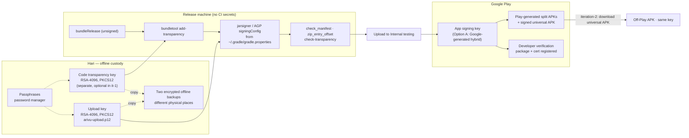

# Release and signing architecture

Spine anchors: **C1** (one tap from Play), **C3** (verifiably private), **C4** (forkable),
**R1** (iteration-2 off-Play APK: same package, same key). Researched 2026-09-15.

Evidence labels used below:
**[V-doc]** verified against current Google documentation (URL in Sources) ·
**[V-local]** verified in this repo by command or measurement ·
**[B]** architect's belief, not verified — each has a check in W18.

---

## 1. What Play App Signing actually means for Arivu

| Fact | Evidence |
|---|---|
| An app published as an AAB must use Play App Signing. Google holds the **app signing key**; we sign uploads with an **upload key**. | [B] well established since 2021; the Console flow below presumes it |
| **New apps are enrolled by default in "quantum-ready hybrid signing with Google-generated keys"** (RSA-4096 + ML-DSA-65; verified by APK Signature Scheme v3.2 on Android 17+). | [V-doc] Play App Signing help |
| Before release, the default can be changed to "use the same key as another app in this account" or "provide your own app signing key" (encrypted upload with the PEPK tool). Custom keys: RSA ≥ 2048. The page implies a developer-supplied key cannot be the hybrid kind. | [V-doc] |
| **"Signing keys can only be changed before the app is released to Open testing or Production tracks."** Internal testing does not lock the choice. | [V-doc] — this is the deadline for the decision |
| Google does not offer to let you download a Google-generated private key. It offers instead to **"download a signed, universal APK from the Play Console or the Play Developer API to distribute elsewhere"**. | [V-doc] |
| A lost or compromised **upload key** can be reset by Google (new PEM certificate, Console request). A lost app signing key that you manage yourself cannot be recovered. | [V-doc] |
| Key upgrade (rotation) of the app signing key: annual upgrade for installs on Android 17+; Android 13–16 enforce the latest classical key via v3.1; Android 7–12 rely on Play Protect. Because minSdk is 30, every Arivu device supports v3 key rotation lineage. | [V-doc] for Play rules; minSdk from `android/app/build.gradle.kts` [V-local] |
| Developer verification: "If you use Play App Signing, … your eligible apps will be part of the automatic registration process." Multiple signing keys can be registered per package. Lost signing key → cannot register packages. Unregistered apps are blocked on certified devices in enforced regions (BR, ID, SG, TH from 2026-09-30; global 2027); ADB installs exempt. | [V-doc] developer-verification FAQ |
| Whether an **off-Play** copy with the same package and the same Play-held key is covered by that automatic registration, or needs the manual step BRIEF.md names. | [B] ambiguous in docs — check in the Console's verification page before iteration-2 |
| The current release AAB is **unsigned** (no top-level `META-INF/` signature; the release buildType has no `signingConfig`). Play rejects unsigned uploads. | [V-local] `unzip -l app-release.aab` |

### What that implies for "iteration-2 must share the key"

BRIEF.md's instruction ("guard the signing key carefully from day one") was written as if Hari holds
*the* key. Under Play App Signing there are two keys, and only one of them decides whether a shared
APK updates a Play install: the **app signing key**. There are exactly two ways to satisfy R1:

- **Option A — Google-generated app signing key (the default).** The off-Play APK is the
  *signed universal APK Play generates* from the very AAB we uploaded. Same key by construction.
- **Option B — Hari's own app signing key**, generated offline and handed to Play via PEPK before the
  first Open/Production release. Hari signs off-Play APKs himself with `bundletool build-apks --mode=universal`.

Opting out of Play App Signing entirely is not available for AAB publishing.

## 2. Decision analysis (proposed D-018)

| | A: Google-generated key, Play-signed universal APK | B: Hari-generated key, uploaded via PEPK |
|---|---|---|
| Worst custody failure | Upload key lost/leaked → Google resets it; no user harmed | App signing key leaked → attacker ships adware that **updates genuine installs** over P2P and passes as Hari's registered key. Lost → no more off-Play updates, ever |
| Who can make an off-Play build | Only via Play Console / Play Developer API | Hari, offline, any time |
| Account loss / suspension | No new builds on any channel | Play channel gone; off-Play builds still signable — but developer verification also lives in Google's consoles, so the independence is partial |
| Crypto | Hybrid RSA-4096 + ML-DSA-65; annual upgrades | RSA-4096 classical |
| F-Droid (iteration-2, pending) | F-Droid signs with its own key → cannot update a Play install (same as B unless F-Droid adopts reproducible-build developer signatures) | Possible to have F-Droid publish Hari-signed reproducible builds |
| Reproducible-build verification | Compare Play's universal APK to a local `bundletool --mode=universal` build **excluding the signature block**; code transparency (§5) proves Google did not alter DEX/native code | Same, and Hari's own signature can be copied onto a verified build |
| Single release train | Yes: the off-Play APK *is* a Play release (same versionCode, same bytes modulo packaging) | Must be enforced by process |
| Unknowns | Whether the Play universal APK (a) includes the install-time model pack, (b) keeps the model STORED at an offset % 32 == 0, (c) is offered for hybrid-signed apps. [B] for all three | None of these; but PEPK key handling and backups are on Hari |

**Recommendation: Option A**, conditional on a W18 check that Play's signed universal APK installs,
contains the model aligned, and installs over / is updated by the Play-installed copy. The threat that
matters most in these markets is a *repackaged* app; the worst outcome is a leaked app signing key,
because it turns repackaging into a trusted update. A solo PM holding that key on a laptop is the
weakest link in the system; Google's HSM is not. If W18's check fails, switch to Option B **before any
Open testing or Production release** (the documented lock point). Needs Hari: it is irreversible.

## 3. Key custody design

Rules:

1. **Upload key**: `keytool -genkeypair -alias arivu-upload -keyalg RSA -keysize 4096 -validity 10000 -storetype PKCS12`.
   Never in the repo, never in CI, never emailed. Passphrase in a password manager.
   Two encrypted offline copies in two places. Record its SHA-256 certificate fingerprint in this Leaf once created.
2. **Gradle reads signing material only from outside the repo** (`~/.gradle/gradle.properties` or env vars).
   If absent, `bundleRelease` still produces an unsigned AAB (so CI and other Leaves can build). An
   upload-ready build is produced only on the release machine.
3. **App signing key** (Option A): nothing to hold. Record the **app signing certificate SHA-256** from
   Play Console → App integrity in this Leaf, the About screen docs and the public site. That value is
   what users, stores and iteration-2's in-app fingerprint screen compare against — never the upload key's.
4. **If Option B is chosen instead**: generate on an offline machine, RSA-4096, PKCS12; upload with PEPK;
   three offline encrypted copies; the upload key must be a *different* key; write down a rotation plan
   (v3 proof-of-rotation lineage — supported by all minSdk-30 devices) before first release.
5. **Code transparency key** (§5) is a third, separate key. Losing it only stops future transparency files.
6. **Revocation/incident**: upload key suspected leaked → Console upload-key reset the same day; publish
   notice on the site. App signing key leak (Option B only) → Play key upgrade + public warning; installs
   of Android < 13 are not protected by the upgrade.

## 4. Release pipeline (iteration-1)

| Step | What | Gate | Owner |
|---|---|---|---|
| 1 | `tools/fetch_model.sh` (sha256), `tools/llama/fetch_llama.sh` (pinned commit), host smoke | `run_smoke.sh` ALL PASSED | Engineering |
| 2 | `./gradlew :app:testDebugUnitTest :app:bundleRelease` | unit tests | Engineering |
| 3 | `tools/check_manifest.sh` | no network perms, allow-list, arm64-only, backup off | Engineering |
| 4 | *(if adopted)* `bundletool add-transparency` with the transparency key | `bundletool check-transparency --mode=bundle` | Release |
| 5 | Sign AAB with upload key; bump `arivu.versionCode` (monotonic, one train for all channels) | `jarsigner -verify`; versionCode > last uploaded | Release |
| 6 | Upload to **Internal testing** (does not lock key choice); keep default Play App Signing | Console accepts; pre-launch report reviewed | Release |
| 7 | **W18**: from Latest releases and bundles download (a) device-specific APKs for the test phone and (b) signed universal APK. Run `tools/zip_entry_offset.py <apk> .gguf` on the model pack split and on the universal APK; `apksigner verify --print-certs` both; confirm cert == Console app signing cert; install from Play on the phone, then `adb install -r` the universal APK over it, and back | offsets % 32 == 0, STORED; same cert; both upgrade paths work | Release + Architecture |
| 8 | On-phone M1 run from the **Play-installed** build (airplane mode) | M1 recorded in NOTES.md | Engineering |
| 9 | Closed testing — **for a personal developer account created after 2023-11-13, ≥ 12 testers opted in for 14 continuous days before production access can be requested** [V-doc] | 14 days elapsed | Hari |
| 10 | Console config: device-catalog RAM exclusion rule (gate layer 2, from D-009), Data safety (no collection, no sharing), privacy policy URL, foreground-service declaration (shortService), content rating, AI-generated content declaration, target audience | Compliance Leaf checklist | Hari + Compliance |
| 11 | Production (staged rollout). Signing key choice is now locked. | — | Hari |

Every release: record AAB sha256, versionCode, llama.cpp commit, model sha256, and the Play app signing
cert SHA-256 in `NOTES.md` — this is the minimum a later reproducible-build claim can stand on.

## 5. Code transparency (adopt, cheap, strengthens C3)

With Play App Signing, Google re-signs and could in principle alter code. `bundletool add-transparency`
signs a manifest of DEX and `lib/` hashes with a key only we hold; `bundletool check-transparency
--mode=connected_device` verifies an installed app against it. [V-doc] It covers DEX and native libs
only — **not assets**, so not the model (the model's identity is its sha256, checkable from the split APK).
It is independent of Play App Signing. Unknown [B]: interaction with `extractNativeLibs=true`
(`useLegacyPackaging`) — the on-device check reads the installed APKs, so it should work; W18 confirms.

Recommendation: adopt in iteration-1 if W18's check passes in under half a day; otherwise iteration-2
alongside reproducible builds. Not a release blocker.

## 6. Do not enable

- **Play Integrity "automatic protection"** — injects checks that prompt users to get the app from Play
  and relies on Play services connectivity; it would break the offline promise (C2/C3) and every
  iteration-2 sideloaded copy (R1). [B] on exact runtime behaviour; the conflict with R1 is by design.
- **Any crash/analytics SDK** — impossible without INTERNET and would contradict the Data safety form.
- **v4 signing / incremental install** — irrelevant; also not compatible with hybrid signing [V-doc].

## Sources

- Play App Signing — https://support.google.com/googleplay/android-developer/answer/9842756
- Developer verification — https://developer.android.com/developer-verification and FAQ https://developer.android.com/developer-verification/guides/faq
- Code transparency — https://developer.android.com/guide/app-bundle/code-transparency
- Testing requirements for new personal accounts — https://support.google.com/googleplay/android-developer/answer/14151465
- Device catalog exclusion rules — https://support.google.com/googleplay/android-developer/answer/7353455
- App bundle explorer (signed universal APK download) — https://support.google.com/googleplay/android-developer/answer/9844279
