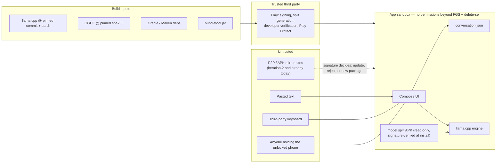

# Threat model

Scope: iteration-1 (Play, install-time model pack) and what iteration-2 (R1, P2P universal APK) adds.
Evidence labels as in `release-and-signing.md`: [V-doc] [V-local] [B].

## Assets and what the attacker wants

| Asset | Why it matters | Spine |
|---|---|---|
| The **name and trust** of Arivu in the target markets | A repackaged "Arivu" with adware or scam text spends our credibility | C3, C5 |
| **App signing key** (Play-held under D-018 option A) | Whoever holds it can ship *updates* to genuine installs | C1, R1 |
| **Upload key** | Can push to Play (resettable) | C1 |
| **User text** in `conversation.json` | Letters, contracts, personal circumstances | C3 |
| **The model file** | Swapped weights can emit targeted scams in a trusted voice | C5, C9 |
| **The build inputs** (llama.cpp, model, Gradle deps, bundletool, NDK) | Supply chain into every install | C3, C4 |

## Trust boundaries

The design's biggest security property is its **small blast radius**: no network, no storage
permission, no contacts, no accounts. A memory-safety bug in the tokenizer reached by pasted text can,
at worst, read the conversation file it already has and has nowhere to send it. That is why the
no-INTERNET gate (M5) is also the primary security control, not just a privacy claim.

## Threats → mitigations

Columns: **Now** = exists in the repo today · **It-1** = needed before/at Play release · **It-2** = with R1.

| # | Threat | Likelihood / impact | Now | It-1 release | It-2 |
|---|---|---|---|---|---|
| T1 | **Repackaging with adware** under the Arivu name/icon, distributed via Xender/SHAREit/APK sites. Signed with attacker's key. | High / High | Android refuses to install it **over** a genuine install (signature mismatch) [V-doc, platform rule]. No-INTERNET claim is checkable on the Play listing. | Record and publish the **Play app signing cert SHA-256** (site + store description). Complete developer verification so the package name is registered to Hari: an attacker's key is "not eligible" to claim `io.github.brettleehari.arivu` and unregistered copies are blocked on certified devices in BR/ID/SG/TH from 2026-09-30, global 2027 [V-doc]. Register the package name early (D-001). | In-app screen showing the running copy's signing-cert SHA-256 **plus** the plain instruction "a real Arivu installs over the Play copy without uninstalling". Honest limit: a repackager can fake an in-app fingerprint screen; the durable controls are platform ones (signature-update rule, developer verification, Play Protect). Reproducible builds + code transparency for experts and stores. |
| T2 | **Renamed-package clone** (`com.arivu.free`) — avoids the signature and registration checks. | High / Medium | None possible in code. | Listing and site say: one package name, one developer name, one fingerprint. Trademark check on the name (Hari). | Same; Play Protect reports. |
| T3 | **Tampered model file** (weights swapped to emit scams / ads) inside a repackaged APK. | Medium / High | Cannot happen to a Play install without breaking the split APK signature, verified by the package installer at install [B: installer verifies every split]. Runtime rejects misaligned offsets (not an integrity check). | Nothing extra: tampering implies repackaging → T1. **Do not** hash 400 MB at every load (seconds of I/O and it faults every page into cache, defeating the memory model — C2). | In-app fingerprint screen (T1) covers it. Optionally show the model sha256 recorded at build time next to it. |
| T4 | **Rooted-device tampering** of `/data/app` split APKs after install. | Low / Low | Out of scope: a rooted attacker already owns the conversation. | — | — |
| T5 | **Malicious GGUF parsing** (crafted metadata → heap overflow in llama.cpp). | Low / Medium | Only reachable if the attacker controls the model, which requires T1/T4 — at which point they control the code anyway. | Pin llama.cpp; re-run host smoke on every bump. | Same. |
| T6 | **llama.cpp supply chain** (malicious upstream commit, compromised mirror). | Low / High | Commit SHA pinned; our patch in repo; `git clean`; KleidiAI FetchContent disabled (`GGML_CPU_KLEIDIAI OFF`) so no build-time download [V-local]. | Record commit in NOTES per release; review the diff when bumping (no auto-bump). | Reproducible builds: third parties rebuild from the pin. |
| T7 | **Model supply chain.** The GGUF comes from `unsloth/Qwen3-0.6B-GGUF` — a third-party re-quantisation, not Qwen's own artifact. sha256 pins *which* file, not that it is faithful to Qwen's weights. | Low / Medium | sha256 pinned in `tools/fetch_model.sh` [V-local]. | Record provenance in the licences screen/NOTICE ("quantised by Unsloth from Qwen/Qwen3-0.6B"). Decide (proposed D-019) whether to quantise ourselves from Qwen's safetensors with the pinned llama.cpp `convert`+`llama-quantize`, reproducibly. [B] whether Qwen publishes an official Q4_K_M GGUF. | Self-quantised, reproducible model required for a reproducible-build claim. |
| T8 | **bundletool supply chain.** `tools/check_manifest.sh` and `tools/install_bundle.sh` `curl` the jar from GitHub with **no checksum**. | Low / Medium (it is the tool that certifies M5) | Local jar sha256 `a099cfa1543f55593bc2ed16a70a7c67fe54b1747bb7301f37fdfd6d91028e29` [V-local — not compared against upstream]. | Pin sha256 in both scripts; verify against the GitHub release. | Same. |
| T9 | **Gradle/Maven dependency supply chain** (dependency confusion, compromised artifact, wrapper swap). | Low / High | Only google() + mavenCentral(); `FAIL_ON_PROJECT_REPOS`. **No** `distributionSha256Sum` in the wrapper and **no** `gradle/verification-metadata.xml` [V-local]. | Add both. Merged-manifest check (M5) already catches a dependency that adds INTERNET. | Required for reproducible builds. |
| T10 | **Play-side transformation** (Play re-signs and generates splits; could in principle alter code or break alignment). | Very low / Medium | D-013 runtime alignment check. | W18: download Play's APKs, check offsets and certs. Adopt **code transparency** (proves DEX + native libs unchanged; not assets). | Same. |
| T11 | **Upload key compromise.** | Low / Medium | Keystore never committed (`.gitignore`, no signingConfig). | Custody rules in `release-and-signing.md` §3; Console reset if leaked [V-doc]. | — |
| T12 | **App signing key compromise** (only if Hari holds it — D-018 option B). | Low / **Critical** (trusted malicious updates) | n/a | Prefer option A. | If B: offline key, rotation plan, v3 lineage. |
| T13 | **Data at rest on a shared phone** — family member opens Arivu and reads the history. | High / Medium | App-private storage; File-Based Encryption protects it while the phone is off/locked-before-first-unlock [B: FBE standard on API 30+ devices]; `allowBackup=false`, `fullBackupContent=false`, data-extraction rules exclude cloud and device transfer [V-local]; release not debuggable → no `run-as`. | No way to delete the conversation today (D-011). Recommend D-011 "Clear conversation" before production. Delete `conversation.json.corrupt-*` files (currently kept forever). Optional: `Activity.setRecentsScreenshotEnabled(false)` so the recents thumbnail does not show a contract to the next person. No app lock (would be a setting — C8). | — |
| T14 | **Keyboard sees everything typed.** A networked third-party/OEM IME can exfiltrate text; Arivu's "private" claim cannot cover it. | Medium / Medium | None. | Request no personalised learning from the IME (`EditorInfo.IME_FLAG_NO_PERSONALIZED_LEARNING`, via Compose platform IME options) [B: honoured by Gboard, not guaranteed by others]. Say in About: "Arivu cannot see or control what your keyboard app does." | — |
| T15 | **Clipboard** after "Copy message". | Low / Low | Android 10+ blocks background clipboard reads; Android 13+ shows the access toast [B]. | Nothing. | — |
| T16 | **Report-output intent** sends user text via the user's email app. | n/a (user-initiated) | Share/email intent only (C9). | About screen says what the email will contain and where it goes. Compliance Leaf confirms Data safety treatment of user-initiated email. | — |
| T17 | **Harmful or scam-shaped output** by the genuine model. | Medium / Medium | System prompt; report intent (C9). | Play AI-generated content policy compliance; eval (D-017). | — |
| T18 | **Exported component abuse.** | Low / Low | Only the launcher activity is exported; `arivu.fakeTotalMem` extra honoured only in `BuildConfig.DEBUG` [V-local]; service not exported. | Keep `check_manifest.sh` allow-list. | Share `FileProvider` must be non-exported with grant-only URIs. |

## Residual risk statement (for Hari)

Iteration-1 via Play is well protected by platform controls we adopt rather than build. The real
exposure starts with iteration-2: once Arivu is expected to arrive by Bluetooth, users will accept any
APK called Arivu, and a renamed-package clone (T2) cannot be stopped technically. The cheapest
countermeasure is started now and costs nothing later: register the package name under developer
verification, publish one certificate fingerprint everywhere, and never let the app signing key sit on
a laptop.
