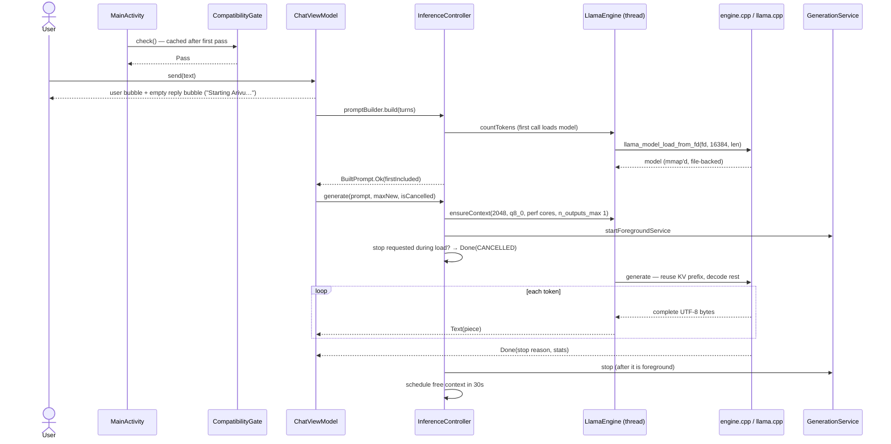
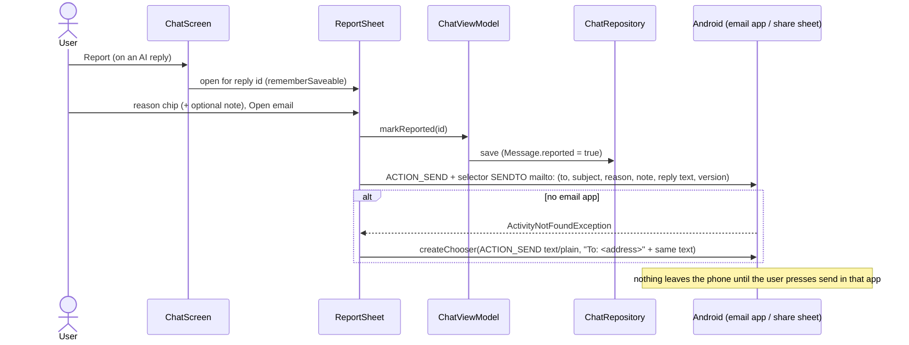
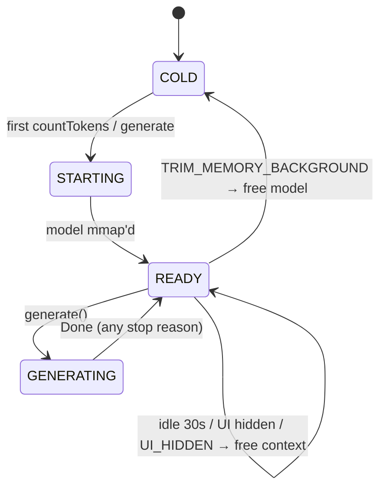

# Engineering Leaf

The working prototype **is** `android/`. This Leaf is the map and the sequence flows the code does
not show visually.

## Leaf changelog

- **2026-09-15 (b)** — Integrated Architecture, Design, GTM and Compliance findings: compute buffer 309 → 27 MiB
  (`n_outputs_max = 1`), API 34 service timeout, upload signing from outside the repo, supply-chain pins, manifest
  check in every bundle build, per-reply **Report** (provisional scope change, see below), in-app privacy policy,
  licence fixes L1–L10, system-prompt safeguards. First end-to-end emulator run (functional only); three bugs fixed.
  Still Spine 0.1.
- **2026-09-15 (a)** — First Leaf.

> **Provisional, pending Hari:** the chat screen now has *Send, Stop, Copy, **Report***. SPINE §3/BRIEF.md say
> "Send. Stop. Copy message. That is all." Report was added because Play's AI-generated content policy is read as
> needing a flag on the output itself (play-policy-checklist.md §1). The in-app privacy policy text is also
> Engineering's derivation of GTM's draft and has no developer name, retention period or repo URL yet.

## Build it

```sh
tools/llama/fetch_llama.sh          # pinned llama.cpp + patches → third_party/
tools/fetch_model.sh                # Qwen3-0.6B Q4_K_M, sha256-verified → models/
tools/host/run_smoke.sh             # host: fd-window load, prefix reuse, cancel, context-full
cd android && ./gradlew :app:testDebugUnitTest :app:bundleRelease
tools/check_manifest.sh             # also runs automatically after every :app:bundleRelease / bundleDebug
```

Toolchain used for the first build: JDK 21 (Temurin, arm64), AGP 9.4.0, Gradle 9.7.1, Kotlin 2.4.20,
NDK 29.0.14206865, CMake 4.1.2, compileSdk 37 / targetSdk 36 / minSdk 30.

On the phone:

```sh
tools/bench.sh                      # W02: benchmark → build/bench/*.json → leaves/NOTES.md
tools/install_bundle.sh             # install base + ABI split + model pack like Play does
tools/verify_lifecycle.sh           # W08: RSS falls back after 30s idle
adb shell am start -n io.github.brettleehari.arivu/io.github.brettleehari.arivu.app.MainActivity --el arivu.fakeTotalMem 2000000000   # W10 (debug)
```

## Map

| Path | What |
|---|---|
| `tools/llama/patches/0001-load-model-from-fd-window.patch` | `llama_model_load_from_fd(fd, offset, length)`: funopen window for GGUF parsing, mmap of the real fd from the page-aligned offset below the window |
| `android/llama/src/main/cpp/engine.{h,cpp}` | Engine: lazy context (`n_outputs_max = 1` → 27–28 MiB compute buffer), KV prefix reuse, cancel via abort callback, UTF-8-safe streaming, stop reasons |
| `android/llama/src/main/cpp/jni_bridge.cpp` | JNI; bytes in/out as UTF-8; `nativeMemoryKb` = VmRSS, VmHWM, last compute buffer KiB |
| `android/llama/.../LlamaEngine.kt` | single-thread dispatcher; `generate()` is a cold Flow |
| `android/llama/src/androidTest/.../Benchmark.kt` | W01 harness (now also records `computeBufferKib`) |
| `android/app/.../Policy.kt` | every would-be setting, each tied to a decision; system prompt incl. safeguards |
| `android/app/.../inference/InferenceController.kt` | lifecycle rules; logs one `generation done` line per reply (tok/s, no text) |
| `android/app/.../inference/GenerationService.kt` | shortService; `onTimeout(int)` (API 34) and `onTimeout(int,int)` (35+) |
| `android/app/.../inference/PromptBuilder.kt` | ChatML, whole-turn truncation, TooLong |
| `android/app/.../chat/ChatViewModel.kt` | send/stop (stop-request flag), `loaded`, reply placeholder, throttled streaming save, `markReported` |
| `android/app/.../chat/ChatRepository.kt` | flat JSON; `Message.reported`; keeps only the newest `.corrupt-*` copy |
| `android/app/.../ui/ChatScreen.kt` | the single screen; Report/Copy row; `NoPersonalizedLearning` IME wrapper |
| `android/app/.../ui/ReportOutput.kt` | `ReportSheet` + `reportOutput()` (mailto selector → share fallback), shared with About |
| `android/app/.../ui/AboutScreen.kt` | About, offline privacy policy, licences |
| `android/app/src/main/assets/licenses/` | `index.txt` + texts; `NOTICE.txt` must equal root `NOTICE` (LicensesTest) |
| `android/app/.../gate/CompatibilityGate.kt` | gate layer 3 (pure `evaluate` + cached `check`) |
| `android/app/build.gradle.kts` | upload signing from outside the repo; `checkManifest<Variant>` finalizes `bundle<Variant>`; tests get merged native libs dir |
| `android/gradle/verification-metadata.xml` | sha256 of every Gradle/Maven artifact (regenerate on dependency bumps, below) |
| `android/modelpack/` | install-time asset pack; stages `models/*.gguf` as `*.gguf.so` |
| `tools/fetch_bundletool.sh` | bundletool download + sha256 pin (used by check_manifest, install_bundle, release_check) |
| `tools/make_upload_key.sh` | Hari creates the upload key (never an agent) |
| `tools/release_check.sh` | release gate; fails on placeholders, pending D-001/D-010, unsigned **or test-key-signed** bundles |
| `tools/host/` | host smoke tests sharing `engine.cpp` with the app |

## How to release (for Hari, step by step)

Only steps 1–3 are one-time. Nothing here uploads anything by itself.

1. **Decide D-001 (package name) and D-010 (report address)** in `leaves/decisions.yml`, then set
   `arivu.applicationId` and `arivu.reportEmail` in `android/gradle.properties`. Also fill the privacy policy
   placeholders (developer name, retention, repo URL) in `leaves/gtm/privacy-policy.html` and align
   `privacy_*` strings in `strings.xml`.
2. **Create the upload key, once, yourself:** `tools/make_upload_key.sh` (default `~/.arivu-keys/arivu-upload.p12`).
   Make the two encrypted offline backups it tells you to. Record the printed SHA-256 in
   `leaves/architecture/release-and-signing.md`.
3. **Tell Gradle where it is**, outside the repo: append to `~/.gradle/gradle.properties` (then `chmod 600` it):
   ```
   arivu.upload.storeFile=/Users/<you>/.arivu-keys/arivu-upload.p12
   arivu.upload.storePassword=<passphrase>
   arivu.upload.keyAlias=arivu-upload
   ```
   (or `ARIVU_UPLOAD_STORE_FILE` / `ARIVU_UPLOAD_STORE_PASSWORD` env vars for one shell). A keystore path inside the
   repo fails the build.
4. **Every release:** bump `arivu.versionCode` (monotonic), then
   ```sh
   export JAVA_HOME=$(ls -d ~/Library/Java/JavaVirtualMachines/jdk-21*/Contents/Home)
   tools/host/run_smoke.sh
   (cd android && ./gradlew :app:testDebugUnitTest :app:lintRelease :app:bundleRelease)   # manifest check runs itself
   tools/release_check.sh          # must print RELEASE CHECK: PASSED
   ```
5. Record in `leaves/NOTES.md`: AAB sha256 (`shasum -a 256 android/app/build/outputs/bundle/release/app-release.aab`),
   versionCode, llama.cpp commit, model sha256.
6. Upload `app-release.aab` to **Internal testing** in Play Console (keeps the default Play App Signing, D-018 in
   release-and-signing.md). Then W18 (download Play's APKs, check model offset and cert), W19 Console items
   (Data safety, privacy URL, content rating, device RAM exclusion, FGS declaration), closed testing (12 testers ×
   14 days for a new personal account), production.

Dependency bump: `cd android && ./gradlew --write-verification-metadata sha256 :app:testDebugUnitTest :app:lintRelease
:app:bundleRelease :app:bundleDebug :llama:assembleDebugAndroidTest`, review the diff of
`gradle/verification-metadata.xml` (new hashes are trust-on-first-use), commit it with the bump.

## Sequence — first message after install



## Sequence — stop, hide, trim

```mermaid
sequenceDiagram
  actor U as User
  participant VM as ChatViewModel
  participant IC as InferenceController
  participant N as engine.cpp
  participant OS as Android

  U->>VM: Stop
  VM->>VM: stopRequested = true (covers model load / context creation)
  VM->>IC: cancel()
  IC->>N: request_cancel (atomic)
  N-->>VM: Done(CANCELLED) — mid-prefill via abort callback, or next token
  OS->>IC: ProcessLifecycle onStop
  alt not generating
    IC->>N: free_context (KV + compute freed)
  else generating
    Note over IC: service holds priority; free when last token lands
  end
  OS->>IC: onTrimMemory(BACKGROUND)
  IC->>N: free_model (munmap; pages were evictable anyway)
```

## Sequence — report a reply (C9, provisional)



## Engine states



## Verified so far (and to what level)

Levels: **host** = macOS arm64 CPU build sharing `engine.cpp`; **unit** = JVM tests; **build** = Gradle/scripts on the
artifact; **emulator** = arm64 AVD, functional only (leaves/NOTES.md "Emulator functional run"); **phone** = the 4 GB test
phone. Only *phone* counts for M1–M4.

| Claim | Level | Evidence |
|---|---|---|
| Patched loader maps a GGUF at a non-page-aligned offset, matches a path load token-for-token | host | `tools/host/run_smoke.sh` [1] |
| Prefix reuse, cancel, context-full reporting, UTF-8 boundary buffering | host, emulator | smoke [2]–[5]; logcat `reused=` |
| Compute buffer 309.34 → 26.59 MiB (host) / 28.09 MiB (emulator) with `n_outputs_max = 1` | host, emulator | leaves/NOTES.md round 2 |
| Model entry STORED, offset 16384 in the device APK set; loads from `split_modelpack.apk` | build, emulator | `zip_entry_offset.py`; replies on emulator |
| Release (R8) bundle installs like Play and runs: JNI, asset pack, streaming | emulator | leaves/NOTES.md |
| No network permission; allow-list; arm64-only; ram.normal; backup + D2D off — on every bundle build | build | `checkManifest<Variant>`, `check_manifest.sh` |
| Native libs 16 KB aligned; licence texts incl. NOTICE in bundle | build | `release_check.sh` |
| Every shipped `.so` maps to a licence entry; in-app NOTICE == root NOTICE | unit | `LicensesTest` |
| Gate logic; truncation; persistence (incl. `reported`, corrupt-copy pruning); no settings; report intent contract | unit | 29 JVM tests |
| Upload signing only from outside the repo; unsigned otherwise; test key rejected by release gate | build | in-repo path fails build; `release_check.sh` FAIL on `CN=THROWAWAY…` |
| bundletool, Gradle distribution, Maven artifacts checksum-pinned | build | `fetch_bundletool.sh`; wrapper; verification metadata tamper test |
| Starting → Reading → streaming → done; Stop during load / prefill / stream; Copy; divider; too-long notice | emulator | `leaves/gtm/screenshots/` |
| Report sheet → reply marked → email intent / share fallback; About report; privacy policy; licences | emulator | `evidence/ev-report-*.png` |
| Foreground service (shortService) keeps a hidden reply going; context freed when it ends hidden | emulator | `dumpsys activity services`, logcat |
| Context freed 30 s idle; model freed on trim BACKGROUND; blank recents thumbnail; partial reply survives process death | emulator | logcat, `dumpsys meminfo` (non-representative) |
| Incompatible screen + ACTION_DELETE confirmation (debug fake totalMem) | emulator | `shot-7-incompatible-debug.png`, `ev-uninstall-dialog.png` |
| `onTimeout(int)` fires on Android 14 after ~3 min | **not verified** | needs an API 34 image or phone and a > 3 min reply |
| `IME_FLAG_NO_PERSONALIZED_LEARNING` reaches the keyboard | **not verified** | code path only; check with Gboard on a phone |
| M1 (≤ 15 s cold first token), M2 (≥ 8 tok/s), M3 (≤ 800 MB peak), M4 (idle RSS), thermal | **phone only — nothing yet** | W02, W08 |
| Play accepts the bundle; Play's split/universal APKs keep the model aligned; email hand-off passes AI-content review | **not verified** | W18, Console |
