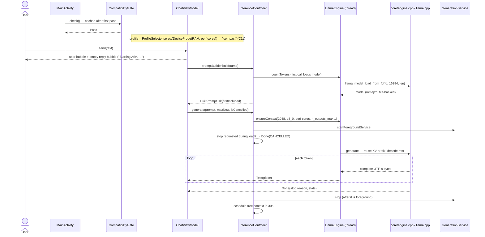
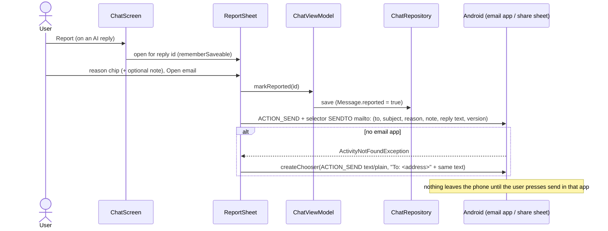
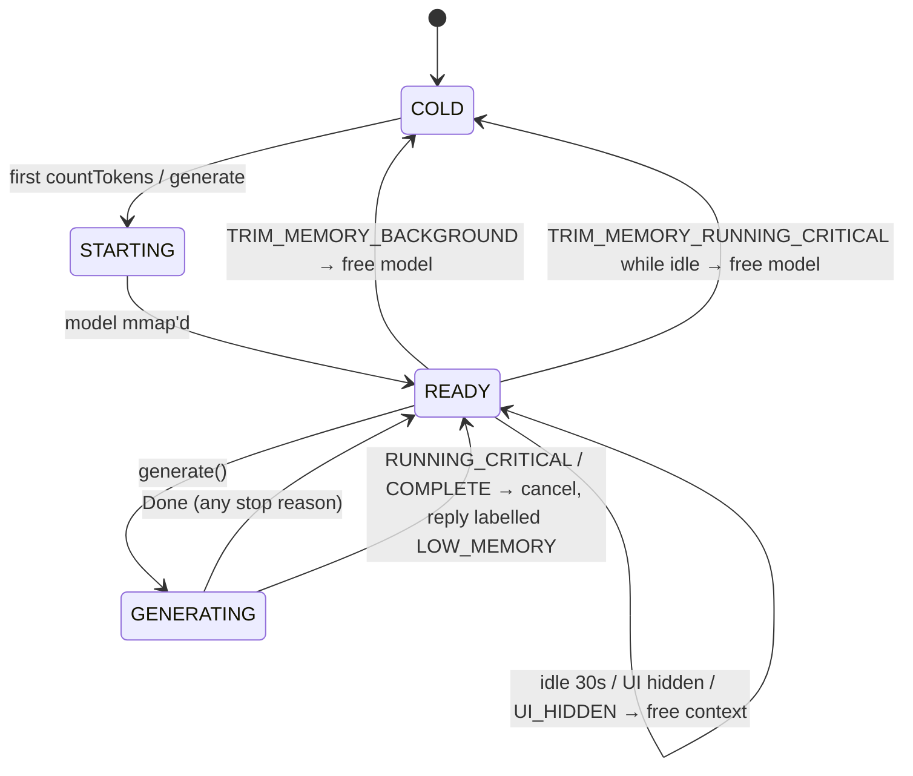

# Engineering Leaf — core + Android

The working prototype **is** `core/` + `android/`. This Leaf is the map and the sequence flows the
code does not show visually.

**Scope.** This Leaf covers the shared C++ engine (`core/`), the Android app (`android/`) and the
shared tooling (`tools/`). **iOS has its own Leaf, `leaves/engineering-ios.md`** — same Spine, same
`core/`, same `decisions.yml` and `leaves/NOTES.md`, its own map and release path
(leaves/MULTIPLATFORM.md "Versioning and releases"). Nothing below is Android-only *by platform*: where
behaviour differs it is because the device differs (spine: C11).

## Leaf changelog

- **2026-09-15 (c)** — **Re-stamped to Spine 0.2.** Monorepo: the C++ engine moved to `core/`, `android/`
  keeps only `jni_bridge.cpp`; the map below spans both. Two Android changes: a user-visible **low-memory
  state** (`Stop.LOW_MEMORY` label, `Notice.LowMemory` bar, `inference/MemoryPressure.kt`) wired to three
  signals — a failed allocation, a foreground-critical `onTrimMemory`, and `ActivityManager.MemoryInfo.lowMemory`
  read where a reply died — and **profile plumbing for C11**: `Policy.kt` now holds only what no device gets a
  say in, and everything else comes from a named `Profile` chosen by a `DeviceProbe` (`app/profile/Profile.kt`).
  One profile ships (`compact`). 56 JVM tests (was 29), including the Compliance Leaf's cross-tree
  `ProfileParityTest`. Second emulator functional run; no regressions.
- **2026-09-15 (b)** — Integrated Architecture, Design, GTM and Compliance findings: compute buffer 309 → 27 MiB
  (`n_outputs_max = 1`), API 34 service timeout, upload signing from outside the repo, supply-chain pins, manifest
  check in every bundle build, per-reply **Report** (provisional scope change, see below), in-app privacy policy,
  licence fixes L1–L10, system-prompt safeguards. First end-to-end emulator run (functional only); three bugs fixed.
  Still Spine 0.1.
- **2026-09-15 (a)** — First Leaf.

> **Provisional, pending Hari:** the chat screen now has *Send, Stop, Copy, **Report***. SPINE §3/BRIEF.md say
> "Send. Stop. Copy message. That is all." Report was added because Play's AI-generated content policy is read as
> needing a flag on the output itself (play-policy-checklist.md §1). The in-app privacy policy text is also
> Engineering's derivation of GTM's draft and has no developer name, retention period or repo URL yet.

## Build it

```sh
tools/llama/fetch_llama.sh          # pinned llama.cpp + patches → third_party/
tools/fetch_model.sh                # Qwen3-0.6B Q4_K_M, sha256-verified → models/
tools/core_test.sh                  # core/ unit tests: no model, no platform SDK, seconds
tools/host/run_smoke.sh             # host: fd-window load, prefix reuse, cancel, context-full
cd android && ./gradlew :app:testDebugUnitTest :app:lintRelease :app:bundleRelease
tools/check_manifest.sh             # also runs automatically after every :app:bundleRelease / bundleDebug
/usr/bin/python3 tools/trace.py --strict    # every commitment has a tagged feature and a tagged test
tools/release_check.sh              # the release gate
```

`core/` must build and pass with **no Android or Apple SDK present** — `tools/core_test.sh` and
`tools/host/run_smoke.sh` are that contract (leaves/MULTIPLATFORM.md). If a `core/` change needs a platform
SDK, the abstraction has leaked and the change belongs in `android/` or `ios/`.

Toolchain used for the first build: JDK 21 (Temurin, arm64), AGP 9.4.0, Gradle 9.7.1, Kotlin 2.4.20,
NDK 29.0.14206865, CMake 4.1.2, compileSdk 37 / targetSdk 36 / minSdk 30.

On the phone:

```sh
tools/bench.sh                      # W02: benchmark → build/bench/*.json → leaves/NOTES.md
tools/install_bundle.sh             # install base + ABI split + model pack like Play does
tools/verify_lifecycle.sh           # W08: RSS falls back after 30s idle
adb shell am start -n io.github.brettleehari.arivu/io.github.brettleehari.arivu.app.MainActivity --el arivu.fakeTotalMem 2000000000   # W10 (debug)
```

## Map

### Shared — `core/` and `tools/` (no platform SDK anywhere in here)

| Path | What |
|---|---|
| `core/include/arivu/arivu.h` | **The platform boundary.** C, not C++, so Swift imports it directly and JNI does not care. Model bytes always arrive as fd + offset + length: Android passes a window inside the APK, iOS offset 0 and the whole file |
| `core/src/engine.cpp`, `core/include/arivu/engine.h` | Engine: lazy context (`n_outputs_max = 1` → 27–28 MiB compute buffer), KV prefix reuse, cancel via abort callback, UTF-8-safe streaming, stop reasons |
| `core/src/profile.cpp` | The C profile object (`arivu_profile`, `arivu_device`, `arivu_profile_fits`, `arivu_profile_select`) — spine C11 in the core. Android does not consume it yet; see "Profiles" below |
| `core/src/prompt.cpp`, `core/src/text.cpp`, `core/src/arivu_c.cpp` | Prompt/truncation logic, UTF-8 boundary buffering, the C shim over the C++ engine |
| `core/tests/` | Core unit tests; `tools/core_test.sh` runs them with neither llama.cpp nor a platform SDK |
| `tools/llama/patches/0001-load-model-from-fd-window.patch` | `llama_model_load_from_fd(fd, offset, length)`: funopen window for GGUF parsing, mmap of the real fd from the page-aligned offset below the window |
| `tools/host/` | Host smoke tests sharing `core/src/engine.cpp` with the app — the "no SDK needed" contract |

### Android — `android/`

| Path | What |
|---|---|
| `android/llama/src/main/cpp/jni_bridge.cpp` | The only C++ left in `android/`. JNI; bytes in/out as UTF-8; `nativeMemoryKb` = VmRSS, VmHWM, last compute buffer KiB. `android/llama/CMakeLists` points at `../../core` |
| `android/llama/.../LlamaEngine.kt` | single-thread dispatcher; `generate()` is a cold Flow |
| `android/llama/src/androidTest/.../Benchmark.kt` | W01 harness (now also records `computeBufferKib`) |
| `android/app/.../Policy.kt` | the would-be settings **no device gets a say in**: system prompt (incl. safeguards), idle timeout |
| `android/app/.../profile/Profile.kt` | **spine: C11.** `DeviceProbe` (total RAM, performance cores) → `ProfileSelector.select` → `Profile`: model asset, context, batch, thread ceiling, KV type, reserves, sampling, capability set. One profile ships (`compact`); the catalogue is ordered richest-first and the last entry is the floor |
| `android/app/.../inference/MemoryPressure.kt` | **spine: C6.** Pure rules for Android's memory signals: which trim level does what, whether a message or throwable is an allocation failure, and whether a reply that died was the phone's doing |
| `android/app/.../inference/InferenceController.kt` | lifecycle rules; reads the `Profile`; logs one `generation done` line per reply (tok/s, profile name, no text) |
| `android/app/.../inference/GenerationService.kt` | shortService; `onTimeout(int)` (API 34) and `onTimeout(int,int)` (35+) |
| `android/app/.../inference/PromptBuilder.kt` | ChatML, whole-turn truncation, TooLong |
| `android/app/.../chat/ChatViewModel.kt` | send/stop (stop-request flag), `loaded`, reply placeholder, throttled streaming save, `markReported` |
| `android/app/.../chat/ChatRepository.kt` | flat JSON; `Message.reported`; keeps only the newest `.corrupt-*` copy |
| `android/app/.../ui/ChatScreen.kt` | the single screen; Report/Copy row; `NoPersonalizedLearning` IME wrapper |
| `android/app/.../ui/ReportOutput.kt` | `ReportSheet` + `reportOutput()` (mailto selector → share fallback), shared with About |
| `android/app/.../ui/AboutScreen.kt` | About, offline privacy policy, licences |
| `android/app/src/main/assets/licenses/` | `index.txt` + texts; `NOTICE.txt` must equal root `NOTICE` (LicensesTest) |
| `android/app/.../gate/CompatibilityGate.kt` | gate layer 3 (pure `evaluate` + cached `check`) |
| `android/app/build.gradle.kts` | upload signing from outside the repo; `checkManifest<Variant>` finalizes `bundle<Variant>`; tests get merged native libs dir |
| `android/gradle/verification-metadata.xml` | sha256 of every Gradle/Maven artifact (regenerate on dependency bumps, below) |
| `android/modelpack/` | install-time asset pack; stages `models/*.gguf` as `*.gguf.so` |
| `tools/fetch_bundletool.sh` | bundletool download + sha256 pin (used by check_manifest, install_bundle, release_check) |
| `tools/make_upload_key.sh` | Hari creates the upload key (never an agent) |
| `tools/release_check.sh` | release gate; fails on placeholders, pending D-001/D-010, unsigned **or test-key-signed** bundles, and on `trace.py --strict` |
| `tools/core_test.sh`, `tools/release_tag.sh`, `tools/check_alignment.py` | core tests; platform-prefixed tags (`core/v…`, `android/v…`, `ios/v…`); 16 KB alignment |

## Profiles — what the device gets a say in (spine: C11)

There is no platform branch anywhere in the app. What changes between devices changes through one
object, and the object is chosen, never edited:

```
DeviceProbe(totalRamBytes, performanceCores)   ActivityManager.MemoryInfo + cpufreq
        │
        ▼
ProfileSelector.select(probe, Profiles.SHIPPED)   richest first, first fit wins
        │
        ▼
Profile "compact"   model asset · n_ctx 2048 · n_batch 512 · q8_0 KV · ≤4 threads
                    reserve 512 / max reply 768 · no repack · temp 0.7 / top_k 20 / top_p 0.8
                    capabilities { CHAT }
```

Three rules make this hold:

- **The floor is the gate's floor.** `Profiles.COMPACT.minTotalRamBytes` *is*
  `BuildConfig.MIN_TOTAL_RAM_BYTES` (D-009), so every device `CompatibilityGate` lets through can carry the
  shipped profile, and `select` never has to invent an answer for a device that should have been refused
  (spine: C6, SPINE R8).
- **Selection is arithmetic over two numbers the platform measured.** Nothing else. An 8GB Android phone
  and an 8GB iPhone reaching the same profile is a test (`ProfileSelectorTest`), not an intention.
- **A second profile is a Spine change, not a build tweak** (SPINE R3). `Profiles.SHIPPED` has exactly one
  entry and a test says so; the selection logic is exercised against a three-profile fixture so the shape is
  verified now rather than the first time a second profile exists.

`Policy.kt` keeps only what no device gets a say in: the system prompt and the 30s idle timeout.

**Convergence with `core/` (a later pass, deliberately not done here).** `core/src/profile.cpp` now carries
the same idea in C — `arivu_profile`, `arivu_device`, `arivu_profile_fits`, `arivu_profile_select` ("first
that fits, richest first": the same rule). The core object is richer: it also models memory
(`kv_bytes_per_token`, `compute_buffer_bytes`, mapped vs charged footprint) and returns a typed `arivu_fit`
reason. When Android consumes it, `DeviceProbe` and the gate's `DeviceFacts` become one `arivu_device`, and
`CompatibilityGate.evaluate` + `ProfileSelector.select` become one call to `arivu_profile_fits` — which is
also how the gate's *sentences* stay identical on both platforms. See the proposed work items.

## Low memory — the phone, not Arivu (spine: C6)

A model that cannot be loaded and a phone that has run out of room are different things, and until now the
user saw the same sentence for both. `inference/MemoryPressure.kt` holds the rules, pure, so they are
testable without a device — which matters, because both the emulator and the test phone misreport memory
pressure (leaves/NOTES.md).

Three signals, because no one of them is available everywhere:

| Signal | Where it comes from | Where it is not available |
|---|---|---|
| Allocation failure | `OutOfMemoryError`, or the engine's error string (`failed to allocate`, `ENOMEM`, `bad_alloc`, …) | — always exact when it happens |
| `onTrimMemory` at `RUNNING_CRITICAL` / `COMPLETE` | Android, while a reply is being written | deprecated from API 34; may never be delivered |
| `ActivityManager.MemoryInfo.lowMemory` | read at the moment a reply died | — available on every supported version |

What the user sees (leaves/design.md idiom — notice bar, or stop label; no jargon, name the next step):

| Situation | Surface | String |
|---|---|---|
| Nothing could start: the model or context would not allocate | Notice bar above the input | `low_memory` — "Arivu stopped because your phone is low on memory. Close some other apps, then try again." |
| A reply ended because of memory | Stop label under the partial reply, error colour | `stopped_low_memory` — "Stopped because your phone is low on memory. Close some other apps, then try again." |

Two rules that keep it honest:

- **The user's own Stop is never relabelled.** `stopRequested` is checked before memory is blamed.
- **A reply that finished is never called a failure.** Only `ERROR` and `CANCELLED` can be reinterpreted.

And the app stays usable: partial text is kept, Report and Copy stay on the reply, the notice dismisses, and
the next send reloads the model from scratch (the weights are file-backed, so this is a page-cache hit).

## How to release (for Hari, step by step)

Releases are **per platform** (leaves/MULTIPLATFORM.md): never hold an Android fix for App Store review.
Shared core version, independent app versions; tags are platform-prefixed (`core/v1.4.0`, `android/v1.2.0`)
so `git log core/v1.3.0..core/v1.4.0` is useful. Steps below are the Android release; iOS has its own in
`leaves/engineering-ios.md`.

Only steps 1–3 are one-time. Nothing here uploads anything by itself.

1. **Decide D-001 (package name) and D-010 (report address)** in `leaves/decisions.yml`, then set
   `arivu.applicationId` and `arivu.reportEmail` in `android/gradle.properties`. Also fill the privacy policy
   placeholders (developer name, retention, repo URL) in `leaves/gtm/privacy-policy.html` and align
   `privacy_*` strings in `strings.xml`.
2. **Create the upload key, once, yourself:** `tools/make_upload_key.sh` (default `~/.arivu-keys/arivu-upload.p12`).
   Make the two encrypted offline backups it tells you to. Record the printed SHA-256 in
   `leaves/architecture/release-and-signing.md`.
3. **Tell Gradle where it is**, outside the repo: append to `~/.gradle/gradle.properties` (then `chmod 600` it):
   ```
   arivu.upload.storeFile=/Users/<you>/.arivu-keys/arivu-upload.p12
   arivu.upload.storePassword=<passphrase>
   arivu.upload.keyAlias=arivu-upload
   ```
   (or `ARIVU_UPLOAD_STORE_FILE` / `ARIVU_UPLOAD_STORE_PASSWORD` env vars for one shell). A keystore path inside the
   repo fails the build.
4. **Every release:** bump `arivu.versionCode` (monotonic), then
   ```sh
   export JAVA_HOME=$(ls -d ~/Library/Java/JavaVirtualMachines/jdk-21*/Contents/Home)
   tools/core_test.sh              # core/ first: it is the cheapest place to catch an engine regression
   tools/host/run_smoke.sh
   (cd android && ./gradlew :app:testDebugUnitTest :app:lintRelease :app:bundleRelease)   # manifest check runs itself
   tools/release_check.sh          # must print RELEASE CHECK: PASSED (it runs trace.py --strict itself)
   ```
5. Record in `leaves/NOTES.md`: AAB sha256 (`shasum -a 256 android/app/build/outputs/bundle/release/app-release.aab`),
   versionCode, core version, llama.cpp commit, model sha256.
6. Upload `app-release.aab` to **Internal testing** in Play Console (keeps the default Play App Signing, D-018 in
   release-and-signing.md). Then W18 (download Play's APKs, check model offset and cert), W19 Console items
   (Data safety, privacy URL, content rating, device RAM exclusion, FGS declaration), closed testing (12 testers ×
   14 days for a new personal account), production.

Dependency bump: `cd android && ./gradlew --write-verification-metadata sha256 :app:testDebugUnitTest :app:lintRelease
:app:bundleRelease :app:bundleDebug :llama:assembleDebugAndroidTest`, review the diff of
`gradle/verification-metadata.xml` (new hashes are trust-on-first-use), commit it with the bump.

## Sequence — first message after install



## Sequence — stop, hide, trim

```mermaid
sequenceDiagram
  actor U as User
  participant VM as ChatViewModel
  participant IC as InferenceController
  participant N as core/engine.cpp
  participant OS as Android

  U->>VM: Stop
  VM->>VM: stopRequested = true (covers model load / context creation)
  VM->>IC: cancel()
  IC->>N: request_cancel (atomic)
  N-->>VM: Done(CANCELLED) — mid-prefill via abort callback, or next token
  OS->>IC: ProcessLifecycle onStop
  alt not generating
    IC->>N: free_context (KV + compute freed)
  else generating
    Note over IC: service holds priority; free when last token lands
  end
  OS->>IC: onTrimMemory(BACKGROUND)
  IC->>N: free_model (munmap; pages were evictable anyway)
```

`onTrimMemory` now goes through one pure function, `MemoryPressure.classify(level, generating)`:

| Level | Writing a reply | Idle |
|---|---|---|
| `RUNNING_MODERATE`, `RUNNING_LOW` | nothing | nothing |
| `RUNNING_CRITICAL` | **stop the reply and say why** (C6) | free the model |
| `UI_HIDDEN` … `MODERATE` | nothing — the foreground service holds the reply up (C10) | free context, then model at `BACKGROUND`+ |
| `COMPLETE` | **stop the reply and say why** | free the model |

The only behaviour that changed is the two critical rows: everything else is what the first emulator run
recorded, and a test asserts each row.

## Sequence — stopped because the phone is low on memory (C6)

```mermaid
sequenceDiagram
  actor U as User
  participant OS as Android
  participant IC as InferenceController
  participant MP as MemoryPressure (pure)
  participant N as core/engine.cpp
  participant VM as ChatViewModel
  participant CS as ChatScreen

  Note over U,CS: A — the phone tells us first
  OS->>IC: onTrimMemory(RUNNING_CRITICAL)
  IC->>MP: classify(15, generating = true)
  MP-->>IC: STOP_FOR_MEMORY
  IC->>IC: criticalTrimAt = now
  IC->>N: request_cancel (same path as the user's Stop)
  N-->>VM: Done(CANCELLED)
  VM->>IC: endedForMemory(CANCELLED, error = null)
  IC->>MP: within 15s of criticalTrimAt? MemoryInfo.lowMemory?
  MP-->>IC: yes
  IC-->>VM: true
  VM->>CS: reply.stop = LOW_MEMORY (partial text kept)
  CS-->>U: "Stopped because your phone is low on memory. Close some other apps, then try again."

  Note over U,CS: B — the allocation fails first (no trim ever arrives)
  VM->>IC: generate / countTokens
  IC->>N: ensure_context
  N-->>VM: LlamaException "failed to allocate…" (or OutOfMemoryError)
  alt the reply never started
    VM->>CS: remove the reply bubble, Notice.LowMemory
    CS-->>U: notice bar, dismissible; the app stays usable
  else it died mid-reply
    VM->>CS: reply.stop = LOW_MEMORY, partial text kept
  end

  Note over VM: the user's own Stop is checked first and is never relabelled (C10)
```

## Sequence — report a reply (C9, provisional)



## Engine states



The engine has no low-memory *state*: being out of memory is not a mode Arivu sits in, it is a reason a
reply ended. Everything still works on the next send, from COLD.

## Verified so far (and to what level)

Levels: **core** = `core/tests`, no model and no platform SDK; **host** = macOS arm64 CPU build sharing
`core/src/engine.cpp`; **unit** = JVM tests (56); **build** = Gradle/scripts on the artifact; **emulator** = arm64
AVD, functional only (leaves/NOTES.md "Emulator functional run"); **phone** = the 4 GB test phone.
Only *phone* counts for M1–M4.

| Claim | Level | Evidence |
|---|---|---|
| `core/` builds and passes with no Android or Apple SDK present (the multiplatform contract) | core, host | `tools/core_test.sh`, `tools/host/run_smoke.sh` |
| Engine moved to `core/`, Android keeps only `jni_bridge.cpp`; no behaviour change | unit, build, emulator | 56 JVM tests, release bundle, second emulator run |
| Patched loader maps a GGUF at a non-page-aligned offset, matches a path load token-for-token | host | `tools/host/run_smoke.sh` [1] |
| Prefix reuse, cancel, context-full reporting, UTF-8 boundary buffering | host, emulator | smoke [2]–[5]; logcat `reused=` |
| Compute buffer 309.34 → 26.59 MiB (host) / 28.09 MiB (emulator) with `n_outputs_max = 1` | host, emulator | leaves/NOTES.md round 2 |
| Model entry STORED, offset 16384 in the device APK set; loads from `split_modelpack.apk` | build, emulator | `zip_entry_offset.py`; replies on emulator |
| Release (R8) bundle installs like Play and runs: JNI, asset pack, streaming | emulator | leaves/NOTES.md |
| No network permission; allow-list; arm64-only; ram.normal; backup + D2D off — on every bundle build | build | `checkManifest<Variant>`, `check_manifest.sh` |
| Native libs 16 KB aligned; licence texts incl. NOTICE in bundle | build | `release_check.sh` |
| Every shipped `.so` maps to a licence entry; in-app NOTICE == root NOTICE | unit | `LicensesTest` |
| Gate logic; truncation; persistence (incl. `reported`, corrupt-copy pruning); no settings; report intent contract | unit | 56 JVM tests |
| Profile selection: richest-fit-first, RAM **and** cores, floor fallback, thread ceiling; two devices with the same numbers get the same profile; exactly one profile ships; `Profile` fields immutable | unit | `ProfileSelectorTest` (9) |
| Profile reaches the engine on a device (`profile=compact` on every reply) | emulator | logcat `arivu-lifecycle: generation done: … profile=compact` |
| The numbers in `core/`, `android/` and `ios/` are the same numbers, and the system prompt is byte-identical on both platforms | unit | `ProfileParityTest` (5, added by the Compliance Leaf in `android/app/src/test/`) |
| Low memory: which trim level does what (each row of the table above), allocation-failure recognition across JVM/ggml/libc wording, the attribution window, `MemoryInfo.lowMemory`, and that a finished reply or a user Stop is never relabelled | unit | `MemoryPressureTest` (12) |
| `RUNNING_CRITICAL` while idle frees the model (new behaviour; the old code ignored level 15) | emulator | `am send-trim-memory … RUNNING_CRITICAL` → `model freed: trim level 15` |
| `Stop.LOW_MEMORY` round-trips the conversation schema and renders as the low-memory label under the partial reply, with Report/Copy still available and the app usable afterwards | emulator | stored conversation with `"stop":"LOW_MEMORY"`, relaunch, then a normal send |
| A reply stopped **mid-flight** by a real critical trim, end to end | **not verified** | the framework refuses `am send-trim-memory` for a process holding a foreground service; needs the 4 GB phone under genuine pressure |
| Upload signing only from outside the repo; unsigned otherwise; test key rejected by release gate | build | in-repo path fails build; `release_check.sh` FAIL on `CN=THROWAWAY…` |
| bundletool, Gradle distribution, Maven artifacts checksum-pinned | build | `fetch_bundletool.sh`; wrapper; verification metadata tamper test |
| Starting → Reading → streaming → done; Stop during load / prefill / stream; Copy; divider; too-long notice | emulator | `leaves/gtm/screenshots/` |
| Report sheet → reply marked → email intent / share fallback; About report; privacy policy; licences | emulator | `evidence/ev-report-*.png` |
| Foreground service (shortService) keeps a hidden reply going; context freed when it ends hidden | emulator | `dumpsys activity services`, logcat |
| Context freed 30 s idle; model freed on trim BACKGROUND; blank recents thumbnail; partial reply survives process death | emulator | logcat, `dumpsys meminfo` (non-representative) |
| Incompatible screen + ACTION_DELETE confirmation (debug fake totalMem) | emulator | `shot-7-incompatible-debug.png`, `ev-uninstall-dialog.png` |
| `onTimeout(int)` fires on Android 14 after ~3 min | **not verified** | needs an API 34 image or phone and a > 3 min reply |
| `IME_FLAG_NO_PERSONALIZED_LEARNING` reaches the keyboard | **not verified** | code path only; check with Gboard on a phone |
| M1 (≤ 15 s cold first token), M2 (≥ 8 tok/s), M3 (≤ 800 MB peak), M4 (idle RSS), thermal | **phone only — nothing yet** | W02, W08 |
| Play accepts the bundle; Play's split/universal APKs keep the model aligned; email hand-off passes AI-content review | **not verified** | W18, Console |

## Open items this Leaf is carrying

- **Android does not consume `core/`'s profile object yet.** Two selectors now exist with the same rule
  (`ProfileSelector.select` in Kotlin, `arivu_profile_select` in C), and three copies of the numbers
  (`core/`, `android/`, `ios/`) held in step only by a source-text test (`ProfileParityTest`). That is
  deliberate for one pass and a liability for two: the next pass should delete the Kotlin arithmetic, fill an
  `arivu_device` from `ActivityManager.MemoryInfo`/`StatFs`, and let `arivu_profile_fits` answer both "which
  profile" and "should this phone run Arivu at all" — which is also how the gate's sentences stay identical
  on iOS, and what lets the parity test be deleted rather than maintained.
- **`onTrimMemory` below `UI_HIDDEN` is deprecated from API 34** and may never be delivered. The low-memory
  message does not depend on it alone (allocation failure and `MemoryInfo.lowMemory` both work on every
  version), but the *early* stop — ending the reply before Android kills the process — does. Worth measuring
  on the 4 GB phone under real pressure before claiming it.
- **The mid-flight low-memory stop is unverified on a device.** The emulator's framework refuses
  `am send-trim-memory` for a process holding a foreground service, which is exactly the state a reply is in.
- **Report is still provisional, pending Hari** (see the note at the top).
