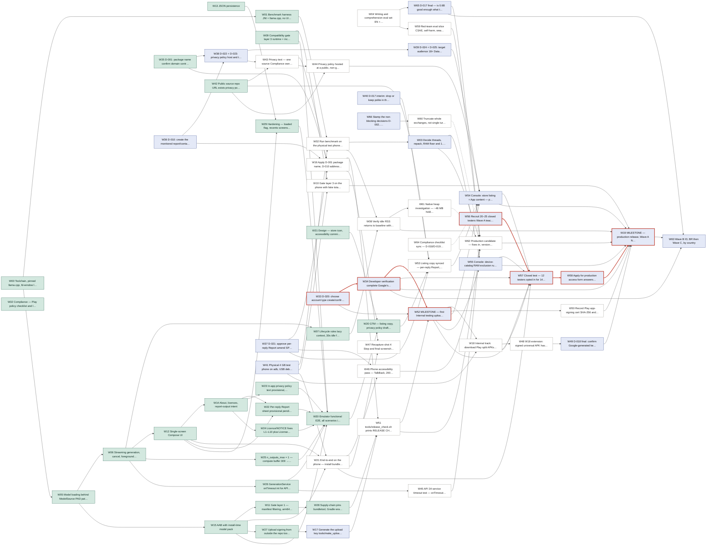

<!-- generated by tools/sequence.py from workitems.yml — do not edit -->

# Sequencing Leaf

Today **2026-09-15** (Tuesday) · slice **all** · done 25/67 · builders 1 + Hari · phones 1

Done means verified to the stated level. **Nothing has run on a physical phone**; emulator runs are functional only.

## Milestones

| Milestone | Item | Critical path (unconstrained) | Bandwidth-aware finish | Calendar days |
|---|---|---|---|---|
| internal | W52 | 4 days | 2026-09-21 (Mon) | 7 |
| production | W19 | 30.25 days | 2026-10-17 (Sat) | 33 |

Unconstrained = sum of effort + elapsed on the longest chain if every owner were free. Bandwidth-aware = simulated with 1 builder(s), Hari 1 slot on weekdays, 1 phone, agents every day; `~` estimates are guesses.

### What-if calendar

| Scenario | internal | production |
|---|---|---|
| 1 builder(s), personal account (base) | 2026-09-21 | 2026-10-17 |
| 2 builders, personal account | 2026-09-21 | 2026-10-17 |
| 1 builder(s), organisation account exempt from closed test (UNVERIFIED) | 2026-09-21 | 2026-09-26 |

## Critical path — internal (W52)

**Unconstrained: 4 days.** W33 (0.5d) → W34 (~0.25d + 3d elapsed) → W52 (0.25d)

Bandwidth chain (the dependency that finished last, traced back from the milestone):

| Item | Owner | Ready | Start | Finish | Queued (days) |
|---|---|---|---|---|---|
| W33 D-020: choose account type; create/confirm Play developer account; sta | Hari | 2026-09-15 | 2026-09-15 | 2026-09-15 | 0 |
| W34 Developer verification complete (Google's review) | Hari | 2026-09-15 | 2026-09-15 | 2026-09-18 | 0 |
| W52 MILESTONE — first Internal testing upload (create app, internal track, | Hari | 2026-09-18 | 2026-09-21 | 2026-09-21 | 2.25 |

## Critical path — production (W19)

**Unconstrained: 30.25 days.** W56 (~0.5d + 5d elapsed) → W57 (0.25d + 15d elapsed) → W58 (~0.25d + 7d elapsed) → W19 (~0.25d + 2d elapsed)

Bandwidth chain (the dependency that finished last, traced back from the milestone):

| Item | Owner | Ready | Start | Finish | Queued (days) |
|---|---|---|---|---|---|
| W56 Recruit 20–25 closed testers (Wave A teachers + 2–3 in BR/ID); GTM dra | Hari | 2026-09-15 | 2026-09-17 | 2026-09-22 | 2.25 |
| W57 Closed test — 12 testers opted in for 14 continuous days (cannot be co | Hari | 2026-09-22 | 2026-09-22 | 2026-10-07 | 0 |
| W58 Apply for production access (form answers from the closed test) and wa | Hari | 2026-10-08 | 2026-10-08 | 2026-10-15 | 0 |
| W19 MILESTONE — production release, Wave A (NG, GH, KE, UG, ZA, PH) | Hari | 2026-10-15 | 2026-10-15 | 2026-10-17 | 0 |

## Deadlines

| Item | Deadline | Days left | Scheduled finish | Flag |
|---|---|---|---|---|
| W33 D-020: choose account type; create/confirm Play developer ac | 2026-09-30 | 15 | 2026-09-15 | on schedule |
| W34 Developer verification complete (Google's review) | 2026-09-30 | 15 | 2026-09-18 | on schedule, but rests on a guessed duration |

### Decision SLAs (decisions.yml)

| Decision | Blocks release | Status | SLA expires | Flag | Work items |
|---|---|---|---|---|---|
| D-001 | **yes** | resolved_human | 2026-09-17 |  | W16, W51 |
| D-002 | no | pending | 2026-09-17 | expires in 2d | W37 |
| D-003 | no | pending | 2026-09-17 | expires in 2d | W66, W45 |
| D-004 | no | pending | 2026-09-17 | expires in 2d | W03, W65 |
| D-005 | no | pending | 2026-09-17 | expires in 2d | W66 |
| D-006 | no | pending | 2026-09-17 | expires in 2d | W10, W66 |
| D-007 | no | pending | 2026-09-17 | expires in 2d | W66 |
| D-008 | no | pending | 2026-09-17 | expires in 2d | W02, W03 |
| D-009 | **yes** | pending | 2026-09-17 | expires in 2d | W03, W47, W55, W62 |
| D-010 | **yes** | pending | 2026-09-17 | expires in 2d | W36, W16, W51 |
| D-011 | no | pending | 2026-09-17 | expires in 2d | W37 |
| D-012 | no | pending | 2026-09-17 | expires in 2d | W66 |
| D-013 | no | pending | 2026-09-17 | expires in 2d | W66, W18, W48 |
| D-014 | no | pending | 2026-09-17 | expires in 2d | W63 |
| D-015 | no | pending | 2026-09-17 | expires in 2d | W02, W03 |
| D-016 | no | pending | 2026-09-17 | expires in 2d | W66 |
| D-017 | **yes** | pending | 2026-09-17 | expires in 2d | W04, W65, W40, W53, W62, W63 |
| D-018 | **yes** | pending | 2026-09-17 | expires in 2d | W17, W52, W48, W49, W50, W19 |
| D-019 | no | pending | 2026-09-17 | expires in 2d | W66 |
| D-020 | **yes** | pending | 2026-09-17 | expires in 2d | W33, W34, W52, W57, W58, W19 |
| D-021 | **yes** | pending | 2026-09-17 | expires in 2d | W37, W16, W53, W47, W54, W64 |
| D-022 | **yes** | pending | 2026-09-17 | expires in 2d | W38, W43, W16, W44, W54 |
| D-023 | **yes** | pending | 2026-09-17 | expires in 2d | W38, W43 |
| D-024 | **yes** | pending | 2026-09-17 | expires in 2d | W39, W54 |
| D-025 | **yes** | pending | 2026-09-17 | expires in 2d | W39, W54 |
| D-026 | no | pending | 2026-09-17 | expires in 2d | W66, W59, W64 |
| D-027 | no | pending | 2026-09-17 | expires in 2d | W66, W48 |
| D-028 | no | pending | 2026-09-17 | expires in 2d | W66 |
| D-029 | no | pending | 2026-09-17 | expires in 2d | W66, W19, W63 |
| D-030 | no | pending | 2026-09-17 | expires in 2d | W04, W40 |
| D-031 | no | pending | 2026-09-17 | expires in 2d | W66 |
| D-032 | no | pending | 2026-09-17 | expires in 2d | W04, W66 |
| D-033 | no | pending | 2026-09-17 | expires in 2d | W66, W60 |
| D-034 | no | pending | 2026-09-17 | expires in 2d | W08, W61 |

## Ready now, by owner

### Hari

| Item | Slice | Title | Estimate | Deadline | Decisions | Needs |
|---|---|---|---|---|---|---|
| W33 | PLAY | D-020: choose account type; create/confirm Play developer account; start developer verification | 0.5d | 2026-09-30; verification enforced in BR, ID, SG, TH from 2026-09-30 | D-020 |  |
| W36 | PLAY | D-010: create the monitored report/contact mailbox; record resolution in decisions.yml | 0.25d | before the first upload (release_check.sh fails on the placeholder) | D-010 |  |
| W37 | PLAY | D-021: approve per-reply Report; amend SPINE §3 (+ D-002 permissions, D-011 if yes); bump version, run propagate.py | 0.5d | before the first upload (the build already contains Report) | D-021 D-002 D-011 |  |
| W17 | PLAY | Generate the upload key (tools/make_upload_key.sh), two encrypted offline backups, Gradle props outside the repo, record upload cert SHA-256 | 0.5d | before the first upload (release_check.sh fails unsigned) | D-018 | never an agent; provisional D-018 option A (Play-generated app signing key) at the first upload |
| W56 | PLAY | Recruit 20–25 closed testers (Wave A teachers + 2–3 in BR/ID); GTM drafts the message | ~0.5d + 5d elapsed |  |  | agents cannot recruit humans; launch-plan.md Phase 2 |
| W41 | BENCH | Physical 4 GB test phone on adb, USB debugging, its Google account ready to join Internal testing | ~0.25d |  |  | surfaced by Sequencing — every phone item waits on this; assumes Hari already owns the phone (if not, add purchase lead time) |
| W40 | PLAY | D-017 interim: drop or keep "polite" in the listing and first example | 0.25d | before the store listing is uploaded | D-017 D-030 |  |
| W66 | PLAY | Stamp the non-blocking decisions (D-002..D-034 non-blocking set, incl. D-028, D-033) | 0.25d |  | D-003 D-005 D-006 D-007 D-012 D-013 D-016 D-019 D-026 D-027 D-028 D-029 D-031 D-032 D-033 |  |

### Engineering

| Item | Slice | Title | Estimate | Deadline | Decisions | Needs |
|---|---|---|---|---|---|---|
| W04 | BENCH | Writing and comprehension eval set (EN + 2 target languages), incl. "continue" case | ~2d |  | D-017 D-032 D-030 | host run is valid for quality (same GGUF, same engine.cpp, shipped sampling); not for speed |
| W45 | MVP | API 34 service timeout test — onTimeout(int) fires and stops after ~3 min | ~0.5d |  | D-003 | API 34 arm64 emulator image (or phone on Android 14) and a > 3 min reply (debug slow-down hook) |

### Compliance

| Item | Slice | Title | Estimate | Deadline | Decisions | Needs |
|---|---|---|---|---|---|---|
| W64 | PLAY | Compliance checklist sync — D-018/D-019 → D-021/D-026; §1 and §3 describe the built Report sheet and in-app policy | 0.25d |  | D-021 D-026 |  |

## Hari's queue (all open, in simulated order)

| # | Item | Estimate | Deadline | Decisions | Waiting on | Scheduled |
|---|---|---|---|---|---|---|
| 1 | W33 D-020: choose account type; create/confirm Play developer account; start developer verification | 0.5d | 2026-09-30; verification enforced in BR, ID, SG, TH from 2026-09-30 | D-020 | ready | 2026-09-15 → 2026-09-15 |
| 2 | W34 Developer verification complete (Google's review) | ~0.25d + 3d elapsed | 2026-09-30 | D-020 | W33 | 2026-09-15 → 2026-09-18 |
| 3 | W36 D-010: create the monitored report/contact mailbox; record resolution in decisions.yml | 0.25d | before the first upload (release_check.sh fails on the placeholder) | D-010 | ready | 2026-09-15 → 2026-09-15 |
| 4 | W37 D-021: approve per-reply Report; amend SPINE §3 (+ D-002 permissions, D-011 if yes); bump version, run propagate.py | 0.5d | before the first upload (the build already contains Report) | D-021 D-002 D-011 | ready | 2026-09-16 → 2026-09-16 |
| 5 | W38 D-022 + D-023: privacy policy host and text owner; retention period; supply developer name and repo URL | 0.25d | before the first upload (in-app text ships) and before the Data safety form | D-022 D-023 | W36 | 2026-09-16 → 2026-09-16 |
| 6 | W17 Generate the upload key (tools/make_upload_key.sh), two encrypted offline backups, Gradle props outside the repo, record upload cert SHA-256 | 0.5d | before the first upload (release_check.sh fails unsigned) | D-018 | ready | 2026-09-16 → 2026-09-17 |
| 7 | W56 Recruit 20–25 closed testers (Wave A teachers + 2–3 in BR/ID); GTM drafts the message | ~0.5d + 5d elapsed |  |  | ready | 2026-09-17 → 2026-09-22 |
| 8 | W41 Physical 4 GB test phone on adb, USB debugging, its Google account ready to join Internal testing | ~0.25d |  |  | ready | 2026-09-17 → 2026-09-17 |
| 9 | W40 D-017 interim: drop or keep "polite" in the listing and first example | 0.25d | before the store listing is uploaded | D-017 D-030 | ready | 2026-09-18 → 2026-09-18 |
| 10 | W39 D-024 + D-025: target audience 18+; Data safety answer | 0.25d | before the Console App content forms | D-024 D-025 | W38 | 2026-09-18 → 2026-09-18 |
| 11 | W65 D-017 final — is 0.6B good enough; what the listing may promise | 0.5d | final call before production; Wave B also needs the non-English result | D-017 D-004 | W04 | 2026-09-18 → 2026-09-18 |
| 12 | W52 MILESTONE — first Internal testing upload (create app, internal track, testers, upload signed AAB, keep Play App Signing) | 0.25d |  | D-018 D-020 | W51, W34, W33 | 2026-09-21 → 2026-09-21 |
| 13 | W03 Decide threads, repack, RAM floor (and 1.7B fit) from W02 measurements | 0.5d | D-009 before any track wider than Internal testing | D-004 D-008 D-009 D-015 | W02 | 2026-09-21 → 2026-09-21 |
| 14 | W54 Console: store listing + App content — privacy URL, Data safety, target audience, IARC, AI content / App access notes, ads, FGS check | 0.5d |  | D-021 D-022 D-024 D-025 | W52, W39, W44, W53 | 2026-09-21 → 2026-09-22 |
| 15 | W55 Console: device-catalog RAM exclusion rule (gate layer 2) from D-009 | 0.25d | before any track wider than Internal testing | D-009 | W03, W52 | 2026-09-22 → 2026-09-22 |
| 16 | W66 Stamp the non-blocking decisions (D-002..D-034 non-blocking set, incl. D-028, D-033) | 0.25d |  | D-003 D-005 D-006 D-007 D-012 D-013 D-016 D-019 D-026 D-027 D-028 D-029 D-031 D-032 D-033 | ready | 2026-09-22 → 2026-09-22 |
| 17 | W57 Closed test — 12 testers opted in for 14 continuous days (cannot be compressed) | 0.25d + 15d elapsed |  | D-020 | W52, W18, W21, W54, W55, W56, W34 | 2026-09-22 → 2026-10-07 |
| 18 | W49 D-018 final: confirm Google-generated key (A) or switch to own key via PEPK (B) | 0.25d | before the first Open testing or Production release (locks then) | D-018 | W48 | 2026-09-23 → 2026-09-23 |
| 19 | W58 Apply for production access (form answers from the closed test) and wait for Google | ~0.25d + 7d elapsed |  | D-020 | W57 | 2026-10-08 → 2026-10-15 |
| 20 | W19 MILESTONE — production release, Wave A (NG, GH, KE, UG, ZA, PH) | ~0.25d + 2d elapsed |  | D-018 D-020 D-029 | W58, W62, W49, W50, W08, W10, W54, W55, W34 | 2026-10-15 → 2026-10-17 |
| 21 | W63 Wave B (ID, BR) then Wave C, by country | ~0.25d + 7d elapsed |  | D-029 D-014 D-017 | W19, W65, W34 | 2026-10-19 → 2026-10-26 |

Hari effort still open: 7 days.

## Open items no milestone requires

W61 (Engineering), W66 (Hari), W60 (Engineering), W47 (GTM), W63 (Hari), W64 (Compliance). Scheduled after milestone work; soft dependencies are dotted in the graph.

## Schedule (simulated)

| Item | Owner | Slice | Status | Estimate | Start | Finish |
|---|---|---|---|---|---|---|
| W33 D-020: choose account type; create/confirm Play developer account; sta | Hari | PLAY | todo | 0.5d | 2026-09-15 | 2026-09-15 |
| W36 D-010: create the monitored report/contact mailbox; record resolution  | Hari | PLAY | todo | 0.25d | 2026-09-15 | 2026-09-15 |
| W37 D-021: approve per-reply Report; amend SPINE §3 (+ D-002 permissions,  | Hari | PLAY | todo | 0.5d | 2026-09-16 | 2026-09-16 |
| W38 D-022 + D-023: privacy policy host and text owner; retention period; s | Hari | PLAY | todo | 0.25d | 2026-09-16 | 2026-09-16 |
| W04 Writing and comprehension eval set (EN + 2 target languages), incl. "c | Engineering | BENCH | todo | ~2d | 2026-09-15 | 2026-09-16 |
| W17 Generate the upload key (tools/make_upload_key.sh), two encrypted offl | Hari | PLAY | todo | 0.5d | 2026-09-16 | 2026-09-17 |
| W43 Privacy text — one source (Compliance owns), placeholders filled, rete | Compliance | PLAY | todo | 0.25d | 2026-09-17 | 2026-09-17 |
| W16 Apply D-001 package name, D-010 address and the privacy text into the  | Engineering | PLAY | todo | 0.5d | 2026-09-17 | 2026-09-17 |
| W41 Physical 4 GB test phone on adb, USB debugging, its Google account rea | Hari | BENCH | todo | ~0.25d | 2026-09-17 | 2026-09-17 |
| W51 tools/release_check.sh prints RELEASE CHECK PASSED on the upload-key-s | Engineering | PLAY | todo | 0.25d | 2026-09-17 | 2026-09-17 |
| W40 D-017 interim: drop or keep "polite" in the listing and first example | Hari | PLAY | todo | 0.25d | 2026-09-18 | 2026-09-18 |
| W39 D-024 + D-025: target audience 18+; Data safety answer | Hari | PLAY | todo | 0.25d | 2026-09-18 | 2026-09-18 |
| W34 Developer verification complete (Google's review) | Hari | PLAY | todo | ~0.25d + 3d elapsed | 2026-09-15 | 2026-09-18 |
| W02 Run benchmark on the physical test phone; record leaves/NOTES.md | Engineering | BENCH | todo | 1d | 2026-09-18 | 2026-09-18 |
| W65 D-017 final — is 0.6B good enough; what the listing may promise | Hari | BENCH | todo | 0.5d | 2026-09-18 | 2026-09-18 |
| W44 Privacy policy hosted at a public, non-geofenced URL (GitHub Pages, no | GTM | PLAY | todo | 0.25d | 2026-09-19 | 2026-09-19 |
| W53 Listing copy synced — per-reply Report, Send/Stop/Copy/Report, D-017 i | GTM | PLAY | todo | 0.25d | 2026-09-19 | 2026-09-19 |
| W21 End-to-end on the phone — install bundle, airplane mode, first reply ( | Engineering | MVP | todo | 0.5d | 2026-09-19 | 2026-09-19 |
| W59 Red-team eval slice (CSAE, self-harm, weapons, forged official letters | Engineering | BENCH | todo | ~1d | 2026-09-20 | 2026-09-20 |
| W52 MILESTONE — first Internal testing upload (create app, internal track, | Hari | PLAY | todo | 0.25d | 2026-09-21 | 2026-09-21 |
| W45 API 34 service timeout test — onTimeout(int) fires and stops after ~3  | Engineering | MVP | todo | ~0.5d | 2026-09-21 | 2026-09-21 |
| W03 Decide threads, repack, RAM floor (and 1.7B fit) from W02 measurements | Hari | BENCH | todo | 0.5d | 2026-09-21 | 2026-09-21 |
| W18 Internal track: download Play split APKs; model STORED, offset % 16384 | Engineering | PLAY | todo | 0.5d | 2026-09-21 | 2026-09-21 |
| W54 Console: store listing + App content — privacy URL, Data safety, targe | Hari | PLAY | todo | 0.5d | 2026-09-21 | 2026-09-22 |
| W46 Phone accessibility pass — TalkBack, 200% text, RTL (design.md commitm | Design | MVP | todo | ~0.5d | 2026-09-22 | 2026-09-22 |
| W55 Console: device-catalog RAM exclusion rule (gate layer 2) from D-009 | Hari | PLAY | todo | 0.25d | 2026-09-22 | 2026-09-22 |
| W56 Recruit 20–25 closed testers (Wave A teachers + 2–3 in BR/ID); GTM dra | Hari | PLAY | todo | ~0.5d + 5d elapsed | 2026-09-17 | 2026-09-22 |
| W66 Stamp the non-blocking decisions (D-002..D-034 non-blocking set, incl. | Hari | PLAY | todo | 0.25d | 2026-09-22 | 2026-09-22 |
| W48 W18 extension: signed universal APK has the model aligned; apksigner c | Architecture | PLAY | todo | ~0.5d | 2026-09-22 | 2026-09-22 |
| W49 D-018 final: confirm Google-generated key (A) or switch to own key via | Hari | PLAY | todo | 0.25d | 2026-09-23 | 2026-09-23 |
| W08 Verify idle RSS returns to baseline with dumpsys meminfo (M4) | Engineering | BENCH | todo | 0.5d | 2026-09-23 | 2026-09-23 |
| W10 Gate layer 3 on the phone with fake totalMem; ACTION_DELETE works | Engineering | MVP | todo | 0.5d | 2026-09-23 | 2026-09-23 |
| W62 Production candidate — fixes in, versionCode bumped, release_check.sh  | Engineering | PLAY | todo | 0.5d | 2026-09-24 | 2026-09-24 |
| W50 Record Play app-signing cert SHA-256 and release provenance (AAB sha25 | Engineering | PLAY | todo | 0.25d | 2026-09-24 | 2026-09-24 |
| W60 Truncate whole exchanges, not single turns (+ Design review of divider | Engineering | MVP | todo | ~1d | 2026-09-24 | 2026-09-25 |
| W47 Recapture shot 4 (Stop) and final screenshots on the phone (+ shot 8 R | GTM | PLAY | todo | 0.5d | 2026-09-25 | 2026-09-26 |
| W61 Native heap investigation — ~46 MB held after idle context free | Engineering | BENCH | todo | ~0.5d | 2026-09-26 | 2026-09-26 |
| W64 Compliance checklist sync — D-018/D-019 → D-021/D-026; §1 and §3 descr | Compliance | PLAY | todo | 0.25d | 2026-09-26 | 2026-09-26 |
| W57 Closed test — 12 testers opted in for 14 continuous days (cannot be co | Hari | PLAY | todo | 0.25d + 15d elapsed | 2026-09-22 | 2026-10-07 |
| W58 Apply for production access (form answers from the closed test) and wa | Hari | PLAY | todo | ~0.25d + 7d elapsed | 2026-10-08 | 2026-10-15 |
| W19 MILESTONE — production release, Wave A (NG, GH, KE, UG, ZA, PH) | Hari | PLAY | todo | ~0.25d + 2d elapsed | 2026-10-15 | 2026-10-17 |
| W63 Wave B (ID, BR) then Wave C, by country | Hari | PLAY | todo | ~0.25d + 7d elapsed | 2026-10-19 | 2026-10-26 |

## Done — verified to

| Item | Owner | Verified to |
|---|---|---|
| W00 Toolchain, pinned llama.cpp, fd-window load patch | Engineering | host (macOS arm64) — tools/host/run_smoke.sh ALL PASSED |
| W01 Benchmark harness (JNI + llama.cpp, no UI) | Engineering | build — compiles into the androidTest APK, records computeBufferKib; NOT run on a phone |
| W05 Model loading behind ModelSource; PAD path; embedded stub | Engineering | host (loads from bundletool split APK at offset 16384) + emulator (loads from split_modelpack.apk, offset 16384) |
| W06 Streaming generation, cancel, foreground service | Engineering | host (cancel/stream smoke) + emulator API 36 (shortService isForeground, hidden reply completes); NOT on a phone |
| W07 Lifecycle rules (lazy context, 30s idle free, onStop, onTrimMemory) | Engineering | emulator (logcat — context freed at 30.02 s idle; model freed on trim BACKGROUND); RSS numbers non-representative |
| W09 Compatibility gate layer 3 (runtime) + incompatible screen | Engineering | unit (CompatibilityGateTest) + emulator (debug fakeTotalMem → incompatible screen) |
| W11 Gate layer 1 — manifest filtering, arm64-only bundle | Engineering | build — tools/check_manifest.sh, now run automatically after every bundleRelease/bundleDebug |
| W12 Single-screen Compose UI | Engineering | emulator (Starting → Reading → streaming → done; Stop; Copy; divider; too-long); NOT on a phone |
| W13 JSON persistence | Engineering | unit (ChatRepositoryTest incl. reported flag, corrupt-copy pruning) + emulator (partial reply survives process death) |
| W14 About, licences, report-output intent | Engineering | emulator (About, licences, NOTICE, report → Gmail / share fallback); report address still the D-010 placeholder |
| W15 AAB with install-time model pack | Engineering | build (model STORED, 16K-aligned in split and universal APKs) + emulator (bundletool --local-testing install, R8 release runs); NOT Play-generated APKs |
| W22 Per-reply Report sheet (provisional pending D-021) | Engineering | emulator (sheet → Reported → ACTION_SEND mailto to Gmail; share fallback) + unit (report intent contract); NOT reviewed by Play |
| W23 In-app privacy policy text (provisional, placeholders) | Engineering | emulator (About → Privacy policy expands offline); text has no developer name, retention or repo URL; differs from privacy-policy.html |
| W24 Licence/NOTICE fixes L1–L10 plus LicensesTest | Engineering | unit (LicensesTest — every shipped .so maps to a licence entry; in-app NOTICE == root NOTICE) + build (release_check licence assets) |
| W25 n_outputs_max = 1 — compute buffer 309 → 27 MiB | Engineering | host (26.59 MiB, smoke identical) + emulator (28.09 MiB); peak RSS on a phone unknown (W02) |
| W26 GenerationService onTimeout(int) for API 34 | Engineering | code only — never fired; test is W45 |
| W27 Upload signing from outside the repo; tools/make_upload_key.sh; release gate rejects test keys | Engineering | build (in-repo keystore path fails the build; release_check FAILs on CN=THROWAWAY); no real key exists yet (W17) |
| W28 Supply-chain pins (bundletool, Gradle wrapper sha256, dependency verification); manifest check in bundle tasks | Engineering | build (tamper test fails the build); Maven hashes are trust-on-first-use, not independently checked |
| W29 Hardening — loaded flag, recents screenshot off, IME no-learning; 3 bugs fixed (clipped end, Stop in cold start, text lost on process death) | Engineering | emulator (each bug re-run; blank recents thumbnail); IME_FLAG_NO_PERSONALIZED_LEARNING reaching Gboard NOT verified (phone) |
| W30 Emulator functional E2E, all scenarios (install via bundletool → gate → uninstall dialog) | Engineering | emulator arm64 API 36, functional only; 29 unit tests, lint 0 errors, host smoke, trace --strict 0 gaps |
| W31 Design — store icon, accessibility commitments, copy | Design | delivered (design.md, store-icon-512.png); accessibility commitments NOT yet checked on a phone (W46) |
| W32 Compliance — Play policy checklist and licence audit | Compliance | delivered (play-policy-checklist.md, licence-audit.md); checklist partly stale after round 2 (W64) |
| W20 GTM — listing copy, privacy policy draft, feature graphic, 4 screenshots, release notes, launch plan | GTM | delivered; screenshots are emulator captures (dev icon in status bar); nothing uploaded; shot 2 dropped (6/6 failed), shot 4 needs recapture |
| W35 D-001: package name (confirm domain control); record resolution in decisions.yml | Hari | resolved_human 2026-09-15: io.github.brettleehari.arivu; renamed across the source tree; unit tests + emulator run confirm JNI still binds |
| W42 Public source repo URL exists (privacy policy, listing, GitHub Pages host) | Hari | github.com/brettleehari/arivu, public, pushed 2026-09-15 (D-035) |

## Graph

Red: critical paths to the internal upload and to production. Dotted: soft dependency.

