<!-- generated by tools/sequence.py from workitems.yml — do not edit -->

# Sequencing Leaf

Today **2026-09-23** (Wednesday) · slice **all** · platform **all** · done 53/146 · builders 1 + Hari

Done means verified to the stated level, never more. **Nothing has run on a physical Android phone or on any iPhone.** Emulator runs are functional only; the 94 iOS tests ran on macOS, not on iOS.

## Resource gates

Every `uses:` value must be declared here as available or not. An unavailable resource with an `acquired_by` item becomes an implicit dependency of everything that uses it — shown as `gate` in the tables below.

| Resource | In hand | Capacity | Created by | Open items waiting on it |
|---|---|---|---|---|
| `phone` The 4 GB Android test phone (Helio G85 / SD680 class) on adb | **NO** | 1 | W112 (2026-10-03) | 9: W02, W08, W10, W18, W21, W46, W47, W48, W61 |
| `iphone` A 3-4 GB test iPhone (SE 2020 / iPhone 11 class — the iOS twin of the Helio G85 target) | **NO** | 1 | W111 (2026-10-05) | 5: W101, W92, W93, W94, W99 |
| `mac-with-xcode` A Mac with Xcode 16+ (Swift 6 toolchain), cmake and xcodegen | yes | 1 | W85 (2026-09-23) | 11: W101, W109, W119, W92, W93, W94, W95, W96, W97, W98, W99 |
| `mac` The development Mac as it is today (Command Line Tools, no Xcode) | yes | 1 | — | 0: — |
| `Engineering` An agent that can drive builds, adb and scripts, lent to another Leaf's item | yes | 1 | — | 7: W101, W107, W46, W47, W48, W81, W99 |
| `ci-runner` GitHub-hosted runners (ubuntu-latest and macos-latest) | yes | 1 | — | 2: W74, W75 |

**`phone` — not in hand.** W41 has assumed since 0.1 that Hari already owns this handset. No measurement, screenshot or logcat in the repo comes from a physical Android phone, so Sequencing now models it as not-yet-in-hand with an explicit purchase item. If Hari does own one, close W112 in a minute and every date below moves left.

**`iphone` — not in hand.** Does not exist. Every iOS number in every Leaf is an Android measurement or an estimate (engineering-ios.md "the whole memory story"). Also needs the Apple Developer Program (W110) before an app can be installed on it at all.

## Milestones — two per store, independent calendars

| Milestone | Store | Item | Critical path (unconstrained) | Bandwidth-aware finish | Calendar days |
|---|---|---|---|---|---|
| **play_internal** — First Play Internal-testing upload (signed AAB accepted on the internal track) | android | W52 | 4 days | 2026-09-28 (Mon) | 6 |
| **play_production** — Play production release, Wave A (NG, GH, KE, UG, ZA, PH) | android | W19 | 32 days | 2026-11-01 (Sun) | 40 |
| **ios_testflight** — First TestFlight build (internal testers, no Beta App Review) | ios | W120 | 7.5 days | 2026-10-12 (Mon) | 20 |
| **ios_appstore** — App Store release (submitted with "Manually release this version") | ios | W123 | 11.25 days | 2026-10-19 (Mon) | 27 |

Unconstrained = sum of effort + elapsed on the longest chain if every owner were free. Bandwidth-aware = simulated with 1 builder(s), Hari 1 slot on weekdays, the declared resource capacities, agents every day; `~` estimates are guesses.

### Are the two stores independent?

- **Yes.** No open item tagged for one platform sits in the other platform's milestone ancestry. What the two queues share is Hari, the shared `/core` and `/tools` work, and the eight both-platform decisions (D-009, D-010, D-017, D-020, D-022, D-023, D-024, D-025).

- On the base scenario: **iOS reaches users first** by about 13 days (2026-10-19 vs 2026-11-01). Apple imposes no 12-tester / 14-day gate, so the App Store release is not downstream of the Play closed test. Whether that is what happens is a decision (D-041), not a constraint.

### What-if calendar

| Scenario | play_internal | play_production | ios_testflight | ios_appstore |
|---|---|---|---|---|
| 1 builder(s), hardware still to buy (base) | 2026-09-28 | 2026-11-01 | 2026-10-12 | 2026-10-19 |
| 2 builders | 2026-09-28 | 2026-10-31 | 2026-10-07 | 2026-10-14 |
| both handsets already in a drawer | 2026-09-28 | 2026-10-29 | 2026-10-06 | 2026-10-14 |
| organisation account exempt from the Play closed test (UNVERIFIED) | 2026-09-28 | 2026-10-14 | 2026-10-12 | 2026-10-19 |
| both of the above | 2026-09-28 | 2026-10-07 | 2026-10-06 | 2026-10-14 |

## Critical path — play_internal (W52, android)

**Unconstrained: 4 days.** W33 (0.5d) → W34 (~0.25d + 3d elapsed) → W52 (0.25d)

Bandwidth chain (the dependency that finished last, traced back from the milestone):

| Item | Owner | Plat | Ready | Start | Finish | Queued (days) |
|---|---|---|---|---|---|---|
| W33 D-020: choose account type; create/confirm Play developer account; | Hari | both | 2026-09-23 | 2026-09-23 | 2026-09-23 | 0 |
| W34 Developer verification complete (Google's review) | Hari | android | 2026-09-23 | 2026-09-24 | 2026-09-27 | 0.5 |
| W52 MILESTONE — first Play Internal-testing upload (create app, intern | Hari | android | 2026-09-27 | 2026-09-28 | 2026-09-28 | 1 |

## Critical path — play_production (W19, android)

**Unconstrained: 32 days.** W112 (~0.25d + 5d elapsed) → W41 (~0.25d) → W02 (1d) → W03 (0.5d) → W55 (0.25d) → W57 (0.25d + 15d elapsed) → W58 (~0.25d + 7d elapsed) → W19 (~0.25d + 2d elapsed)

Bandwidth chain (the dependency that finished last, traced back from the milestone):

| Item | Owner | Plat | Ready | Start | Finish | Queued (days) |
|---|---|---|---|---|---|---|
| W112 Buy or borrow the 4 GB Android test phone (Helio G85 / SD680 class | Hari | android | 2026-09-23 | 2026-09-28 | 2026-10-03 | 5.5 |
| W41 Android test phone on adb — USB debugging, its Google account read | Hari | android | 2026-10-03 | 2026-10-05 | 2026-10-05 | 1.25 |
| W21 End-to-end on the Android phone — install bundle, airplane mode, f | Engineering | android | 2026-10-05 | 2026-10-07 | 2026-10-07 | 1.75 |
| W57 Closed test — 12 testers opted in for 14 continuous days (cannot b | Hari | android | 2026-10-07 | 2026-10-07 | 2026-10-22 | 0 |
| W58 Apply for production access (form answers from the closed test) an | Hari | android | 2026-10-22 | 2026-10-22 | 2026-10-29 | 0 |
| W19 MILESTONE — Play production release, Wave A (NG, GH, KE, UG, ZA, P | Hari | android | 2026-10-30 | 2026-10-30 | 2026-11-01 | 0 |

## Critical path — ios_testflight (W120, ios)

**Unconstrained: 7.5 days.** W33 (0.5d) → W110 (~0.25d + 5d elapsed) → W92 (~0.5d) → W119 (~0.5d) → W96 (0.5d) → W120 (0.25d)

Bandwidth chain (the dependency that finished last, traced back from the milestone):

| Item | Owner | Plat | Ready | Start | Finish | Queued (days) |
|---|---|---|---|---|---|---|
| W111 Buy or borrow a test iPhone (SE 2020 / iPhone 11 class, 3–4 GB) | Hari | ios | 2026-09-23 | 2026-09-30 | 2026-10-05 | 7 |
| W92 iOS step 8 — put it on a physical iPhone (SE 2020 / iPhone 11 clas | Engineering | ios | 2026-10-05 | 2026-10-10 | 2026-10-10 | 4.75 |
| W119 First signed device archive — Release configuration, distribution  | Engineering | ios | 2026-10-10 | 2026-10-10 | 2026-10-10 | 0 |
| W96 iOS step 12 — pre-submission gate: tools/ios_release_check.sh agai | Compliance | ios | 2026-10-11 | 2026-10-11 | 2026-10-11 | 0 |
| W120 MILESTONE — first TestFlight build (internal testers, team only, n | Hari | ios | 2026-10-11 | 2026-10-12 | 2026-10-12 | 0.5 |

## Critical path — ios_appstore (W123, ios)

**Unconstrained: 11.25 days.** W33 (0.5d) → W110 (~0.25d + 5d elapsed) → W92 (~0.5d) → W94 (~1d) → W101 (~0.5d) → W108 (0.5d) → W107 (0.25d) → W122 (~0.5d + 2d elapsed) → W123 (0.25d)

Bandwidth chain (the dependency that finished last, traced back from the milestone):

| Item | Owner | Plat | Ready | Start | Finish | Queued (days) |
|---|---|---|---|---|---|---|
| W111 Buy or borrow a test iPhone (SE 2020 / iPhone 11 class, 3–4 GB) | Hari | ios | 2026-09-23 | 2026-09-30 | 2026-10-05 | 7 |
| W92 iOS step 8 — put it on a physical iPhone (SE 2020 / iPhone 11 clas | Engineering | ios | 2026-10-05 | 2026-10-10 | 2026-10-10 | 4.75 |
| W93 iOS step 9 — first iPhone measurement, airplane mode: cold first m | Engineering | ios | 2026-10-10 | 2026-10-12 | 2026-10-13 | 2 |
| W109 Choose the shipping MinimumOSVersion from measurement (D-042) and  | Engineering | ios | 2026-10-13 | 2026-10-14 | 2026-10-14 | 0.5 |
| W108 App Store listing finalised — the approved iOS privacy wording, th | GTM | ios | 2026-10-14 | 2026-10-14 | 2026-10-14 | 0 |
| W107 Four-way privacy consistency read before every submission — listin | GTM | both | 2026-10-14 | 2026-10-14 | 2026-10-14 | 0 |
| W122 Submit to the App Store with "Manually release this version"; wait | Hari | ios | 2026-10-15 | 2026-10-15 | 2026-10-17 | 0 |
| W123 MILESTONE — App Store release (release the held build) | Hari | ios | 2026-10-17 | 2026-10-19 | 2026-10-19 | 1.5 |

## Deadlines

| Item | Deadline | Days left | Scheduled finish | Flag |
|---|---|---|---|---|
| W33 D-020: choose account type; create/confirm Play developer ac | 2026-09-30 | 7 | 2026-09-23 | on schedule |
| W34 Developer verification complete (Google's review) | 2026-09-30 | 7 | 2026-09-27 | on schedule, but rests on a guessed duration |

### Decision SLAs (decisions.yml), by the store they block

| Decision | Blocks Play | Blocks App Store | Status | SLA expires | Flag | Work items |
|---|---|---|---|---|---|---|
| D-001 | **yes** | **yes** | resolved_human | 2026-09-17 |  | W16, W51, W113 |
| D-002 | no | no | pending | 2026-09-17 | **OVERDUE** | W37 |
| D-003 | no | no | pending | 2026-09-17 | **OVERDUE** | W66, W45 |
| D-004 | no | no | pending | 2026-09-17 | **OVERDUE** | W03, W65 |
| D-005 | no | no | pending | 2026-09-17 | **OVERDUE** | W66 |
| D-006 | no | no | pending | 2026-09-17 | **OVERDUE** | W10, W66 |
| D-007 | no | no | pending | 2026-09-17 | **OVERDUE** | W66 |
| D-008 | no | no | pending | 2026-09-17 | **OVERDUE** | W02, W03 |
| D-009 | **yes** | **yes** | pending | 2026-09-17 | **OVERDUE** | W03, W47, W55, W62, W109 |
| D-010 | **yes** | **yes** | resolved_human | 2026-09-17 |  | W36, W16, W51, W96, W105, W106 |
| D-011 | no | no | pending | 2026-09-17 | **OVERDUE** | W37 |
| D-012 | no | no | pending | 2026-09-17 | **OVERDUE** | W66 |
| D-013 | no | no | pending | 2026-09-17 | **OVERDUE** | W66, W18, W48, W119 |
| D-014 | no | no | pending | 2026-09-17 | **OVERDUE** | W63 |
| D-015 | no | no | pending | 2026-09-17 | **OVERDUE** | W02, W03 |
| D-016 | no | no | pending | 2026-09-17 | **OVERDUE** | W66 |
| D-017 | **yes** | **yes** | pending | 2026-09-17 | **OVERDUE** | W04, W65, W40, W53, W62, W63, W108 |
| D-018 | **yes** | no | pending | 2026-09-17 | **OVERDUE** | W17, W52, W48, W49, W50, W19 |
| D-019 | no | no | pending | 2026-09-17 | **OVERDUE** | W66, W103 |
| D-020 | **yes** | **yes** | pending | 2026-09-17 | **OVERDUE** | W33, W34, W52, W57, W58, W19, W110, W113 |
| D-021 | **yes** | no | pending | 2026-09-17 | **OVERDUE** | W37, W16, W53, W47, W54, W64, W94, W105 |
| D-022 | **yes** | **yes** | pending | 2026-09-17 | **OVERDUE** | W38, W43, W16, W44, W54, W98, W106, W107 |
| D-023 | **yes** | **yes** | pending | 2026-09-17 | **OVERDUE** | W38, W43 |
| D-024 | **yes** | **yes** | pending | 2026-09-17 | **OVERDUE** | W39, W59, W54, W122 |
| D-025 | **yes** | **yes** | pending | 2026-09-17 | **OVERDUE** | W39, W54, W96, W107, W122 |
| D-026 | no | no | pending | 2026-09-17 | **OVERDUE** | W66, W59, W64 |
| D-027 | no | no | pending | 2026-09-17 | **OVERDUE** | W66, W48 |
| D-028 | no | no | pending | 2026-09-17 | **OVERDUE** | W66 |
| D-029 | no | no | pending | 2026-09-17 | **OVERDUE** | W66, W19, W63, W123 |
| D-030 | no | no | pending | 2026-09-17 | **OVERDUE** | W04, W40 |
| D-031 | no | no | pending | 2026-09-17 | **OVERDUE** | W66 |
| D-032 | no | no | pending | 2026-09-17 | **OVERDUE** | W04, W66 |
| D-033 | no | no | pending | 2026-09-17 | **OVERDUE** | W66, W60 |
| D-034 | no | no | pending | 2026-09-17 | **OVERDUE** | W08, W61 |
| D-036 | no | no | pending | 2026-09-17 | **OVERDUE** | W66 |
| D-038 | no | **yes** | pending | 2026-09-18 | **OVERDUE** | W69, W79, W80, W93, W116 |
| D-039 | no | **yes** | pending | 2026-09-18 | **OVERDUE** | W78, W96, W107, W108, W115, W122 |
| D-040 | no | no | pending | 2026-09-18 | **OVERDUE** | W116 |
| D-041 | no | no | pending | 2026-09-18 | **OVERDUE** | W116, W120, W122, W123, W124, W136 |
| D-042 | no | **yes** | pending | 2026-09-18 | **OVERDUE** | W93, W108, W109 |
| D-043 | no | **yes** | pending | 2026-09-18 | **OVERDUE** | W94, W118 |
| D-044 | no | no | pending | 2026-09-18 | **OVERDUE** | W118, W121 |
| D-045 | no | no | pending | 2026-09-18 | **OVERDUE** | W81, W94, W101, W121 |
| D-046 | no | **yes** | pending | 2026-09-18 | **OVERDUE** | W76, W110, W114, W119, W120 |
| D-047 | no | no | pending | 2026-09-18 | **OVERDUE** | W80, W93, W121 |
| D-048 | no | no | pending | 2026-09-18 | **OVERDUE** | W69, W79, W80, W93, W97, W121 |
| D-049 | no | **yes** | pending | 2026-09-18 | **OVERDUE** | W78, W96, W115 |
| D-050 | no | no | pending | 2026-09-18 | **OVERDUE** | W121 |
| D-051 | no | no | pending | 2026-09-18 | **OVERDUE** | W93, W121 |
| D-052 | no | no | pending | 2026-09-18 | **OVERDUE** | W60, W97, W121 |
| D-053 | no | no | pending | 2026-09-18 | **OVERDUE** | W77, W81, W83, W121 |
| D-054 | no | no | pending | 2026-09-18 | **OVERDUE** | W84, W121 |
| D-055 | no | no | pending | 2026-09-18 | **OVERDUE** | W121 |
| D-056 | no | no | pending | 2026-09-18 | **OVERDUE** | W117, W103, W121 |
| D-057 | no | no | pending | 2026-09-18 | **OVERDUE** | W108, W121 |
| D-058 | no | no | pending | 2026-09-18 | **OVERDUE** | W101, W108, W121 |
| D-059 | no | no | pending | 2026-09-18 | **OVERDUE** | W108, W121, W122, W123 |
| D-061 | no | no | resolved_human | 2026-09-22 |  | W139 |
| D-063 | no | no | resolved_human | 2026-09-22 |  | W139 |
| D-064 | no | no | resolved_human |  |  | W142 |

9 open decisions block the Play release; 13 block the App Store release; 7 block both.

## Ready now, by platform and owner

### Shared (`/core`, `/tools`, and decisions that serve both stores)

**Hari**

| Item | Slice | Title | Estimate | Deadline | Decisions | Needs |
|---|---|---|---|---|---|---|
| W33 | PLAY | D-020: choose account type; create/confirm Play developer account; start developer verification | 0.5d | 2026-09-30; verification enforced in BR, ID, SG, TH from 2026-09-30 | D-020 | the same personal-vs-organisation trade-off decides the Apple enrolment (W110) — decide it once, execute it twice |
| W36 | PLAY | D-010: create the monitored report/contact mailbox; record resolution in decisions.yml | 0.25d | before the first upload to EITHER store (release_check.sh step 1 and ios_release_check.sh step 8 both fail on the placeholder) | D-010 | one address serves three forms — the Play public contact, the privacy contact, and the iOS Info.plist ARIVUReportEmail key plus the App Store support contact. Both release gates fail on the placeholder today |
| W37 | PLAY | D-021: approve per-reply Report; amend SPINE §3 (+ D-002 permissions, D-011 if yes); bump version, run propagate.py | 0.5d | before the first upload (both builds already contain Report) | D-021 D-002 D-011 | the sheet is built and working on both platforms. Compliance found it PASSES Apple Guideline 1.2 outright while remaining a documented gap against Play's "without needing to exit the app" |
| W40 | PLAY | D-017 interim: drop or keep "polite" in the listing and first example | 0.25d | before either store listing is uploaded | D-017 D-030 | applies to both listings; the polite rewrite echoed the input unchanged 6/6 on device |
| W66 | PLAY | Stamp the carried-over non-blocking decisions (D-002..D-008, D-011..D-016, D-019, D-026..D-034, D-036) | 0.25d |  | D-003 D-005 D-006 D-007 D-012 D-013 D-016 D-019 D-026 D-027 D-028 D-029 D-031 D-032 D-033 D-036 |  |

**Engineering**

| Item | Slice | Title | Estimate | Deadline | Decisions | Needs |
|---|---|---|---|---|---|---|
| W04 | BENCH | Writing and comprehension eval set (EN + 2 target languages), incl. "continue" case | ~2d |  | D-017 D-032 D-030 | host run is valid for quality (same GGUF, same engine.cpp, shipped sampling); not for speed. Serves both stores — App Store review scrutinises model output more closely than Play does |
| W67 | CORE | Boundary lint (E3) — grep /core for JNI, Android, Foundation, UIKit, Metal, TARGET_OS_, __ANDROID__ | 0.5d |  |  | catches a leak that happens to compile on the host anyway, because macOS has Foundation |
| W68 | CORE | C-API conformance (E4): C99 header compile + nm symbol check; move engine_smoke.cpp / apk_window_check.cpp onto arivu.h | 0.5d |  |  | the behavioural harness still runs against the C++ surface while both shells use the C one (architecture.md B13) |
| W70 | CORE | Inject core/vX.Y.Z into arivu_version(); About shows the provenance triple on both platforms | 0.5d |  |  | arivu_version() is the literal "0.1.0" today, so a shipped build cannot say which core it contains (B15). The iOS parity tests currently skip on a "stub-" prefix, a convention invented on the Swift side |
| W71 | PLAY | release_check.sh asserts the one-sentence description is identical in all five places | 0.5d |  |  | architecture.md §6 — the mechanical version of the fork test; it now has to cover the App Store listing too, which makes it six places |
| W73 | CORE | Tiny GGUF fixture (~5 MB) so CI can run run_smoke.sh without fetching 400 MB | 0.5d |  |  | lower priority than it was — core_test.sh --logic-only already needs no model |
| W77 | CORE | tools/check_copy.py — one key set across Android strings.xml and iOS Localizable.strings | 0.5d |  | D-053 | fails when a key exists on one platform only without an explicit android_only/ios_only marker, or when a shared string's text differs; normalises %1$s → %1$@ / %1$ld. This is what makes D-053 real rather than a promise |

### Android → Play

**Hari**

| Item | Slice | Title | Estimate | Deadline | Decisions | Needs |
|---|---|---|---|---|---|---|
| W17 | PLAY | Generate the Play upload key, two encrypted offline backups, Gradle props outside the repo, record upload cert SHA-256 | 0.5d | before the first upload (release_check.sh fails unsigned) | D-018 | never an agent; provisional D-018 option A (Play-generated app signing key) at the first upload |
| W112 | BENCH | Buy or borrow the 4 GB Android test phone (Helio G85 / SD680 class) | ~0.25d + 5d elapsed |  |  | 0.1 assumed Hari already owned this. Nothing in the repo is evidence that he does, and M1–M4, D-009, D-008 and D-015 all wait on it. If it is already in a drawer, close this item and W41 on the same day |
| W56 | PLAY | Recruit 20–25 closed testers (Wave A teachers + 2–3 in BR/ID); GTM drafts the message | ~0.5d + 5d elapsed |  |  | agents cannot recruit humans; launch-plan.md Phase 2. Apple needs none of this (W133) |
| W139 | MVP | Android does not draw the per-reply stats its conversation file now carries | 0.5d |  | D-061 D-063 | the `stats` field is in ChatRepository.Message so an Android save cannot silently drop what an iOS save wrote, but nothing on Android writes or shows it. Until it does, the same conversation tells the user what a reply cost on one phone and |
| W142 | MVP | D-064 is iOS-only, which is a live C11 violation until Android has the same editor | 0.5d |  | D-064 | the schema field is mirrored in StoredConversation so no Android save drops an iOS edit, but Android has no editor and no split safety suffix. Two phones running the same conversation file would behave differently with nothing measured to j |

**Engineering**

| Item | Slice | Title | Estimate | Deadline | Decisions | Needs |
|---|---|---|---|---|---|---|
| W45 | MVP | API 34 service timeout test — onTimeout(int) fires and stops after ~3 min | ~0.5d |  | D-003 | API 34 arm64 emulator image (or phone on Android 14) and a > 3 min reply (debug slow-down hook) |
| W79 | MVP | Android DeviceProbe + ProfileSelector; retire the hardcoded arithmetic in Policy.kt | 1.5d |  | D-038 D-048 | three copies of the numbers exist (core, Kotlin, Swift) held in step only by a source-text ProfileParityTest. This is the item that lets that test be deleted rather than maintained |
| W83 | MVP | Finish stopped_low_memory and load_failed_low_memory on Android; announce in the live region | 0.5d |  | D-053 | partly landed; take design.md §7's wording verbatim and rename low_memory → load_failed_low_memory |
| W84 | MVP | Clipboard confirmation on Android ≤ 12 (design.md §4) so one pattern describes both apps | 0.25d |  | D-054 |  |

**Compliance**

| Item | Slice | Title | Estimate | Deadline | Decisions | Needs |
|---|---|---|---|---|---|---|
| W64 | PLAY | Play compliance checklist sync — D-018/D-019 → D-021/D-026; §1 and §3 describe the built Report sheet and in-app policy | 0.25d |  | D-021 D-026 |  |

### iOS → App Store

**Hari**

| Item | Slice | Title | Estimate | Deadline | Decisions | Needs |
|---|---|---|---|---|---|---|
| W111 | BENCH | Buy or borrow a test iPhone (SE 2020 / iPhone 11 class, 3–4 GB) | ~0.25d + 5d elapsed |  |  | launch-plan.md calls this and the enrolment the longest lead time on either platform. Second-hand is fine; the RAM class is the requirement, not the year. This item is what makes the `iphone` resource exist |
| W118 | MVP | D-043: what happens to a reply when the user backgrounds the app on iOS (C10 on two platforms) | 0.25d | before the first TestFlight build goes to anyone outside the team | D-043 D-044 | iOS gives roughly 30 seconds; a full reply takes about 96. Recommended — stop and keep the partial reply, exactly as process death already does on Android. The alternative is a shorter reply cap on iOS, which is a platform-shaped limit and  |
| W116 | STORE | D-040 + D-041 + D-038: what iOS is for (a Spine sentence), the launch shape, and ratifying profiles as the C11 mechanism | 0.5d |  | D-040 D-041 D-038 | D-041 is the one that decides this calendar: Apple has no 12-tester gate, so iOS CAN ship first. GTM recommends coupling the ANNOUNCEMENT, not the release — submit with "Manually release this version" and release the day Play goes live; if  |
| W121 | STORE | Stamp the iOS non-blocking decisions (D-044, D-045, D-047, D-048, D-050..D-059) | 0.25d |  | D-044 D-045 D-047 D-048 D-050 D-051 D-052 D-053 D-054 D-055 D-056 D-057 D-058 D-059 |  |

**Engineering**

| Item | Slice | Title | Estimate | Deadline | Decisions | Needs |
|---|---|---|---|---|---|---|
| W98 | MVP | iOS at-rest test: Data Protection class AND isExcludedFromBackupKey asserted as resource values, not reviewed by eye | 0.5d |  | D-022 | uses mac-with-xcode; ChatRepository.protect() is iOS-only and has never been compiled. Without this the conversation reaches iCloud — exactly what the Android side went to trouble to prevent. privacy-policy.html carries a placeholder block  |
| W78 | CORE | tools/check_ios_binary.sh — M5 on iOS (no CFNetwork, Network.framework, libcurl, URLSession/socket/connect symbols) | 0.5d |  | D-039 D-049 | GTM's requirement is narrower than Architecture's: it must exist AND its exact guarantee must be written down BEFORE any listing or policy sentence describes it. Until then the copy may not say "our build check fails if any is added" (D-039 |
| W97 | CORE | Run CoreParityTests against the real core (not the stub) and settle D-052 | 0.5d |  | D-052 D-048 | uses mac-with-xcode; two tests are skipped by design today because the stub answers them. Also settles the three open questions engineering-ios.md put to the Core Leaf (version format, prompt-builder ownership rule, available_memory_bytes = |

**Architecture**

| Item | Slice | Title | Estimate | Deadline | Decisions | Needs |
|---|---|---|---|---|---|---|
| W76 | STORE | iOS section of release-and-signing.md; the research that feeds D-046 | 1d |  | D-046 | deliberately no recommendation yet — Apple's model is not Play App Signing and the analogy misleads. A lead-time item |
| W136 | STORE | Correct architecture/ios-port.md — the Play closed test is NOT free budget for the iOS port | 0.25d |  | D-041 | ios-port.md assumed the iOS port would happen inside Play's 14-day closed-test window and that the two would launch together. Compliance's finding (no Apple tester gate) undercuts the assumption in both directions, and this Leaf's calendars |

**Compliance**

| Item | Slice | Title | Estimate | Deadline | Decisions | Needs |
|---|---|---|---|---|---|---|
| W103 | STORE | Reconcile the iOS licences index with licence-audit.md §7.4 (Swift runtime and libc++ rows) | 0.25d |  | D-056 D-019 | ios/App/Resources/licenses/index.txt ships rows for the Swift standard library and LLVM libc++; licence-audit.md §7.4 says both are deliberately absent on iOS. One of the two is wrong and C4 is "licences visible in-app", not "most licences" |

**Design**

| Item | Slice | Title | Estimate | Deadline | Decisions | Needs |
|---|---|---|---|---|---|---|
| W100 | MVP | Contrast verification of the iOS palette against design.md §10, computed rather than eyeballed | 0.25d |  |  |  |
| W95 | STORE | iOS step 11 — icon and launch screen under the system corner mask, light and dark; 1024×1024 App Store icon from the same SVG | 0.25d |  |  | uses mac-with-xcode; arivu-1024.png exists but has never been through actool and has never been seen under the mask |

## Hari's queue (all open, in simulated order)

| # | Item | Plat | Estimate | Deadline | Decisions | Waiting on | Scheduled |
|---|---|---|---|---|---|---|---|
| 1 | W33 D-020: choose account type; create/confirm Play developer account; sta | both | 0.5d | 2026-09-30; verification enforced in BR, ID, SG, TH from 2026-09-30 | D-020 | ready | 2026-09-23 → 2026-09-23 |
| 2 | W36 D-010: create the monitored report/contact mailbox; record resolution  | both | 0.25d | before the first upload to EITHER store (release_check.sh step 1 and ios_release_check.sh step 8 both fail on the placeholder) | D-010 | ready | 2026-09-23 → 2026-09-23 |
| 3 | W38 D-022 + D-023: privacy policy host and text owner; retention period; s | both | 0.25d | before the first upload (in-app text ships) and before the Data safety form | D-022 D-023 | W36 | 2026-09-23 → 2026-09-23 |
| 4 | W34 Developer verification complete (Google's review) | android | ~0.25d + 3d elapsed | 2026-09-30 | D-020 | W33 | 2026-09-24 → 2026-09-27 |
| 5 | W37 D-021: approve per-reply Report; amend SPINE §3 (+ D-002 permissions,  | both | 0.5d | before the first upload (both builds already contain Report) | D-021 D-002 D-011 | ready | 2026-09-24 → 2026-09-24 |
| 6 | W17 Generate the Play upload key, two encrypted offline backups, Gradle pr | android | 0.5d | before the first upload (release_check.sh fails unsigned) | D-018 | ready | 2026-09-24 → 2026-09-25 |
| 7 | W40 D-017 interim: drop or keep "polite" in the listing and first example | both | 0.25d | before either store listing is uploaded | D-017 D-030 | ready | 2026-09-25 → 2026-09-25 |
| 8 | W39 D-024 + D-025: target audience 18+ (Play) and the Apple age-rating ove | both | 0.25d | before the Console App content forms and before the App Store Connect age questionnaire | D-024 D-025 | W38 | 2026-09-25 → 2026-09-25 |
| 9 | W65 D-017 final — is 0.6B good enough; what the listing may promise | both | 0.5d | final call before either production release; Wave B also needs the non-English result | D-017 D-004 | W04 | 2026-09-25 → 2026-09-28 |
| 10 | W52 MILESTONE — first Play Internal-testing upload (create app, internal t | android | 0.25d |  | D-018 D-020 | W51, W34, W33 | 2026-09-28 → 2026-09-28 |
| 11 | W112 Buy or borrow the 4 GB Android test phone (Helio G85 / SD680 class) | android | ~0.25d + 5d elapsed |  |  | ready | 2026-09-28 → 2026-10-03 |
| 12 | W56 Recruit 20–25 closed testers (Wave A teachers + 2–3 in BR/ID); GTM dra | android | ~0.5d + 5d elapsed |  |  | ready | 2026-09-28 → 2026-10-04 |
| 13 | W54 Play Console: store listing + App content — privacy URL, Data safety,  | android | 0.5d |  | D-021 D-022 D-024 D-025 | W52, W39, W44, W53 | 2026-09-29 → 2026-09-29 |
| 14 | W110 Apple Developer Program enrolment ($99/yr, 2FA, legal name or D-U-N-S) | ios | ~0.25d + 5d elapsed |  | D-020 D-046 | W33 | 2026-09-29 → 2026-10-04 |
| 15 | W111 Buy or borrow a test iPhone (SE 2020 / iPhone 11 class, 3–4 GB) | ios | ~0.25d + 5d elapsed |  |  | ready | 2026-09-30 → 2026-10-05 |
| 16 | W114 D-046: iOS signing and distribution-certificate custody — Xcode-manage | ios | 0.25d | before the first TestFlight upload | D-046 | W76 | 2026-09-30 → 2026-09-30 |
| 17 | W118 D-043: what happens to a reply when the user backgrounds the app on iO | ios | 0.25d | before the first TestFlight build goes to anyone outside the team | D-043 D-044 | ready | 2026-09-30 → 2026-09-30 |
| 18 | W115 D-039 + D-049: the iOS privacy wording, and M5 restated for two platfo | ios | 0.5d | before any iOS listing copy exists | D-039 D-049 | W78 | 2026-09-30 → 2026-10-01 |
| 19 | W116 D-040 + D-041 + D-038: what iOS is for (a Spine sentence), the launch  | ios | 0.5d |  | D-040 D-041 D-038 | ready | 2026-10-01 → 2026-10-01 |
| 20 | W66 Stamp the carried-over non-blocking decisions (D-002..D-008, D-011..D- | both | 0.25d |  | D-003 D-005 D-006 D-007 D-012 D-013 D-016 D-019 D-026 D-027 D-028 D-029 D-031 D-032 D-033 D-036 | ready | 2026-10-01 → 2026-10-01 |
| 21 | W139 Android does not draw the per-reply stats its conversation file now ca | android | 0.5d |  | D-061 D-063 | ready | 2026-10-02 → 2026-10-02 |
| 22 | W142 D-064 is iOS-only, which is a live C11 violation until Android has the | android | 0.5d |  | D-064 | ready | 2026-10-02 → 2026-10-02 |
| 23 | W41 Android test phone on adb — USB debugging, its Google account ready to | android | ~0.25d |  |  | W112 | 2026-10-05 → 2026-10-05 |
| 24 | W113 App Store Connect record — bundle id io.github.brettleehari.arivu, agr | ios | 0.25d |  | D-001 D-020 | W110 | 2026-10-05 → 2026-10-05 |
| 25 | W121 Stamp the iOS non-blocking decisions (D-044, D-045, D-047, D-048, D-05 | ios | 0.25d |  | D-044 D-045 D-047 D-048 D-050 D-051 D-052 D-053 D-054 D-055 D-056 D-057 D-058 D-059 | ready | 2026-10-05 → 2026-10-05 |
| 26 | W03 Decide threads, repack, RAM floor (and 1.7B fit) from W02 measurements | both | 0.5d | D-009 before any track wider than Internal testing | D-004 D-008 D-009 D-015 | W02 | 2026-10-06 → 2026-10-06 |
| 27 | W55 Play Console: device-catalog RAM exclusion rule (gate layer 2) from D- | android | 0.25d | before any track wider than Internal testing | D-009 | W03, W52 | 2026-10-07 → 2026-10-07 |
| 28 | W57 Closed test — 12 testers opted in for 14 continuous days (cannot be co | android | 0.25d + 15d elapsed |  | D-020 | W52, W18, W21, W54, W55, W56, W34 | 2026-10-07 → 2026-10-22 |
| 29 | W49 D-018 final: confirm Google-generated key (A) or switch to own key via | android | 0.25d | before the first Open testing or Production release (locks then) | D-018 | W48 | 2026-10-08 → 2026-10-08 |
| 30 | W120 MILESTONE — first TestFlight build (internal testers, team only, no Be | ios | 0.25d |  | D-046 D-041 | W119, W96, W118 | 2026-10-12 → 2026-10-12 |
| 31 | W124 External TestFlight round with Beta App Review and the same tester que | ios | ~0.5d + 10d elapsed |  | D-041 | W120 | 2026-10-12 → 2026-10-22 |
| 32 | W122 Submit to the App Store with "Manually release this version"; wait for | ios | ~0.5d + 2d elapsed |  | D-041 D-024 D-025 D-039 D-059 | W120, W108, W105, W106, W107, W39, W59, W65, W109, W116 | 2026-10-15 → 2026-10-17 |
| 33 | W123 MILESTONE — App Store release (release the held build) | ios | 0.25d |  | D-041 D-059 D-029 | W122 | 2026-10-19 → 2026-10-19 |
| 34 | W58 Apply for production access (form answers from the closed test) and wa | android | ~0.25d + 7d elapsed |  | D-020 | W57 | 2026-10-22 → 2026-10-29 |
| 35 | W19 MILESTONE — Play production release, Wave A (NG, GH, KE, UG, ZA, PH) | android | ~0.25d + 2d elapsed |  | D-018 D-020 D-029 | W58, W62, W49, W50, W08, W10, W54, W55, W34 | 2026-10-30 → 2026-11-01 |
| 36 | W63 Wave B (ID, BR) then Wave C, by country | android | ~0.25d + 7d elapsed |  | D-029 D-014 D-017 | W19, W65, W34 | 2026-11-02 → 2026-11-09 |

Hari effort still open: 12.25 days (8.25 of it not iOS).

## Open items no milestone requires

W61 (Engineering, android), W66 (Hari, both), W60 (Engineering, both), W47 (GTM, android), W63 (Hari, android), W64 (Compliance, android), W67 (Engineering, both), W68 (Engineering, both), W69 (Engineering, both), W70 (Engineering, both), W71 (Engineering, both), W72 (Engineering, android), W73 (Engineering, both), W74 (Engineering, both), W75 (Engineering, ios), W77 (Engineering, both), W79 (Engineering, android), W80 (Engineering, ios), W81 (Design, both), W83 (Engineering, android), W84 (Engineering, android), W117 (Engineering, both), W95 (Design, ios), W97 (Engineering, ios), W99 (Design, ios), W100 (Design, ios), W103 (Compliance, ios), W121 (Hari, ios), W124 (Hari, ios), W142 (Hari, android), W139 (Hari, android), W136 (Architecture, ios). Scheduled after milestone work; soft dependencies are dotted in the graph.

## Schedule (simulated)

| Item | Owner | Plat | Slice | Estimate | Gate | Start | Finish |
|---|---|---|---|---|---|---|---|
| W33 D-020: choose account type; create/confirm Play developer account; | Hari | both | PLAY | 0.5d |  | 2026-09-23 | 2026-09-23 |
| W36 D-010: create the monitored report/contact mailbox; record resolut | Hari | both | PLAY | 0.25d |  | 2026-09-23 | 2026-09-23 |
| W38 D-022 + D-023: privacy policy host and text owner; retention perio | Hari | both | PLAY | 0.25d |  | 2026-09-23 | 2026-09-23 |
| W37 D-021: approve per-reply Report; amend SPINE §3 (+ D-002 permissio | Hari | both | PLAY | 0.5d |  | 2026-09-24 | 2026-09-24 |
| W04 Writing and comprehension eval set (EN + 2 target languages), incl | Engineering | both | BENCH | ~2d |  | 2026-09-23 | 2026-09-24 |
| W17 Generate the Play upload key, two encrypted offline backups, Gradl | Hari | android | PLAY | 0.5d |  | 2026-09-24 | 2026-09-25 |
| W43 Privacy text — one source (Compliance owns), placeholders filled,  | Compliance | both | PLAY | 0.25d |  | 2026-09-25 | 2026-09-25 |
| W40 D-017 interim: drop or keep "polite" in the listing and first exam | Hari | both | PLAY | 0.25d |  | 2026-09-25 | 2026-09-25 |
| W16 Apply D-001 package name, D-010 address and the privacy text into  | Engineering | android | PLAY | 0.5d |  | 2026-09-25 | 2026-09-25 |
| W39 D-024 + D-025: target audience 18+ (Play) and the Apple age-rating | Hari | both | PLAY | 0.25d |  | 2026-09-25 | 2026-09-25 |
| W51 tools/release_check.sh prints RELEASE CHECK PASSED on the upload-k | Engineering | android | PLAY | 0.25d |  | 2026-09-25 | 2026-09-25 |
| W44 Privacy policy hosted at a public, non-geofenced URL (GitHub Pages | GTM | both | PLAY | 0.25d |  | 2026-09-26 | 2026-09-26 |
| W34 Developer verification complete (Google's review) | Hari | android | PLAY | ~0.25d + 3d elapsed |  | 2026-09-24 | 2026-09-27 |
| W59 Red-team eval slice (CSAE, self-harm, weapons, forged official let | Engineering | both | BENCH | ~1d |  | 2026-09-26 | 2026-09-27 |
| W53 Play listing copy synced — per-reply Report, Send/Stop/Copy/Report | GTM | android | PLAY | 0.25d |  | 2026-09-27 | 2026-09-27 |
| W45 API 34 service timeout test — onTimeout(int) fires and stops after | Engineering | android | MVP | ~0.5d |  | 2026-09-27 | 2026-09-27 |
| W65 D-017 final — is 0.6B good enough; what the listing may promise | Hari | both | BENCH | 0.5d |  | 2026-09-25 | 2026-09-28 |
| W52 MILESTONE — first Play Internal-testing upload (create app, intern | Hari | android | PLAY | 0.25d |  | 2026-09-28 | 2026-09-28 |
| W76 iOS section of release-and-signing.md; the research that feeds D-0 | Architecture | ios | STORE | 1d |  | 2026-09-28 | 2026-09-28 |
| W50 Record Play app-signing cert SHA-256 and release provenance (AAB s | Engineering | android | PLAY | 0.25d |  | 2026-09-29 | 2026-09-29 |
| W54 Play Console: store listing + App content — privacy URL, Data safe | Hari | android | PLAY | 0.5d |  | 2026-09-29 | 2026-09-29 |
| W98 iOS at-rest test: Data Protection class AND isExcludedFromBackupKe | Engineering | ios | MVP | 0.5d |  | 2026-09-29 | 2026-09-29 |
| W78 tools/check_ios_binary.sh — M5 on iOS (no CFNetwork, Network.frame | Engineering | ios | CORE | 0.5d |  | 2026-09-29 | 2026-09-30 |
| W114 D-046: iOS signing and distribution-certificate custody — Xcode-ma | Hari | ios | STORE | 0.25d |  | 2026-09-30 | 2026-09-30 |
| W106 Support page at the privacy-policy host — contact address, the thr | GTM | ios | STORE | 0.5d |  | 2026-09-30 | 2026-09-30 |
| W118 D-043: what happens to a reply when the user backgrounds the app o | Hari | ios | MVP | 0.25d |  | 2026-09-30 | 2026-09-30 |
| W105 Draft the App Review Information notes (appstore-policy-checklist. | Compliance | ios | STORE | 0.25d |  | 2026-09-30 | 2026-09-30 |
| W115 D-039 + D-049: the iOS privacy wording, and M5 restated for two pl | Hari | ios | STORE | 0.5d |  | 2026-09-30 | 2026-10-01 |
| W67 Boundary lint (E3) — grep /core for JNI, Android, Foundation, UIKi | Engineering | both | CORE | 0.5d |  | 2026-10-01 | 2026-10-01 |
| W116 D-040 + D-041 + D-038: what iOS is for (a Spine sentence), the lau | Hari | ios | STORE | 0.5d |  | 2026-10-01 | 2026-10-01 |
| W66 Stamp the carried-over non-blocking decisions (D-002..D-008, D-011 | Hari | both | PLAY | 0.25d |  | 2026-10-01 | 2026-10-01 |
| W68 C-API conformance (E4): C99 header compile + nm symbol check; move | Engineering | both | CORE | 0.5d |  | 2026-10-01 | 2026-10-01 |
| W139 Android does not draw the per-reply stats its conversation file no | Hari | android | MVP | 0.5d |  | 2026-10-02 | 2026-10-02 |
| W142 D-064 is iOS-only, which is a live C11 violation until Android has | Hari | android | MVP | 0.5d |  | 2026-10-02 | 2026-10-02 |
| W79 Android DeviceProbe + ProfileSelector; retire the hardcoded arithm | Engineering | android | MVP | 1.5d |  | 2026-10-02 | 2026-10-03 |
| W112 Buy or borrow the 4 GB Android test phone (Helio G85 / SD680 class | Hari | android | BENCH | ~0.25d + 5d elapsed |  | 2026-09-28 | 2026-10-03 |
| W56 Recruit 20–25 closed testers (Wave A teachers + 2–3 in BR/ID); GTM | Hari | android | PLAY | ~0.5d + 5d elapsed |  | 2026-09-28 | 2026-10-04 |
| W74 Run the core and android CI workflows on a runner for the first ti | Engineering | both | CORE | ~1d |  | 2026-10-03 | 2026-10-04 |
| W110 Apple Developer Program enrolment ($99/yr, 2FA, legal name or D-U- | Hari | ios | STORE | ~0.25d + 5d elapsed |  | 2026-09-29 | 2026-10-04 |
| W111 Buy or borrow a test iPhone (SE 2020 / iPhone 11 class, 3–4 GB) | Hari | ios | BENCH | ~0.25d + 5d elapsed |  | 2026-09-30 | 2026-10-05 |
| W41 Android test phone on adb — USB debugging, its Google account read | Hari | android | BENCH | ~0.25d |  | 2026-10-05 | 2026-10-05 |
| W113 App Store Connect record — bundle id io.github.brettleehari.arivu, | Hari | ios | STORE | 0.25d |  | 2026-10-05 | 2026-10-05 |
| W60 Truncate whole exchanges, not single turns (+ Design review of div | Engineering | both | MVP | ~1d |  | 2026-10-04 | 2026-10-05 |
| W121 Stamp the iOS non-blocking decisions (D-044, D-045, D-047, D-048,  | Hari | ios | STORE | 0.25d |  | 2026-10-05 | 2026-10-05 |
| W02 Run benchmark on the physical Android test phone; record leaves/NO | Engineering | android | BENCH | 1d | phone→W112 | 2026-10-05 | 2026-10-06 |
| W03 Decide threads, repack, RAM floor (and 1.7B fit) from W02 measurem | Hari | both | BENCH | 0.5d |  | 2026-10-06 | 2026-10-06 |
| W18 Internal track: download Play split APKs; model STORED, offset % 1 | Engineering | android | PLAY | 0.5d | phone→W112 | 2026-10-06 | 2026-10-06 |
| W55 Play Console: device-catalog RAM exclusion rule (gate layer 2) fro | Hari | android | PLAY | 0.25d |  | 2026-10-07 | 2026-10-07 |
| W21 End-to-end on the Android phone — install bundle, airplane mode, f | Engineering | android | MVP | 0.5d | phone→W112 | 2026-10-07 | 2026-10-07 |
| W46 Android phone accessibility pass — TalkBack, 200% text, RTL (desig | Design | android | MVP | ~0.5d | phone→W112 | 2026-10-07 | 2026-10-07 |
| W48 W18 extension: signed universal APK has the model aligned; apksign | Architecture | android | PLAY | ~0.5d | phone→W112 | 2026-10-08 | 2026-10-08 |
| W49 D-018 final: confirm Google-generated key (A) or switch to own key | Hari | android | PLAY | 0.25d |  | 2026-10-08 | 2026-10-08 |
| W08 Verify idle RSS returns to baseline with dumpsys meminfo (M4) | Engineering | android | BENCH | 0.5d | phone→W112 | 2026-10-08 | 2026-10-08 |
| W10 Gate layer 3 on the phone with fake totalMem; ACTION_DELETE works | Engineering | android | MVP | 0.5d | phone→W112 | 2026-10-09 | 2026-10-09 |
| W62 Play production candidate — fixes in, versionCode bumped, release_ | Engineering | android | PLAY | 0.5d |  | 2026-10-09 | 2026-10-09 |
| W92 iOS step 8 — put it on a physical iPhone (SE 2020 / iPhone 11 clas | Engineering | ios | BENCH | ~0.5d | iphone→W111 | 2026-10-10 | 2026-10-10 |
| W119 First signed device archive — Release configuration, distribution  | Engineering | ios | STORE | ~0.5d |  | 2026-10-10 | 2026-10-10 |
| W96 iOS step 12 — pre-submission gate: tools/ios_release_check.sh agai | Compliance | ios | STORE | 0.5d |  | 2026-10-11 | 2026-10-11 |
| W120 MILESTONE — first TestFlight build (internal testers, team only, n | Hari | ios | STORE | 0.25d |  | 2026-10-12 | 2026-10-12 |
| W94 iOS step 10 — device walk of design.md §3: every state, the gate s | Engineering | ios | MVP | ~1d | iphone→W111 | 2026-10-11 | 2026-10-12 |
| W93 iOS step 9 — first iPhone measurement, airplane mode: cold first m | Engineering | ios | BENCH | ~1d | iphone→W111 | 2026-10-12 | 2026-10-13 |
| W101 iOS screenshot set on a real iPhone — the seven Android states at  | GTM | ios | STORE | ~0.5d | iphone→W111 | 2026-10-13 | 2026-10-13 |
| W109 Choose the shipping MinimumOSVersion from measurement (D-042) and  | Engineering | ios | STORE | 0.25d |  | 2026-10-14 | 2026-10-14 |
| W108 App Store listing finalised — the approved iOS privacy wording, th | GTM | ios | STORE | 0.5d |  | 2026-10-14 | 2026-10-14 |
| W107 Four-way privacy consistency read before every submission — listin | GTM | both | STORE | 0.25d |  | 2026-10-14 | 2026-10-14 |
| W80 iOS DeviceProbe (os_proc_available_memory) + ProfileSelector | Engineering | ios | MVP | 1.5d |  | 2026-10-15 | 2026-10-16 |
| W122 Submit to the App Store with "Manually release this version"; wait | Hari | ios | STORE | ~0.5d + 2d elapsed |  | 2026-10-15 | 2026-10-17 |
| W72 arivu_backend_init(); move Android's direct ggml/llama calls behin | Engineering | android | CORE | 1d |  | 2026-10-16 | 2026-10-17 |
| W103 Reconcile the iOS licences index with licence-audit.md §7.4 (Swift | Compliance | ios | STORE | 0.25d |  | 2026-10-17 | 2026-10-17 |
| W117 tools/make_notice.py — one source, a generated NOTICE per platform | Engineering | both | CORE | 0.5d |  | 2026-10-17 | 2026-10-18 |
| W47 Recapture shot 4 (Stop) and final Android screenshots on the phone | GTM | android | PLAY | 0.5d | phone→W112 | 2026-10-18 | 2026-10-18 |
| W123 MILESTONE — App Store release (release the held build) | Hari | ios | STORE | 0.25d |  | 2026-10-19 | 2026-10-19 |
| W61 Native heap investigation — ~46 MB held after idle context free | Engineering | android | BENCH | ~0.5d | phone→W112 | 2026-10-18 | 2026-10-19 |
| W69 Profile-budget check in CI (architecture.md §2.5) — a profile that | Engineering | both | CORE | 0.5d |  | 2026-10-19 | 2026-10-19 |
| W70 Inject core/vX.Y.Z into arivu_version(); About shows the provenanc | Engineering | both | CORE | 0.5d |  | 2026-10-19 | 2026-10-20 |
| W71 release_check.sh asserts the one-sentence description is identical | Engineering | both | PLAY | 0.5d |  | 2026-10-20 | 2026-10-20 |
| W73 Tiny GGUF fixture (~5 MB) so CI can run run_smoke.sh without fetch | Engineering | both | CORE | 0.5d |  | 2026-10-20 | 2026-10-21 |
| W75 Run the ios CI workflow on a macOS runner for the first time; make | Engineering | ios | CORE | ~0.5d |  | 2026-10-21 | 2026-10-21 |
| W77 tools/check_copy.py — one key set across Android strings.xml and i | Engineering | both | CORE | 0.5d |  | 2026-10-21 | 2026-10-22 |
| W124 External TestFlight round with Beta App Review and the same tester | Hari | ios | STORE | ~0.5d + 10d elapsed |  | 2026-10-12 | 2026-10-22 |
| W57 Closed test — 12 testers opted in for 14 continuous days (cannot b | Hari | android | PLAY | 0.25d + 15d elapsed |  | 2026-10-07 | 2026-10-22 |
| W81 Gate screen says WHY, from arivu_fit_name() — the same copy on bot | Design | both | MVP | 0.5d |  | 2026-10-22 | 2026-10-22 |
| W83 Finish stopped_low_memory and load_failed_low_memory on Android; a | Engineering | android | MVP | 0.5d |  | 2026-10-22 | 2026-10-23 |
| W97 Run CoreParityTests against the real core (not the stub) and settl | Engineering | ios | CORE | 0.5d |  | 2026-10-23 | 2026-10-23 |
| W99 iPhone accessibility pass — VoiceOver, AX5 Dynamic Type, RTL pseud | Design | ios | MVP | ~0.5d | iphone→W111 | 2026-10-23 | 2026-10-24 |
| W100 Contrast verification of the iOS palette against design.md §10, co | Design | ios | MVP | 0.25d |  | 2026-10-24 | 2026-10-24 |
| W136 Correct architecture/ios-port.md — the Play closed test is NOT fre | Architecture | ios | STORE | 0.25d |  | 2026-10-24 | 2026-10-24 |
| W64 Play compliance checklist sync — D-018/D-019 → D-021/D-026; §1 and | Compliance | android | PLAY | 0.25d |  | 2026-10-24 | 2026-10-24 |
| W84 Clipboard confirmation on Android ≤ 12 (design.md §4) so one patte | Engineering | android | MVP | 0.25d |  | 2026-10-25 | 2026-10-25 |
| W95 iOS step 11 — icon and launch screen under the system corner mask, | Design | ios | STORE | 0.25d |  | 2026-10-25 | 2026-10-25 |
| W58 Apply for production access (form answers from the closed test) an | Hari | android | PLAY | ~0.25d + 7d elapsed |  | 2026-10-22 | 2026-10-29 |
| W19 MILESTONE — Play production release, Wave A (NG, GH, KE, UG, ZA, P | Hari | android | PLAY | ~0.25d + 2d elapsed |  | 2026-10-30 | 2026-11-01 |
| W63 Wave B (ID, BR) then Wave C, by country | Hari | android | PLAY | ~0.25d + 7d elapsed |  | 2026-11-02 | 2026-11-09 |

## Done — verified to

| Item | Owner | Plat | Verified to |
|---|---|---|---|
| W00 Toolchain, pinned llama.cpp, fd-window load patch | Engineering | both | host (macOS arm64) — tools/host/run_smoke.sh ALL PASSED |
| W01 Benchmark harness (JNI + llama.cpp, no UI) | Engineering | android | build — compiles into the androidTest APK, records computeBufferKib; NOT run on a phone |
| W05 Model loading behind ModelSource; PAD path; embedded stub | Engineering | android | host (loads from bundletool split APK at offset 16384) + emulator (loads from split_modelpack.apk, offset 16384) |
| W06 Streaming generation, cancel, foreground service | Engineering | android | host (cancel/stream smoke) + emulator API 36 (shortService isForeground, hidden reply completes); NOT on a phone |
| W07 Lifecycle rules (lazy context, 30s idle free, onStop, onTrim | Engineering | android | emulator (logcat — context freed at 30.02 s idle; model freed on trim BACKGROUND); RSS numbers non-representative |
| W09 Compatibility gate layer 3 (runtime) + incompatible screen | Engineering | android | unit (CompatibilityGateTest) + emulator (debug fakeTotalMem → incompatible screen) |
| W11 Gate layer 1 — manifest filtering, arm64-only bundle | Engineering | android | build — tools/check_manifest.sh, now run automatically after every bundleRelease/bundleDebug |
| W12 Single-screen Compose UI | Engineering | android | emulator (Starting → Reading → streaming → done; Stop; Copy; divider; too-long); NOT on a phone |
| W13 JSON persistence | Engineering | android | unit (ChatRepositoryTest incl. reported flag, corrupt-copy pruning) + emulator (partial reply survives process death) |
| W14 About, licences, report-output intent | Engineering | android | emulator (About, licences, NOTICE, report → Gmail / share fallback); report address still the D-010 placeholder |
| W15 AAB with install-time model pack | Engineering | android | build (model STORED, 16K-aligned in split and universal APKs) + emulator (bundletool --local-testing install, R8 release runs); NOT Play-generated APKs |
| W22 Per-reply Report sheet (provisional pending D-021) | Engineering | android | emulator (sheet → Reported → ACTION_SEND mailto to Gmail; share fallback) + unit (report intent contract); NOT reviewed by Play |
| W23 In-app privacy policy text (provisional, placeholders) | Engineering | android | emulator (About → Privacy policy expands offline); text has no developer name, retention or repo URL; differs from privacy-policy.html |
| W24 Licence/NOTICE fixes L1–L10 plus LicensesTest | Engineering | android | unit (LicensesTest — every shipped .so maps to a licence entry; in-app NOTICE == root NOTICE) |
| W25 n_outputs_max = 1 — compute buffer 309 → 27 MiB | Engineering | both | host (26.59 MiB, smoke identical) + emulator (28.09 MiB); peak RSS on a phone unknown (W02), peak footprint on an iPhone unknown (W93) |
| W26 GenerationService onTimeout(int) for API 34 | Engineering | android | type-checked-only — code compiles, never fired; the test is W45 |
| W27 Upload signing from outside the repo; tools/make_upload_key. | Engineering | android | build (in-repo keystore path fails the build; release_check FAILs on CN=THROWAWAY); no real key exists yet (W17) |
| W28 Supply-chain pins (bundletool, Gradle wrapper sha256, depend | Engineering | android | build (tamper test fails the build); Maven hashes are trust-on-first-use, not independently checked |
| W29 Hardening — loaded flag, recents screenshot off, IME no-lear | Engineering | android | emulator (each bug re-run; blank recents thumbnail); IME_FLAG_NO_PERSONALIZED_LEARNING reaching Gboard NOT verified (phone) |
| W30 Emulator functional E2E, all scenarios (install via bundleto | Engineering | android | emulator arm64 API 36, functional only; lint 0 errors, host smoke, trace --strict 0 gaps |
| W31 Design — Play store icon, accessibility commitments, copy | Design | android | delivered (design.md, store-icon-512.png); accessibility commitments NOT yet checked on a phone (W46) |
| W32 Compliance — Play policy checklist and licence audit | Compliance | android | delivered (play-policy-checklist.md, licence-audit.md); checklist partly stale after round 2 (W64) |
| W20 GTM — Play listing copy, privacy policy draft, feature graph | GTM | android | delivered; screenshots are emulator captures (dev icon in status bar); nothing uploaded; shot 2 dropped (6/6 failed), shot 4 needs recapture |
| W125 Monorepo restructure — /core, /android, /ios, /tools, /leave | Engineering | both | host — /core builds with no platform SDK; tools/host/run_smoke.sh ALL PASSED; Android unit tests and release AAB unchanged (MULTIPLATFORM.md contract) |
| W126 Core: profiles, shared prompt builder, C API extended additi | Engineering | both | core — tools/core_test.sh --logic-only runs in 0.16 s with no llama.cpp; arivu_profile/arivu_device/arivu_fit + selector unit-tested; no shell consumes the profile object yet (architecture.md B16) |
| W82 Split the peak estimate into mapped vs footprint bytes; comp | Engineering | both | core — the fit check now judges charged memory rather than mapped bytes; the THRESHOLD it judges against is still unmeasured on any iPhone (W93) |
| W127 Android round 3: profile plumbing (DeviceProbe → Profile), l | Engineering | android | unit (56 JVM tests incl. MemoryPressureTest ×12 and the cross-tree ProfileParityTest) + emulator (critical-trim and low-memory scenarios, no regressions); lint clean; release AAB builds. Mid-flight low-memory stop NOT verified — the emulator refuses send-trim-memory to a foreground-service process |
| W128 iOS port: ios/ArivuKit (4 targets), ios/App SwiftUI, XcodeGe | Engineering | ios | swift-macos — 94 tests pass in Swift 6 language mode via tools/ios/verify_macos.sh. EVERYTHING under ios/App/**, ios/project.yml, the asset catalogue and every tools/ios script except verify_macos.sh and sync_licences.sh is UNVERIFIED — never compiled, no Xcode on this machine |
| W104 iOS copy catalogue — every string from leaves/design/copy.md | Engineering | ios | swift-macos — StringsTests (11) walk every StringKey case, assert no orphans, assert the iOS privacy claim is never Android's, and reject settings/sign-in/download words. The parity CHECK against the Android file does not exist yet (W77) |
| W102 iOS privacy manifest, entitlements and Info.plist keys (Priv | Engineering | ios | type-checked-only — the files are authored and self-consistent (Arivu.entitlements requests NOTHING, so D-047's recommendation is already followed; ITSAppUsesNonExemptEncryption is present). Never parsed by Xcode or App Store Connect. Apple's required-reason API list grows, so W96 re-checks before submission |
| W129 CI workflows written — core.yml, android.yml, ios.yml with p | Engineering | both | type-checked-only — three workflow files exist with the path filters architecture.md §5.4 specifies. NEVER RUN ON A RUNNER. The ios job is explicitly marked unverified in its own header comment |
| W130 tools/ios_release_check.sh — the App Store gate, against app | Compliance | ios | host — runs and fails correctly against a SYNTHETIC fixture only; it has never seen a real .app. Step 8 fails on the D-010 placeholder, as designed |
| W131 Architecture Leaf re-walked for Spine 0.2 (one core two shel | Architecture | both | delivered (architecture.md, architecture/ios-port.md); §3 "nothing in this section has run on an iPhone"; ios-port.md still treats the Play closed test as free budget for the iOS port, which Compliance has now undercut (W136) |
| W132 Design Leaf 0.2 — iOS states, palette, copy catalogue, gate  | Design | both | delivered (design.md §§1–14, design/copy.md); no iOS surface has been seen on a screen of any kind |
| W133 Compliance Leaf 0.2 — App Store policy checklist, Apple has  | Compliance | ios | delivered (compliance/appstore-policy-checklist.md §§1–16) — the finding that inverts the launch plan is here — Apple imposes no tester count and no test duration |
| W134 GTM Leaf 0.2 — iOS positioning, storefronts, launch shape, A | GTM | ios | delivered (gtm/positioning.md §§7–10, gtm/appstore-listing.md, launch-plan.md iOS track); every iOS number in the listing is a placeholder pending W93 |
| W135 Decisions Leaf rewritten for 0.2 — 59 entries, platform and  | Decisions | both | delivered (decisions.yml D-001..D-059, decisions-brief.md) — 10 Play-blocking, 6 App-Store-blocking, one ID map from six Leaves' independent numbering |
| W35 D-001: package name (confirm domain control); record resolut | Hari | both | resolved_human 2026-09-15: io.github.brettleehari.arivu; renamed across the source tree; unit tests + emulator run confirm JNI still binds. Now also the iOS bundle id in ios/project.yml |
| W42 Public source repo URL exists (privacy policy, listing, GitH | Hari | both | delivered — github.com/brettleehari/arivu, public, pushed 2026-09-15 (D-035) |
| W85 iOS step 1 — install the toolchain: Xcode 16+ (Swift 6), bre | Engineering | ios | build — Xcode 27.0 (Swift 6); cmake 4.1.2 and ninja 1.12.1 come from the Android SDK, so no Homebrew (brew here is an Intel install that cannot run on arm64); xcodegen 2.46; xcrun resolves iphoneos and iphonesimulator |
| W86 iOS step 2 — fetch the inputs on that Mac: fetch_llama.sh, f | Engineering | ios | host — third_party/llama.cpp patched, models/ sha256-verified, tools/host/run_smoke.sh ALL PASSED: fd-window load, prefix reuse 31 of 48, cancel, context-full, UTF-8 boundary |
| W87 iOS step 3 — run the 94 ArivuKit tests the normal way (swift | Engineering | ios | swift-macos — 98 tests in 12 suites, green. Also found why it had never passed here; Strings.swift hand-built a bundle path that exists on iOS but not macOS |
| W88 iOS step 4 — make tools/ios/build_core.sh actually produce a | Engineering | ios | build — tools/ios/build_core.sh produces build/ios/ArivuCore.xcframework, ios-arm64 7.6M and ios-arm64-simulator 7.7M, linked by the app. First cross-compile of /core for an Apple SDK |
| W89 iOS step 5 — generate and open the Xcode project (ARIVU_REPO | Engineering | ios | build — tools/ios/generate_project.sh produces ios/Arivu.xcodeproj with both targets, the ArivuKit package, the XCFramework reference and both script phases; project.yml fixed for EXCLUDED_ARCHS, Accelerate and the ArivuTests host relationship. ARIVU_REPORT_EMAIL deliberately unset: that is D-010, and tools/ios/check_release.sh refuses the placeholder so nothing can ship with it |
| W90 iOS step 6 — first Simulator build: meet the compiler with ~ | Engineering | ios | simulator — xcodebuild -sdk iphonesimulator BUILD SUCCEEDED; the app launches and renders the empty state. Four defects found only by compiling: proc_pid_rusage is macOS-only, EXCLUDED_ARCHS missing, Accelerate unlinked, the gate refused an unmeasured device |
| W91 iOS step 7 — run ArivuTests on the Simulator (model in the b | Engineering | ios | simulator — 10 of 10 on the iPhone 17 Simulator, 1 known issue (the D-010 placeholder). Model in the bundle at 378 MB, privacy manifest, licences folder reference and copy catalogue all confirmed |
| W141 Edit the system prompt for one conversation, with the safety | Hari | ios | unit — CustomPromptTests proves no editor input, including an empty string and a prompt injection, can produce a prompt without Policy.systemPromptSafetySuffix; on the phone |
| W145 The learning page becomes a module you use, and is shown onc | Hari | ios | simulator — journeys 11 and 12; the welcome is gone on the second launch and costs one tap to leave, and the playground counts with the real tokenizer |
| W143 Ten user journeys, driven from outside the app, in their own | Hari | ios | simulator — 10/10 on iPhone 17, real model, real generations. Found four defects on the way: the Edit button buried under the whole prompt dump, the bubble swallowing the Copy button's identity, a VoiceOver user getting no Copy confirmation, and a dead end where editing the instructions removed the way back to the editor |
| W144 The app icon was a speech bubble with a sparkle, which is ev | Hari | both | iphone + build — Hari supplied finished calligraphic artwork on 2026-09-22; on the phone for iOS, and in the APK for Android (pulled back out of app-debug.apk to check, not trusted from the source tree). Alpha flattened out of all 19 iOS sizes and both store images (ITMS-90717); KEPT on the Android adaptive foreground, which needs it. Android themed layer generated from the font because the painting cannot be tinted. tools/ios/make_icon.swift deleted with the art it generated |
| W140 Show the exact prompt between the question and the answer, s | Hari | ios | iphone — PromptTranscriptTests builds a prompt with the real PromptBuilder and requires the rebuilt text to be byte-identical, including the truncated-history case; on the phone from f808f43+ |
| W138 EngineWrapperTests.handleCannotLeak is intermittently red —  | Hari | ios | unit — 8 consecutive runs clean. The cause was not the counter reset (which never touched the engine count) but ArivuEngine being an actor: its deinit is not guaranteed to have run by the closing brace of the scope that held it, so an immediate read saw the old value. The test now waits for the handle to come back rather than requiring it back synchronously |
| W137 D-063: replace the system prompt so C5's hedge actually fire | Hari | both | host — tools/eval/sweep.cpp re-run across Qwen3 0.6B/1.7B/4B after the change: off-task corrections 1/6 -> 5/6, hedges 1/6 -> 3/6, on-task output unchanged. Byte-identical on both platforms (ProfileParityTest); 57 Android tests and 61+20+25 iOS tests pass |

## Graph warnings

- W144 claims `iphone` — a physical-handset level. Sequencing has no evidence any handset exists; confirm before this ships in the report
- W140 claims `iphone` — a physical-handset level. Sequencing has no evidence any handset exists; confirm before this ships in the report

## Graph

Red: the critical path to each of the four milestones. Dotted: soft dependency. Blue: Hari. An edge created by a resource gate is a normal edge — the gate is in the item table.

```mermaid
flowchart LR
  W00["W00 Toolchain, pinned llama.cpp, fd-window l…"]:::done
  W01["W01 Benchmark harness JNI + llama.cpp, no UI…"]:::done
  W02["W02 Run benchmark on the physical Android te…"]:::todo
  W04["W04 Writing and comprehension eval set EN +…"]:::todo
  W03["W03 Decide threads, repack, RAM floor and 1.…"]:::hari
  W65["W65 D-017 final — is 0.6B good enough what t…"]:::hari
  W05["W05 Model loading behind ModelSource PAD pat…"]:::done
  W06["W06 Streaming generation, cancel, foreground…"]:::done
  W07["W07 Lifecycle rules lazy context, 30s idle f…"]:::done
  W08["W08 Verify idle RSS returns to baseline with…"]:::todo
  W61["W61 Native heap investigation — ~46 MB held…"]:::todo
  W09["W09 Compatibility gate layer 3 runtime + inc…"]:::done
  W10["W10 Gate layer 3 on the phone with fake tota…"]:::todo
  W11["W11 Gate layer 1 — manifest filtering, arm64…"]:::done
  W12["W12 Single-screen Compose UI"]:::done
  W13["W13 JSON persistence"]:::done
  W14["W14 About, licences, report-output intent"]:::done
  W15["W15 AAB with install-time model pack"]:::done
  W21["W21 End-to-end on the Android phone — instal…"]:::todo
  W22["W22 Per-reply Report sheet provisional pendi…"]:::done
  W23["W23 In-app privacy policy text provisional,…"]:::done
  W24["W24 Licence/NOTICE fixes L1–L10 plus License…"]:::done
  W25["W25 n_outputs_max = 1 — compute buffer 309 →…"]:::done
  W26["W26 GenerationService onTimeout int for API…"]:::done
  W27["W27 Upload signing from outside the repo too…"]:::done
  W28["W28 Supply-chain pins bundletool, Gradle wra…"]:::done
  W29["W29 Hardening — loaded flag, recents screens…"]:::done
  W30["W30 Emulator functional E2E, all scenarios i…"]:::done
  W31["W31 Design — Play store icon, accessibility…"]:::done
  W32["W32 Compliance — Play policy checklist and l…"]:::done
  W20["W20 GTM — Play listing copy, privacy policy…"]:::done
  W125["W125 Monorepo restructure — /core, /android,…"]:::done
  W126["W126 Core: profiles, shared prompt builder, C…"]:::done
  W82["W82 Split the peak estimate into mapped vs f…"]:::done
  W127["W127 Android round 3: profile plumbing Device…"]:::done
  W128["W128 iOS port: ios/ArivuKit 4 targets , ios/A…"]:::done
  W104["W104 iOS copy catalogue — every string from l…"]:::done
  W102["W102 iOS privacy manifest, entitlements and I…"]:::done
  W129["W129 CI workflows written — core.yml, android…"]:::done
  W130["W130 tools/ios_release_check.sh — the App Sto…"]:::done
  W131["W131 Architecture Leaf re-walked for Spine 0.…"]:::done
  W132["W132 Design Leaf 0.2 — iOS states, palette, c…"]:::done
  W133["W133 Compliance Leaf 0.2 — App Store policy c…"]:::done
  W134["W134 GTM Leaf 0.2 — iOS positioning, storefro…"]:::done
  W135["W135 Decisions Leaf rewritten for 0.2 — 59 en…"]:::done
  W33["W33 D-020: choose account type create/confir…"]:::hari
  W34["W34 Developer verification complete Google's…"]:::hari
  W35["W35 D-001: package name confirm domain contr…"]:::done
  W36["W36 D-010: create the monitored report/conta…"]:::hari
  W37["W37 D-021: approve per-reply Report amend SP…"]:::hari
  W38["W38 D-022 + D-023: privacy policy host and t…"]:::hari
  W39["W39 D-024 + D-025: target audience 18+ Play…"]:::hari
  W40["W40 D-017 interim: drop or keep polite in th…"]:::hari
  W17["W17 Generate the Play upload key, two encryp…"]:::hari
  W41["W41 Android test phone on adb — USB debuggin…"]:::hari
  W42["W42 Public source repo URL exists privacy po…"]:::done
  W66["W66 Stamp the carried-over non-blocking deci…"]:::hari
  W43["W43 Privacy text — one source Compliance own…"]:::todo
  W16["W16 Apply D-001 package name, D-010 address…"]:::todo
  W51["W51 tools/release_check.sh prints RELEASE CH…"]:::todo
  W52["W52 MILESTONE — first Play Internal-testing…"]:::hari
  W18["W18 Internal track: download Play split APKs…"]:::todo
  W48["W48 W18 extension: signed universal APK has…"]:::todo
  W49["W49 D-018 final: confirm Google-generated ke…"]:::hari
  W50["W50 Record Play app-signing cert SHA-256 and…"]:::todo
  W45["W45 API 34 service timeout test — onTimeout…"]:::todo
  W46["W46 Android phone accessibility pass — TalkB…"]:::todo
  W59["W59 Red-team eval slice CSAE, self-harm, wea…"]:::todo
  W60["W60 Truncate whole exchanges, not single tur…"]:::todo
  W53["W53 Play listing copy synced — per-reply Rep…"]:::todo
  W47["W47 Recapture shot 4 Stop and final Android…"]:::todo
  W44["W44 Privacy policy hosted at a public, non-g…"]:::todo
  W54["W54 Play Console: store listing + App conten…"]:::hari
  W55["W55 Play Console: device-catalog RAM exclusi…"]:::hari
  W56["W56 Recruit 20–25 closed testers Wave A teac…"]:::hari
  W57["W57 Closed test — 12 testers opted in for 14…"]:::hari
  W58["W58 Apply for production access form answers…"]:::hari
  W62["W62 Play production candidate — fixes in, ve…"]:::todo
  W19["W19 MILESTONE — Play production release, Wav…"]:::hari
  W63["W63 Wave B ID, BR then Wave C, by country"]:::hari
  W64["W64 Play compliance checklist sync — D-018/D…"]:::todo
  W67["W67 Boundary lint E3 — grep /core for JNI, A…"]:::todo
  W68["W68 C-API conformance E4 : C99 header compil…"]:::todo
  W69["W69 Profile-budget check in CI architecture.…"]:::todo
  W70["W70 Inject core/vX.Y.Z into arivu_version Ab…"]:::todo
  W71["W71 release_check.sh asserts the one-sentenc…"]:::todo
  W72["W72 arivu_backend_init move Android's direct…"]:::todo
  W73["W73 Tiny GGUF fixture ~5 MB so CI can run ru…"]:::todo
  W74["W74 Run the core and android CI workflows on…"]:::todo
  W75["W75 Run the ios CI workflow on a macOS runne…"]:::todo
  W76["W76 iOS section of release-and-signing.md th…"]:::todo
  W77["W77 tools/check_copy.py — one key set across…"]:::todo
  W78["W78 tools/check_ios_binary.sh — M5 on iOS no…"]:::todo
  W79["W79 Android DeviceProbe + ProfileSelector re…"]:::todo
  W80["W80 iOS DeviceProbe os_proc_available_memory…"]:::todo
  W81["W81 Gate screen says WHY, from arivu_fit_nam…"]:::todo
  W83["W83 Finish stopped_low_memory and load_faile…"]:::todo
  W84["W84 Clipboard confirmation on Android ≤ 12 d…"]:::todo
  W117["W117 tools/make_notice.py — one source, a gen…"]:::todo
  W85["W85 iOS step 1 — install the toolchain: Xcod…"]:::done
  W86["W86 iOS step 2 — fetch the inputs on that Ma…"]:::done
  W87["W87 iOS step 3 — run the 94 ArivuKit tests t…"]:::done
  W88["W88 iOS step 4 — make tools/ios/build_core.s…"]:::done
  W89["W89 iOS step 5 — generate and open the Xcode…"]:::done
  W90["W90 iOS step 6 — first Simulator build: meet…"]:::done
  W91["W91 iOS step 7 — run ArivuTests on the Simul…"]:::done
  W92["W92 iOS step 8 — put it on a physical iPhone…"]:::todo
  W93["W93 iOS step 9 — first iPhone measurement, a…"]:::todo
  W94["W94 iOS step 10 — device walk of design.md §…"]:::todo
  W95["W95 iOS step 11 — icon and launch screen und…"]:::todo
  W96["W96 iOS step 12 — pre-submission gate: tools…"]:::todo
  W97["W97 Run CoreParityTests against the real cor…"]:::todo
  W98["W98 iOS at-rest test: Data Protection class…"]:::todo
  W99["W99 iPhone accessibility pass — VoiceOver, A…"]:::todo
  W100["W100 Contrast verification of the iOS palette…"]:::todo
  W101["W101 iOS screenshot set on a real iPhone — th…"]:::todo
  W103["W103 Reconcile the iOS licences index with li…"]:::todo
  W105["W105 Draft the App Review Information notes a…"]:::todo
  W106["W106 Support page at the privacy-policy host…"]:::todo
  W107["W107 Four-way privacy consistency read before…"]:::todo
  W108["W108 App Store listing finalised — the approv…"]:::todo
  W109["W109 Choose the shipping MinimumOSVersion fro…"]:::todo
  W110["W110 Apple Developer Program enrolment $99/yr…"]:::hari
  W111["W111 Buy or borrow a test iPhone SE 2020 / iP…"]:::hari
  W112["W112 Buy or borrow the 4 GB Android test phon…"]:::hari
  W113["W113 App Store Connect record — bundle id io.…"]:::hari
  W114["W114 D-046: iOS signing and distribution-cert…"]:::hari
  W115["W115 D-039 + D-049: the iOS privacy wording,…"]:::hari
  W116["W116 D-040 + D-041 + D-038: what iOS is for a…"]:::hari
  W118["W118 D-043: what happens to a reply when the…"]:::hari
  W121["W121 Stamp the iOS non-blocking decisions D-0…"]:::hari
  W119["W119 First signed device archive — Release co…"]:::todo
  W120["W120 MILESTONE — first TestFlight build inter…"]:::hari
  W122["W122 Submit to the App Store with Manually re…"]:::hari
  W123["W123 MILESTONE — App Store release release th…"]:::hari
  W124["W124 External TestFlight round with Beta App…"]:::hari
  W141["W141 Edit the system prompt for one conversat…"]:::done
  W145["W145 The learning page becomes a module you u…"]:::done
  W143["W143 Ten user journeys, driven from outside t…"]:::done
  W144["W144 The app icon was a speech bubble with a…"]:::done
  W142["W142 D-064 is iOS-only, which is a live C11 v…"]:::hari
  W140["W140 Show the exact prompt between the questi…"]:::done
  W138["W138 EngineWrapperTests.handleCannotLeak is i…"]:::done
  W139["W139 Android does not draw the per-reply stat…"]:::hari
  W137["W137 D-063: replace the system prompt so C5's…"]:::done
  W136["W136 Correct architecture/ios-port.md — the P…"]:::todo
  W00 --> W01
  W01 --> W02
  W41 --> W02
  W112 --> W02
  W02 --> W03
  W04 --> W65
  W00 --> W05
  W05 --> W06
  W06 --> W07
  W07 --> W08
  W02 --> W08
  W112 --> W08
  W08 --> W61
  W112 --> W61
  W09 --> W10
  W41 --> W10
  W112 --> W10
  W15 --> W11
  W06 --> W12
  W12 --> W14
  W05 --> W15
  W15 --> W21
  W12 --> W21
  W41 --> W21
  W112 --> W21
  W12 --> W22
  W14 --> W22
  W14 --> W23
  W14 --> W24
  W06 --> W25
  W06 --> W26
  W15 --> W27
  W11 --> W28
  W12 --> W29
  W13 --> W29
  W22 --> W30
  W23 --> W30
  W24 --> W30
  W25 --> W30
  W26 --> W30
  W29 --> W30
  W15 --> W30
  W09 --> W30
  W30 --> W20
  W31 --> W20
  W00 --> W125
  W125 --> W126
  W126 --> W82
  W126 --> W127
  W30 --> W127
  W126 --> W128
  W128 --> W104
  W128 --> W102
  W125 --> W129
  W125 --> W131
  W131 --> W135
  W132 --> W135
  W133 --> W135
  W134 --> W135
  W128 --> W135
  W33 --> W34
  W35 --> W38
  W36 --> W38
  W38 --> W39
  W27 --> W17
  W112 --> W41
  W38 --> W43
  W42 --> W43
  W35 --> W16
  W36 --> W16
  W37 --> W16
  W43 --> W16
  W16 --> W51
  W17 --> W51
  W28 --> W51
  W51 --> W52
  W34 --> W52
  W33 --> W52
  W52 --> W18
  W41 --> W18
  W112 --> W18
  W18 --> W48
  W112 --> W48
  W48 --> W49
  W52 --> W50
  W26 --> W45
  W21 --> W46
  W37 --> W46
  W112 --> W46
  W04 --> W59
  W66 --> W60
  W20 --> W53
  W37 --> W53
  W40 --> W53
  W42 --> W53
  W21 --> W47
  W16 --> W47
  W112 --> W47
  W43 --> W44
  W42 --> W44
  W52 --> W54
  W39 --> W54
  W44 --> W54
  W53 --> W54
  W64 -.-> W54
  W03 --> W55
  W52 --> W55
  W52 --> W57
  W18 --> W57
  W21 --> W57
  W54 --> W57
  W55 --> W57
  W56 --> W57
  W34 --> W57
  W57 --> W58
  W51 --> W62
  W03 --> W62
  W65 --> W62
  W45 --> W62
  W46 --> W62
  W59 --> W62
  W60 -.-> W62
  W61 -.-> W62
  W74 -.-> W62
  W58 --> W19
  W62 --> W19
  W49 --> W19
  W50 --> W19
  W08 --> W19
  W10 --> W19
  W54 --> W19
  W55 --> W19
  W34 --> W19
  W19 --> W63
  W65 --> W63
  W34 --> W63
  W74 --> W69
  W68 --> W72
  W67 --> W74
  W68 --> W74
  W129 --> W74
  W74 --> W75
  W90 --> W75
  W78 --> W75
  W104 --> W77
  W126 --> W79
  W90 --> W80
  W93 --> W80
  W79 --> W81
  W80 --> W81
  W127 --> W83
  W103 --> W117
  W85 --> W86
  W85 --> W87
  W86 --> W88
  W87 -.-> W88
  W88 --> W89
  W89 --> W90
  W90 --> W91
  W91 --> W92
  W110 --> W92
  W111 --> W92
  W92 --> W93
  W111 --> W93
  W92 --> W94
  W111 --> W94
  W90 --> W95
  W119 --> W96
  W36 --> W96
  W78 --> W96
  W88 --> W97
  W90 --> W98
  W94 --> W99
  W111 --> W99
  W94 --> W101
  W111 --> W101
  W36 --> W105
  W44 --> W106
  W36 --> W106
  W43 --> W107
  W44 --> W107
  W108 --> W107
  W53 -.-> W107
  W93 --> W108
  W101 --> W108
  W115 --> W108
  W109 --> W108
  W40 --> W108
  W93 --> W109
  W03 -.-> W109
  W33 --> W110
  W110 --> W113
  W76 --> W114
  W78 --> W115
  W92 --> W119
  W113 --> W119
  W114 --> W119
  W98 --> W119
  W102 --> W119
  W119 --> W120
  W96 --> W120
  W118 --> W120
  W120 --> W122
  W108 --> W122
  W105 --> W122
  W106 --> W122
  W107 --> W122
  W39 --> W122
  W59 --> W122
  W65 --> W122
  W109 --> W122
  W116 --> W122
  W122 --> W123
  W120 --> W124
  classDef done fill:#d3e8df,stroke:#1f5c4a,color:#0b2a20
  classDef todo fill:#fff,stroke:#8a877f,color:#222
  classDef hari fill:#e4e9f7,stroke:#34488a,color:#111
  classDef prog fill:#fdf1c7,stroke:#a07a00,color:#222
  classDef blocked fill:#f7d4d0,stroke:#a33,color:#222
  classDef crit stroke:#c0392b,stroke-width:3px
  class W02,W03,W33,W34,W41,W52,W55,W57,W58,W19,W92,W94,W96,W101,W107,W108,W110,W112,W119,W120,W122,W123 crit
  linkStyle 2,4,60,65,76,105,111,114,124,160,164,167,174,181,184,190,194,200,206,212 stroke:#c0392b,stroke-width:3px
```

